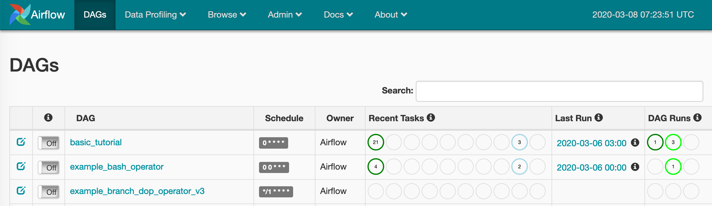

# 개요

이 문서에서는 apache airflow를 설치하고 운영하는 방법을 다룬다. 사실 airflow 운영은 
Airbnb에서 만들었다. Workflow Management System 의 일종인데 각 작업(task)를 DAG으로 만들어 실행한다. 비슷한 것으로는 ㅇㅇㅇㅇㅇ 등이 있다.

Airflow를 사용한다는 것은 DAG을 작성하는 작업과 이 DAG을 실행하는 작업으로 나눠진다. 이 글은 실행하는 것 위주로 살펴볼 예이며, DAG을 작성하는 것은 별도 주제로 다룬다.

## Terms

용어를 우선 알고 들어가자.

### DAG

DAG은 airflow에서 매우 중요하고 일상적인 용어이지만 사실 Directed Acyclic Graph라는 자료구조의 줄임말이다. 직역하면 방향성이 있고 순환구조가 없는 그래프로써 tree 역시 DAG의 일종이다. [DAG 알고리즘(국문)](https://steemit.com/dag/@cryptodreamers/dag-dag-directed-acyclic-graph)을 보면 지루하지 않게 dag의 정의와 알고리즘으로써 역할 그리고 bit coin 등에 활용되는 것을 볼 수 있다.

하지만 airflow에서는 DAG의 상세 내용에 대해서 알 필요는 없다. Airflow에서 DAG은 task의 실행순서와 의존성을 기술하는 언어라고 할 수 있다. 다음 그림은 실제 airflow의 DAG으로써 총 세개의 task (condition, dummy_task_1, dummy_task_2)와 그 의존성을 보여준다.

<figure align="middle">
  
</figure>

### Task

Task는 DAG을 구성하는 하나의 단위이다. 위 이미지에서는 하나의 박스에 해당함

### Operator

Airflow DAG과 그 task는 파이썬으로 기술된다. 이때 각 task가 수행할 수 있는 작업이며, 파이썬 클래스 형태로 제공된다. 자세한 것은 실제 DAG 작성하는 부분에서 살펴보도록 한다. Airflow 에서 기본으로 지원하는 DAG은 다음과 같으며 사용법은 [공홈](http://airflow.apache.org/docs/stable/_api/airflow/operators/index.html)에서 확인가능하다. 흔히 사용되는 것으로 다음과 같은 것들이 있으며, 그 외에 각 스토리지 (hive, mysql, mssql, ..) 등에 접근하는 operator도 있다.

- bash_operator
- dummy_operator
- http_operator

각 operator는 내부적으로 BaseOperator를 상속받아서 만들어져 있는데 필요하다면 사용자가 operator를 추가로 구현할 수 있다. 예를 들어 SSH로 원격 명령어를 실행하려면 bash_operator로 ssh command를 실행해도 되겠지만, ssh_operator 자체를 구현하는 것도 하나의 방법이다.

## Install

이 문서는 맥북 프로 2016, macOS Mojave, python3, Airflow 1.10.9 기준으로 작성되었다. Airflow 는 PIP와 소스설치 두가지 방법으로 설치가능하다.

### 준비

아래 것들을 설치하자. python3만 필수이고 나머지 둘은 선택이다.

- `python3`
- `pip` pip로 설치할 경우에만 필요
- `DB` 데이터 저장용 DB로 mysql 추천. 별도 설치하지 않으면 sqlite가 사용됨.

Airflow는 python3로 구동되며 DAG 역시 python으로 작성한다. 하지만 기존에 python을 사용해보지 않았다고 해도 DAG을 작성하는 것은 문제가 없으며 일반적인 작업에 사용할 operator는 이미 제공이 된다. 설치하면 example DAG이 등록되어 있기 때문에 수정을 해서 사용하면 된다. 만약 자신만의 operator를 작성하려면 airflow 내부 동작과 python의 OOP 문법에 대해서 익숙해야 한다. DAG 작성은 아래에서 다시 설명한다.

### PIP Install

pip 기반 설치는 매우 쉽다. pip만 제대로 설치되어 있다면 말이다.

```bash
$ pip install
:
```

### 소스 기반 설치

github 에서 소스코드를 다운로드 받아서 설치한다. 현재는 1.10.9 tag가 가장 최신다.

```bash
# github에서 clone
$ git clone https://github.com/apache/airflow.git
Cloning into 'airflow'...
$ cd airflow
# 1.10.9 태그 checkout
$ git tags -l
$ git checkout tags/1.10.9
# Install
$ python setup.py install
:
Finished processing dependencies for apache-airflow==1.10.9
```

### 설정

#### AIRFLOW_HOME

일단 메뉴얼에서는 AIRFLOW_HOME을 ~/airflow 로 가이드하고 있다. (기본 설정대로 운영한다면) AIRFLOW_HOME 하위에 db, dags, airflow.cfg 파일 등이 위치한다.

#### 설정파일: airflow.cfg

$AIRFLOW_HOME/airflow.cfg 파일이 위치해야 한다. 설치된 파일중 템플릿 설정 파일을 복사한 후 수정하면 된다.

```bash
# MacOS의 경우 python3 site-packages 하위에 airflow 파일들이 설치된다.
ls /usr/local/lib/python3.7/site-packages/apache_airflow-1.10.9-py3.7.egg
# 위 경로에서 설정 템플릿 파일을 복사하자
cp /usr/local/lib/python3.7/site-packages/apache_airflow-1.10.9-py3.7.egg/airflow/config_templates/default_airflow.cfg $AIRFLOW_HOME/
cd $AIRFLOW_HOME
mv default_airflow.cfg airflow.cfg
```

사실상 아무런 설정도 하지 않고 그대로 사용할 수 있다. 그러면 다음 설정으로 동작하게 된다.

- `webserver`0.0.0.0:8080
- `db` sqlite, 파일위치는 $AIRFLOW_HOME/airflow.db
- `dag 경로` $AIRFLOW_HOME/dags

운영환경에서의 기본적인 설정 수정은 다음 정도일 것이다.

```bash
# Airflow 가 DAG을 읽어들일 경로이다. 즉 사용자는 DAG을 작성하여 이 경로에 복사하면 되다.
# 절대경로여야 한다.
dags_folder = {AIRFLOW_HOME}/dags

# 데이터를 저장한 데이터베이스로 아래는 sqlite 의 기본 설정
sql_alchemy_conn = sqlite:///{AIRFLOW_HOME}/airflow.db
# mysql, postgreql 등의 DBMS도 지원하며 관리차원에서는 DBMS를 선택하는 것이 낫다. 아래는 mysql 예시
sql_alchemy_conn = mysql:///user:password@mysqlhost:3306/airflow.db

# webserver uri는 아래 세 설정을 사용하면 돈다.
base_url = http://localhost:8080
web_server_host = 0.0.0.0
web_server_port = 8080

# 스케줄러 튜닝 과련 옵션들. Concurrency 옵션은 중요한데 이건 실 운영환경에 따라 차이가 난다.
executor
parallelism
dag_concurrency
max_active_runs_per_dag

# 그외 최근 버전에 LDAP 지원이 추가되었는데 해보지 않았다. 관심있으면 try 해보길..
[ldap]
uri = ..
user_filter = ..
:

```

## 실행

### DB 초기화 및 필요한 프로세스 실행

```bash
# 데이터베이스 초기화 작업이 필요하다. 이 작업은 한번만 해야 한다.
$ airflow initdb
# Front-end 역할을 하는 웹서버 실행. Foreground로 실행된다. Daemon으로 실행하는 것은 각자 알아서.
$ airflow webserver
# 실제 dag을 실행하는 스케줄러 프로세스를 실행
$ airflow scheduler
```

## UI 사용

UI를 설명한다.
사용한 DAG 소스 [basic_tutorial.py](.resources/airflow/basic_tutorial.py)

### Dashboard



상단의 DAGs 메뉴 선택하면 보면 현재 등록된 DAG의 리스트와 요약된 상태의 대시보드가 나오며, airflow에 등록된 DAG의 운영상태를 한눈에 알 수 있다. 특이한 점은 오른쪽위의 시간이 UTC로 표시되는 것을 볼 수 있다. 스크린샷을 찍은 시점은 2020-03-07 23:47 KST이기 때문에 9시간의 차이가 나는데 이게 운영하다보면 은근히 헷갈린다.

- `i` DAG의 on 스위치
- `DAG` 등록된 dag 이름. 클릭하면 DAG 상세 페이지로 이동한다.
- `Schedule` DAG에서 지정한 스케줄링 방식을 보여준다. cron 포맷, 안함, 즉시실행 등이 있다. 주의할 것은 이 시간 역시 UTC 기준이다.
- `Owner` 중요하지 않음
- `Recent Tasks` 최근 동작한 task 정보
- `Last Run` 마지막 동작 시간. 설치 직후이므로 기록된 것이 없다.
- `DAG Runs` 동작중인 task
- `Links` DAG의 상세 페이지의 direct link

DAG 상세 페이지로 들어가보자.

#### Graph View 


#### 시간 선택


## DAG 작성

Airflow 를 쓴다는 것은 airflow를 운영하는 것과 dag을 작성하여 workflow를 관리하는 것으로 나눠집니다. DAG 작성은 

## 기타 운영 이슈

### 타임존

Airflow의 시간은 기본적으로 UTC 기반으로 동작하는데 이게 한국에 사는 우리 입장에선 매우 짜증난다. 표면적으로 시간으로 짜증나는 경우는 세가지이다.

1. Dashboard UI의 표기 시간
2. UI에 표기되는 DAG실행 시간
3. 스케줄 지정 시간
4. Task 실행시에 airflow가 전달해주는 시간

### SPOF

Airflow는 일반적으로 시스템 내에서 매우 중요한 위치를 차지하지만 문제는 그 중요도에 비해서 가용성 부분에서 취약하다.

`webserver` DAG 코드는 파이썬 파일로저장되며 동작중인 상태는 데이터베이스에 저장되며 웹서버는 stateless 하고 동작하는 front-end이다. 따라서 프로세스가 다운되더라도 단순히 재실행하기만 하면 된다.
`scheduler` 실제 dag과 task의 실행을 담당하고 상태와 결과를 DB에 저장한다. 따라서 scheduler 프로세스가 죽는 것은 매우 심각한 상황이다.

### 자원 점유

Airflow 운영중 가장 큰 문제는 airflow의 자원 점유이다.

`Thread 점유` Airflow 각 task는 thread로 동작한다.
`메모리 부족` Airflow는 동시에 실행되고 있는 task의 수만큼 메모리를 필요로 한다.

Airflow 자원점유의 특징은 DAG이나 task의 총량이 아니라 `동시에 동작 중인 태스크 수`에 선형적으로 비례한다는 점이다. 이로 인해 발생하는 가장 심각한 문제는 **메모리가 부족한 경우 airflow 프로세스가 사라진다**는 점이다.

### 로그의 누적

### UI 반응성

Airflow front-end의 경우 많은 양의 정보를 보여준다. 특히 graph-view

### ;aldjfdsj
