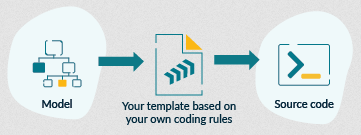
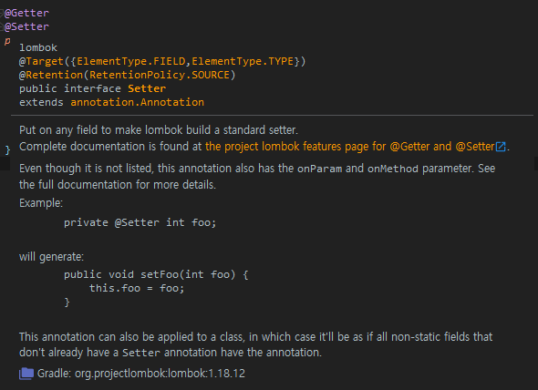
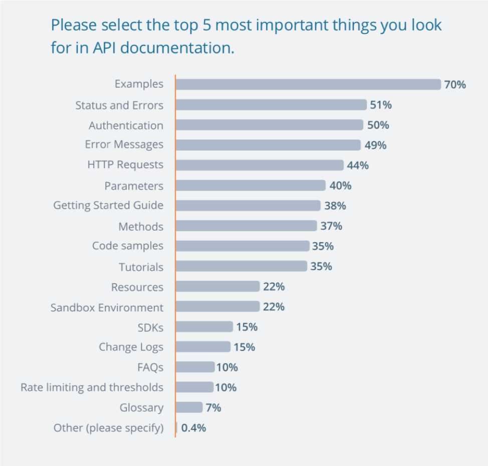
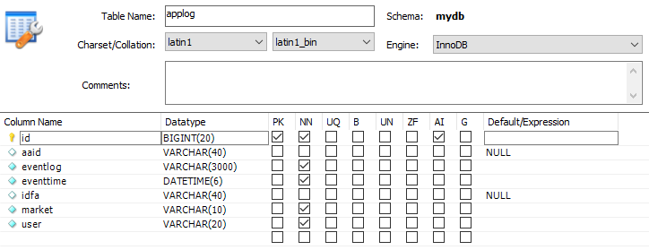
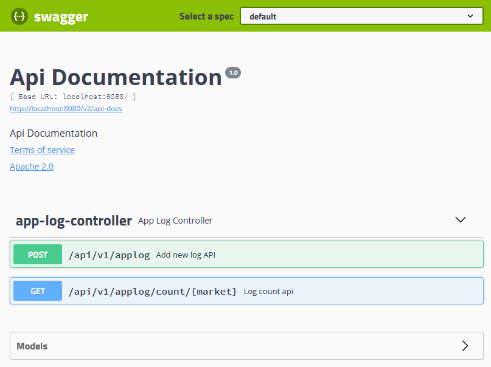
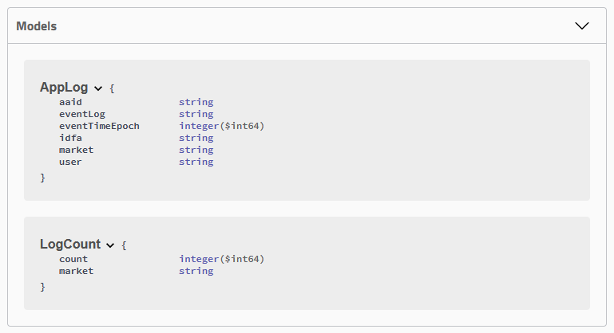
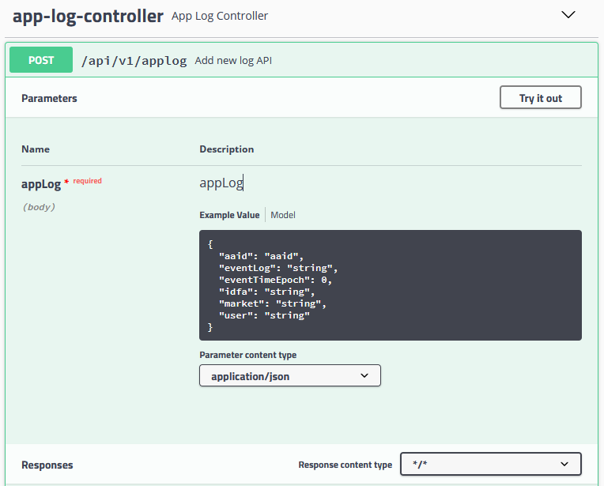
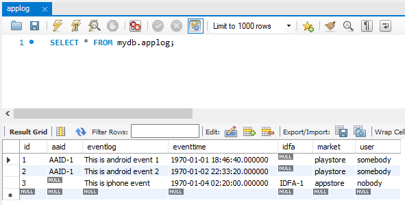
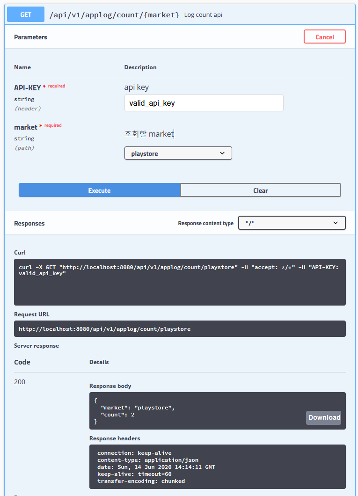

# 개발자의 소통 도구 : Swagger, Lombok

개발자는 다른 개발자와 소통을 한다. 소통이란 작성한 소스코드와 그 동작에 대해서 다른 사람을 이해시키기 위한 활동을 말한다. 소통의 도구를 얘기하기 전에 "왜" 소통을 하는지에 대해서 살펴볼 필요가 있다. 그 이유는

```text
소스코드보다 사람의 언어가 더 이해하기 쉽기 때문이다.
```

살펴볼 소통의 도구는 swagger와 lombok 이며 각각 다음 측면에서 살펴본다.

- `Swagger` 동작에 대한 설명
- `Lombok` 소스코드 가독성 증가

## 개발자의 소통

### 개발자의 소통의 덕목

개발자는 소통에 임함에 있어 다음과 같은 덕목을 추구한다.

- `스피드` 소통을 하는데 필요한 시간
- `명확함` 내용이 정확성, 오해없는 전달
- `디테일` 상세한 내용까지 전달
- `가시성` 멋있게
- `체험` 동작에 대한 예제 및 테스트

### 덕목의 우선순위

소통을 잘한다는 것은 어떤 것일까? 어떤 덕목에 더 가중치를 두고 소통해야 하는가? (특히 월급 받고 일하는 개발자 관점에서)

1. Essential
   1. `명확함` - 필수이다. 나머지 모든 항목이 뛰어나더라도 명확함이 없다면 쓸모없는 소통이다.
2. The better, The better
   1. `스피드` 소통에 드는 시간은 짧을 수록 좋다.
   2. `체험` 체험만큼 많은 것을 얻을 수 있는 것은 없다.
3. Optional, Trade-off
   1. `디테일` 물론 상세한 것은 좋다. 하지만 대게 디테일해질수록 투입 시간대비 문서의 가치는 낮아진다.
   2. `가시성` 시간소모적인 일이며 필요한 곳에 한정해야 한다.

스피드와 스피드 외 덕목들은 반비례 관계라고 할 수 있으며 항목별로 그 정도의 차이가 있다.

### 고전적인 소통

고전적인 소통의 방법으로 매개체로 "문서"를 사용하는 방법이 있다.

1. 소스코드 작성자가 문서를 작성
2. 문서를 통해서 소스코드와 동작을 파악

많은 사람들은 알고 있다. 이 작업은 시간이 많이 걸리고 생성한 문서를 아무도 보지 않을 수도 있으며 문서 본다고 이해할거란 보장도 없다. 결국 문서화는 시간낭비라는 인식이 강화되고 문서로써의 요구사항만을 만족시키는 문서들이 양산된다. 또한 문서의 특성상 "체험"과는 상극이다.

Confluent에서 발췌한 그림이다. 이런 문서는 매우 훌륭하지만 사용자가 한정적인 프로젝트에서 이런 문서를 생산할 필요는 없다.


출처: [Confluent Blog: Real-Time Fleet Management Using Confluent Cloud and MongoDB](https://www.confluent.io/blog/fleet-management-gps-tracking-with-confluent-cloud-mongodb)

#### 여담. 망분리가 되어어 있다면

만약 소통하는 곳 즉 문서를 작성하는 곳과 설명할 것의 위치가 다르다면 어떨까? 자료를 문서에 첨부하는 것이 불가능하거나 매우 불편한경우 문서 작성에 투입되는 시간은 급증한다.


### Code Generation

설계를 하고 그 문서를 작성하면 소스코드가 생성되는 툴들이 존재한다. 즉 사람의 언어로 소통을 했더니 동작하는 소스코드가 탄생하는 것이다. 하지만 아직은 제한적인 분야에서만 활용되고 있다. 여전히 소스코드가 선행한다.



출처: [Obeo.com: Code Generation](https://www.obeo.fr/en/services/code-generation-tools)

### Code as a Doument

그렇다면 소스코드 자체로 소통하면 되지 않나? 이를 도와주는 툴들이 많이 있다. 오늘은 이 관점에서 swagger, lombok 소개하려고 한다.

사실 우리는 이미 일상생활에서 이 기법을 사용중이다. 다음은 @Setter 어노테이션에 마우스오버하면 IntelliJ가 팝업으로 javadoc을 보여주는 화면이다.



Javadoc은 소스코드상에 주석을 작성하면 html 문서가 되는 방식이다. 사실 javadoc은 위치만 소스코드일 뿐 컨텐츠는 별도로 작성해야한다는 면에서 고전적인 문서작성과 같다고 할 수 있다. 그러나 자동화된 도구들이 작성시간을 줄이고 오류발생을 낮춰줌으로써 일반적인 문서대비 투입 리소스가 적다. 또한 위 스크린샷처럼 IDE들이 html을 곧바로 렌더링해서 보여줄 수 있기 때문에 고전적인 문서대비 가시성이 매우 높다.

## 도구

Swagger, Lombok에 대해서 알아보자

### Swagger

API Document 에는 어떤 내용이 주로 담겨야 할까? 다음은 그와 관련한 조사이다.



참고.

[10 Ways to create easy-to-use compelling API Documeent - swagger.io](https://swagger.io/blog/api-documentation/create-compelling-easy-to-use-api-documentation/)

[The State of API 2019 Report - smartbear.com](https://smartbear.com/resources/ebooks/the-state-of-api-2019-report/?utm_medium=content-text&utm_source=swagger-blog&utm_campaign=10-ways-api-documentation)

그렇다면 swagger가 만들어낸 문서를 보자. 다음은 swagger.io 에서 제공하는 데모 화면이다.

[Swagger Live Demo](https://petstore.swagger.io/?_ga=2.24643192.370818538.1592102595-498966297.1592102595#/)

Swagger와 고전적인 문서방식이 각각 어떤 항목에서 강점을 가지는지에 대한 내 의견이다. Demo를 실행해봤다면 내 의견에 공감하리라고 본다.

- `swagger` examples, status and errors, authentication, error messages, http requests, parameter, sandbox environment
- `고전적인 문서` getting started guide, code samples, tutorials, change logs, FAQs

Swagger와 고전적인 문서 모두 고유의 장점을 가진다. 하지만 리스트에서 상위에 랭크된 항목은 전부 swagger의 승리이다. 물론 고전적인 문서로도 위 항목을 대부분 기술 가능하다. 하지만 도구의 선정은 "할수 있느냐"가 아니라 "얼마나 효율적으로 하느냐"의 관점에서 접근해야 한다.

#### Swagger in 소스코드

실제 소스코드에서 swagger 가 사용되는 예를 보자. 아래 ApplicationLogController 클래스는 spring-boot 프로젝트에서 API가 두개인 controller 이다.

<details><summary>ApplicationLogController.java (without swagger)</summary>

```java
@RequiredArgsConstructor
@RestController
@RequestMapping("/api/v1")
public class AppLogController {
    private final AppLogRepository repository;

    @PostMapping(value = "/applog", consumes = MediaType.APPLICATION_JSON_VALUE)
    public ResponseEntity<String> newLog(@RequestBody AppLog appLog) {
        repository.saveAndFlush(AppLogEntity.newEntity(appLog));
        return ResponseEntity.ok("OK");
    }

    @GetMapping(value = "/applog/count/{market}")
    public ResponseEntity<LogCount> countLog(@PathVariable("market") String market,
                                             @RequestHeader("API-KEY") String apiKey) {
        if (!apiKey.equals("valid_api_key")) {
            return ResponseEntity.status(HttpStatus.UNAUTHORIZED).body(new LogCount().market(market).count(-1));
        }
        long count;
        if (market.equalsIgnoreCase("all")) {
            count = repository.count();
        } else {
            count = repository.countByMarket(market);
        }
        return ResponseEntity.ok(new LogCount().market(market).count(count));
    }
}
```

</details>

위 코드로 문서를 작성한다면 대충 다음과 같을 것이다.

```text
설명: 로그를 수신해서 DB에 저장하는 API
URL: /api/v1/applog
Method: Http, POST
Parameter: Request body 에 AppLog 타입의 json
Accept: "application/json
Return: OK (200)
```

```text
설명: market 별로 저장된 로그 수를 리턴하는 API
URL: /api/v1/applog/count/{market}
Method: Http, GET
Parameter
  - market: path, string, 가능값(all, playstore, appstore)
  - API-KEY: header, string
Return
  - UNAUTHRIZED(401): API-KEY가 틀림
  - OK(200): LogCount 타입의 json
```

반대로 이를 swagger 로 작성한려면 code에 swagger 관련 어노테이션을 추가해야 한다. @ApiOperation, @ApiImplicitParams 어노테이션 6라인이 추가되었다. 이를 통해서 사용자는 API의 문서를 볼 수 있을 뿐 아니라 실제로 로그를 전송해서 database에 저장하고 get api를 통해서 로그수를 조회할 수도 있다.

<details><summary>web.ApplicationLogController.java (with swagger)</summary>

```java
@RequiredArgsConstructor
@RestController
@RequestMapping("/api/v1")
public class AppLogController {
    private final AppLogRepository repository;

    @ApiOperation("Add new log API")
    @PostMapping(value = "/applog", consumes = MediaType.APPLICATION_JSON_VALUE)
    public ResponseEntity<String> newLog(@RequestBody AppLog appLog) {
        repository.saveAndFlush(AppLogEntity.newEntity(appLog));
        return ResponseEntity.ok("OK");
    }

    @ApiOperation("Log count api")
    @ApiImplicitParams({
            @ApiImplicitParam(name = "API-KEY", value = "api key", paramType = "header", required = true, example = "valid_api_key"),
            @ApiImplicitParam(name = "market", value = "조회할 market", allowableValues = "all, appstore, playstore", required = true, example = "appstore")
    })
    @GetMapping(value = "/applog/count/{market}")
    public ResponseEntity<LogCount> countLog(@PathVariable("market") String market,
                                             @RequestHeader("API-KEY") String apiKey) {
        if (!apiKey.equals("valid_api_key")) {
            return ResponseEntity.status(HttpStatus.UNAUTHORIZED).body(new LogCount().market(market).count(-1));
        }

        long count;
        if (market.equalsIgnoreCase("all")) {
            count = repository.count();
        } else {
            count = repository.countByMarket(market);
        }
        return ResponseEntity.ok(new LogCount().market(market).count(count));
    }
}
```

</details>

여기까지 작업한 후에는 보통 나는 샘플 리턴데이터를 작성한다. 앞어서 얘기했지만 swagger를 사용하는 이유는 소통이다. 개발 초기에는 당연히 API 스펙만 존재하며 실제로 동작하지 않기 때문에 샘플 리턴 데이터를 작성한다. 사실 각 데이터 타입별로 샘플 데이터를 작성하는 것은 매우 번거롭지만, 작성에 투입한 시간 이상으로 소통에 큰 도움이 된다고 확신한다.

```java
@Getter
@Setter
class LogCount {
    private String market;
    private long count;

    // 샘플 데이터. Controller는 개발 전까지 이 데이터를 리턴한다. 
    public static LogCount getSample() {
        return new LogCount().setMarket("appstore").setCount(10);
    }
}
```

### Lombok

Lombok을 한단어로 줄이면 `소스 다이어트` 라고 할 수 있다. 장황하고 반복적인 관습 코드를 어노테이션으로 대체한다. 이미 공감하고 있는 내용이라면 디테일하게 소통하는 것은 시간낭비이다.

예를 들어 A 클래스가 name, age, address 변수를 가지는 (VO, DTO 같은) 데이터 클래스라고 해보자. 다음 중 어느쪽이 더 이해하기 쉬운가?

1. A 클래스는 getter와 setter로 캡슐화 되어 있다.
2. A 클래스는 String getName(), void setName(String name)으로 name을 캡슐화하고, int getAge(), void setAge(int age)로 age를 캡슐화했으며 String getAddress(), void setAddress(String address)로 address를 캡슐화했다.

많은 사람들이 1번을 선택할거라고 생각한다. 계속해서 lombok이 어떻게 소스의 가독성을 높이는지 살펴보자.

#### lombok.config

우선 lombok의 전역 설정인 lombok.config에 다음 설정을 추가했다. 이 설정은 setter가 this를 리턴하게 함으로써 setter를 체인 형태로 사용할 수 있게 해준다. 이건 그냥 내 코딩 스타일인데 Builder 부분에서 잠시 설명하겠다.

```bash
 lombok.accessors.chain=true
```

#### @Getter / @Setter / @ToString

lombok 의 기능중 가장 많이 사용되는 이 세가지가 아닐까? getter, setter는 필수이면서도 반복적이고 장황한 코드의 전형이다. ToString 역시 작성하기 굉장히 귀찮은 코드이다. 심지어 다른 클래스를 상속하고 있기라도 한다면 부모 클래스의 변수모두 toString에 기술해야 한다.

<details><summary>With Lombok</summary>

```java
@Getter
@Setter
@ToString
public class Person {
    private String name;
    private String birth;
    private String address;

    // new instance sample
    public static Person newPerson() {
        return new Person().setName("IU").setBirth("1993.05.16").setAddress("ASIA/SEOUL");
    }
}
```

</details>

<details><summary>Without Lombok</summary>

```java
public class Person {
    private String name;
    private String birth;
    private String address;

    public String getName() {
        return name;
    }

    public String getBirth() {
        return birth;
    }

    public String getAddress() {
        return address;
    }

    public Person setName(String name) {
        this.name = name;
        return this;
    }

    public Person setBirth(String birth) {
        this.birth = birth;
        return this;
    }

    public Person setAddress(String address) {
        this.address = address;
        return this;
    }

    @Override
    public String toString() {
        return "PersonWithoutLombok(name=" + name + ", birth=" + birth + ", address=" + address;
    }

    public static Person newPerson() {
        return new Person().setName("IU").setBirth("1993.05.16").setAddress("ASIA/SEOUL");
    }
}
```

</details>

#### @Builder

Builder 패턴은 종종 쓸 것이다. 개인적으로는 builder를 만들지 않더라도 setter가 this를 리턴하게 함으로써 체인 형태로 사용가능하도록 만든다. 객체명을 매번 나열해서 지저분해지는 것도 싫고, 파라미터가 여러개인 생성자를 만들어서 오류 가능성을 높이는 것도 싫기 때문이다. 가끔은 파라미터를 "순서"가 아니라 포트란처럼 "이름"으로 매핑하면 좋겠다는 생각도 한다. 각설하고 lombok은 builder를 매우 간편하게 만들 수 있게 해준다.

<details><summary>Builder with lombok</summary>

```java
@Builder
public class PersonWithBuilder {
    private String name;
    private String birth;
    private String address;

    public static PersonWithBuilder newPerson() {
        return PersonWithBuilder.builder().name("IU").birth("1993.05.16").address("ASIA/SEOUL").build();
    }
}
```

</details>

#### @EqualsAndHashCode

equals()와 hashCode() 생성을 간편화해준다. 사실 나는 아직 정확히 저 두 메소드를 어떻게 작성해야하는지 모르고 있고 그다지 알고 싶지도 않다. 그냥 EqualsAndHashCode를 쓰고 있다. JPA Entity 클래스에서 테이블에 primary key가 둘 이상인경우 equals, hashCode 메소드를 가지는 Id만을 포함한 클래스를 작성해야 한다. 다음 예를 보면 왜 lombok이 축복인지 알 수 있다.

<details><summary>With Lombok</summary>

```java
@Getter
@Setter
@Entity
@Table(name = "twokeytable1")
@IdClass(CompositeKeyEntity.Keys.class)
public class CompositeKeyEntity {
    @Id
    private String brand;

    @Id
    private String item;

    private String price;

    private LocalDateTime expireTime;

    @Getter
    @Setter
    @EqualsAndHashCode
    public static class Keys implements Serializable {
        private String brand;
        private String item;
    }
}
```

</details>

<details><summary>Without Lombok</summary>

```java
@Getter
@Setter
@Entity
@Table(name = "twokeytable2")
@IdClass(CompositeKeyEntity2.Keys.class)
public class CompositeKeyEntity2 {
    @Id
    private String brand;

    @Id
    private String item;

    private String price;

    private LocalDateTime expireTime;

    @Getter
    @Setter
    public static class Keys implements Serializable {
        private String brand;
        private String item;

        @Override
        public boolean equals(Object o) {
            if (o == this) {
                return true;
            }
            if (!(o instanceof Keys)) {
                return false;
            }
            Keys other = (Keys) o;
            if (!other.equals((Object) this)) {
                return false;
            }
            if (this.getBrand() == null ? other.getBrand() != null : !this.getBrand().equals(other.getBrand())) {
                return false;
            }
            if (this.getItem() == null ? other.getItem() != null : !this.getItem().equals(other.getItem())) {
                return false;
            }
            return true;
        }

        @Override
        public int hashCode() {
            final int PRIME = 59;
            int result = 1;
            result = (result * PRIME) + (this.getBrand() == null ? 43 : this.getBrand().hashCode());
            result = (result * PRIME) + (this.getItem() == null ? 43 : this.getItem().hashCode());
            return result;
        }
    }
}
```

</details>

#### Val

컴파일 언어들은 기본적으로 변수 선언시에 타입을 명시할 것을 강제한다. 하지만 대입되는 value에 의해서 타입추론이 가능한 경우는 타입을 생략할 수 있는 편의장치 역시 대부분의 언어들이 제공한다. C++ 11 C# Kotlin Scala java10 등. 하지만 아직까지도 가장 많이 사용되는 java8 이라면 다음과 같이 간편화할 수 있다.

<details><summary>With Lombok</summary>

```java
public class FinalAuto {
    public void valExample() {
        val lombokValue = complexReturnMethod();
        for (val entry1 : lombokValue.entrySet()) {
            for (val entry2 : entry1.getValue().entrySet()) {
                System.out.println(entry2);
            }
        }
    }

    private Map<String, Map<Integer, Map<String, Map<Long, List<LocalDateTime>>>>> complexReturnMethod() {
        return new HashMap<>();
    }
}
```

</details>

<details><summary>Without Lombok</summary>

```java
public class FinalAuto {
    public void example() {
        final Map<String, Map<Integer, Map<String, Map<Long, List<LocalDateTime>>>>> bareValue = complexReturnMethod();
        for (Map.Entry<String, Map<Integer, Map<String, Map<Long, List<LocalDateTime>>>>> entry1 : bareValue.entrySet()) {
            for (Map.Entry<Integer, Map<String, Map<Long, List<LocalDateTime>>>> entry2 : entry1.getValue().entrySet()) {
                System.out.println(entry2);
            }
        }
    }

    private Map<String, Map<Integer, Map<String, Map<Long, List<LocalDateTime>>>>> complexReturnMethod() {
        return new HashMap<>();
    }
}
```

</details>

이해를 위한 극단적인 예일뿐, 나는 이렇게 코딩하진 않는다:-)

#### @NonNull

메소드 바디에서 파라미터 null 검사는 매우 자주 필요하지만 번거롭고 그 코드로 인해서 나머지 코드의 가독성을 해친다. 문을 열고 들어갔더니 정리안된 신발이 수북히 쌓여 있는 느낌이랄까? @NonNull을 사용하면 메소드 최상단에 null 검사 코드를 추가된다.

<details><summary>With Lombok</summary>

```java
@Slf4j
public class ValidateNull {
    public void logName(@NonNull String firstName, @NonNull String lastName) {
        logger.info("Name is {} {}", firstName, lastName);
    }
}
```

</details>

<details><summary>Without Lombok</summary>

```java
@Slf4j
public class ValidateNull {
    public void logName(String firstName, String lastName) {
        if (Objects.isNull(firstName)) {
            throw new NullPointerException("firstName is null");
        }
        if (Objects.isNull(lastName)) {
            throw new NullPointerException("lastName is null");
        }
        logger.info("Name is {} {}", firstName, lastName);
    }
}
```

</details>

#### AccessLevel

대부분의 singleton 구현 방식은 singleton 클래스의 생성자를 private으로 숨기는 작업이 필요하다. (물론 예외도 있다: [java singleton pattern - seotory.com](https://blog.seotory.com/post/2016/03/java-singleton-pattern)) AccessLvel을 사용하면 생성자를 간단히 숨길 수 있다.

<details><summary>With Lombok</summary>

```java
@NoArgsConstructor(access = AccessLevel.PRIVATE)
public class Singleton {
    private static class LazyHolder {
        private static final Singleton instance = new Singleton();
    }

    public static Singleton getInstance() {
        return LazyHolder.instance;
    }
}
```

</details>

<details><summary>Without Lombok</summary>

```java
public class Singleton {
    private Singleton() {
    }

    private static class LazyHolder {
        private static final Singleton instance = new Singleton();
    }

    public static Singleton getInstance() {
        return Singleton.LazyHolder.instance;
    }
}
```

</details>

## 간단한 프로젝트

Swagger 설명에서 들었던 API의 전체 소스코드이다.

[샘플코드](https://github.com/sharefeel/open.document/tree/master/.resources/communication_of_developers/snippet)

포함하는 API

1. AppLog 타임의 로그를 수신해서 mysql 데이터베이스에 저장하는 api
2. 데이터베이스에 저장된 로그의 수를 리턴하는 api

사용하는 database 환경

- dbms: mysql 5.7
- endpoint: localhost:3306
- database: mydb

### 실행

다음과 같이 시작 로그가 올라간다. 참고로 다음 jpa(hibernate) 설정이 추가된 상태이다.

```bash
# 프로그램 초기화 시 entity 에 맞는 테이블을 생성한다. 로그에서 drop table 후 create table 쿼리가 실행되는 것을 볼 수 있다.
jpa.hibernate.ddl-auto: create
# JPA 에 의해 실행되는 쿼리가 화면에 출력된다.
jpa.show-sql: true
```

<details><summary> 시작 로그 </summary>

```log4j

  .   ____          _            __ _ _
 /\\ / ___'_ __ _ _(_)_ __  __ _ \ \ \ \
( ( )\___ | '_ | '_| | '_ \/ _` | \ \ \ \
 \\/  ___)| |_)| | | | | || (_| |  ) ) ) )
  '  |____| .__|_| |_|_| |_\__, | / / / /
 =========|_|==============|___/=/_/_/_/
 :: Spring Boot ::        (v2.2.8.RELEASE)

2020-06-14 23:13:16.515  INFO 18168 --- [           main] net.youngrok.snippet.SnippetApplication  : Starting SnippetApplication on DESKTOP-AD0PBN1 with PID 18168 (C:\Users\YK\Desktop\dev\snippet\out\production\classes started by YK in C:\Users\YK\Desktop\dev\snippet)
2020-06-14 23:13:16.528  INFO 18168 --- [           main] net.youngrok.snippet.SnippetApplication  : No active profile set, falling back to default profiles: default
2020-06-14 23:13:17.599  INFO 18168 --- [           main] .s.d.r.c.RepositoryConfigurationDelegate : Bootstrapping Spring Data JPA repositories in DEFAULT mode.
2020-06-14 23:13:17.676  INFO 18168 --- [           main] .s.d.r.c.RepositoryConfigurationDelegate : Finished Spring Data repository scanning in 66ms. Found 1 JPA repository interfaces.
2020-06-14 23:13:18.681  INFO 18168 --- [           main] o.s.b.w.embedded.tomcat.TomcatWebServer  : Tomcat initialized with port(s): 8080 (http)
2020-06-14 23:13:18.694  INFO 18168 --- [           main] o.apache.catalina.core.StandardService   : Starting service [Tomcat]
2020-06-14 23:13:18.694  INFO 18168 --- [           main] org.apache.catalina.core.StandardEngine  : Starting Servlet engine: [Apache Tomcat/9.0.36]
2020-06-14 23:13:18.860  INFO 18168 --- [           main] o.a.c.c.C.[Tomcat].[localhost].[/]       : Initializing Spring embedded WebApplicationContext
2020-06-14 23:13:18.860  INFO 18168 --- [           main] w.s.c.ServletWebServerApplicationContext : Root WebApplicationContext: initialization completed in 2272 ms
2020-06-14 23:13:19.156  INFO 18168 --- [           main] o.hibernate.jpa.internal.util.LogHelper  : HHH000204: Processing PersistenceUnitInfo [name: default]
2020-06-14 23:13:19.234  INFO 18168 --- [           main] org.hibernate.Version                    : HHH000412: Hibernate ORM core version 5.4.17.Final
2020-06-14 23:13:19.420  INFO 18168 --- [           main] o.hibernate.annotations.common.Version   : HCANN000001: Hibernate Commons Annotations {5.1.0.Final}
2020-06-14 23:13:19.555  INFO 18168 --- [           main] com.zaxxer.hikari.HikariDataSource       : HikariPool-1 - Starting...
2020-06-14 23:13:19.729  INFO 18168 --- [           main] com.zaxxer.hikari.HikariDataSource       : HikariPool-1 - Start completed.
2020-06-14 23:13:19.752  INFO 18168 --- [           main] org.hibernate.dialect.Dialect            : HHH000400: Using dialect: org.hibernate.dialect.MySQL57Dialect
Hibernate: drop table if exists applog
Hibernate: create table applog (id bigint not null auto_increment, aaid varchar(40), eventlog varchar(3000) not null, eventtime datetime(6) not null, idfa varchar(40), market varchar(10) not null, user varchar(20) not null, primary key (id)) engine=InnoDB
2020-06-14 23:13:20.603  INFO 18168 --- [           main] o.h.e.t.j.p.i.JtaPlatformInitiator       : HHH000490: Using JtaPlatform implementation: [org.hibernate.engine.transaction.jta.platform.internal.NoJtaPlatform]
2020-06-14 23:13:20.612  INFO 18168 --- [           main] j.LocalContainerEntityManagerFactoryBean : Initialized JPA EntityManagerFactory for persistence unit 'default'
2020-06-14 23:13:21.278  WARN 18168 --- [           main] JpaBaseConfiguration$JpaWebConfiguration : spring.jpa.open-in-view is enabled by default. Therefore, database queries may be performed during view rendering. Explicitly configure spring.jpa.open-in-view to disable this warning
2020-06-14 23:13:21.439  INFO 18168 --- [           main] pertySourcedRequestMappingHandlerMapping : Mapped URL path [/v2/api-docs] onto method [springfox.documentation.swagger2.web.Swagger2Controller#getDocumentation(String, HttpServletRequest)]
2020-06-14 23:13:21.559  INFO 18168 --- [           main] o.s.s.concurrent.ThreadPoolTaskExecutor  : Initializing ExecutorService 'applicationTaskExecutor'
2020-06-14 23:13:21.743  INFO 18168 --- [           main] d.s.w.p.DocumentationPluginsBootstrapper : Context refreshed
2020-06-14 23:13:21.772  INFO 18168 --- [           main] d.s.w.p.DocumentationPluginsBootstrapper : Found 1 custom documentation plugin(s)
2020-06-14 23:13:21.810  INFO 18168 --- [           main] s.d.s.w.s.ApiListingReferenceScanner     : Scanning for api listing references
2020-06-14 23:13:22.131  INFO 18168 --- [           main] o.s.b.w.embedded.tomcat.TomcatWebServer  : Tomcat started on port(s): 8080 (http) with context path ''
2020-06-14 23:13:22.133  INFO 18168 --- [           main] net.youngrok.snippet.SnippetApplication  : Started SnippetApplication in 6.192 seconds (JVM running for 6.865)
```

</details>

실행하고 나면 mysql에 다음과 같이 테이블이 생성된 것을 확인할 수 있다.



### API 사용법







테스트를 위해서 /api/v1/applog API로 다음 세 로그를 전송하자.

```json
{
  "aaid": "AAID-1",
  "eventLog": "This is android event 1",
  "eventTimeEpoch": 100000,
  "market": "playstore",
  "user": "somebody"
}

{
  "aaid": "AAID-1",
  "eventLog": "This is android event 2",
  "eventTimeEpoch": 200000,
  "market": "playstore",
  "user": "somebody"
}

{
  "eventLog": "This is iphone event",
  "eventTimeEpoch": 300000,
  "idfa": "IDFA-1",
  "market": "appstore",
  "user": "nobody"
}
```

Mysql 테이블에 정상적으로 적재된 것을 확인할 수 있다.



다시 swagger로 돌아와서 로그 수를 조회. 검색조건은 market = playstore 이다.



200(OK)와 함께 전송했던 playstore 로그 건수가 리턴된다.

```json
{
  "market": "playstore",
  "count": 2
}
```

## 결론

소통을 할때는 항상 다음을 명심하자.

- 소통의 효율 != sum(소통의 효과)
- 소통의 효율 == sum(소통의 효과) / 투입된 시간

이는 도구를 사용할 때도 마찬가지이다. Swagger에 훨씬 많은 기능이 있지만 그것을 모두 익혀서 사용하는 것은 오히려 효율을 떨어트릴 수 있다. 목적은 효율적인 소통이지 swagger 장인이 되이 것은 아니다.

## Tags

`#Lombok` `#Swagger` `#Swagger`
