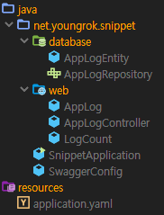

# 개발자의 소통 도구 : Swagger, Lombok, JPA

블라블라
개발자는 다른 개발자와 소통을 한다. 

용어정의

- `생산자` 소통을 위한 컨텐츠를 작성하는 사람
- `소비자` 작성된 컨텐츠를 받아 이해하는 사람

## 개발자의 소통

### 잘하는 소통

소통에 있어서 개발자가 추구하는 항목들

- `스피드` 소통을 하는데 필요한 시간.
- `명확함` 
- `정확함`
- `디테일` 자세함
- `가독(시)성` 
- `겉멋` 매우 중요하다. 개발자에게 있어서 매우 큰 동기부여가 된다.

### 고전적인 소통

소통을 하는 주된 이유중 하나는 바로 내가 작성한 소스코드의 동작을 다른 사람에게 이해시키기 위해서이다.
고전적이 방법으로는 이해의 매개체로 "문서"를 사용하는 방법이 있다.

0. 소스코드 작성자가 문서를 작성
1. 문서를 읽고 ...

많은 사람들은 알고 있다. 이 작업은 시간이 많이 걸리고, 생성한 문서를 아무도 안볼수도 있으며, 문서 본다고 이해할거란 보장도 없다. 결국 문서화는 시간낭비라는 인식이 강화되고 문서로써의 요구사항만을 만족시키는 문서들이 양산된다.

#### 여담. 망분리가 되어어 있다면

만약 소통하는 곳 즉 문서를 작성하는 곳과 설명할 것의 위치가 다르다면 어떨까? 소스코드 또는 그 동작을 문서에 첨부또는 복사 불가능하거나 또는 매우 불편하고 어느 범위까지 복사가 허용되는지에 대한 가이드도 모호하다면? 후략.

#### 여담. 그림 to Code

그렇다면 왜 문서를 작성할까? 그 본질은 소스코드자체보다는 문서가 더 이해하기 쉽다는데 있다. 설계를 하고 그 문서를 작성하면 소스코드가 생성되는 툴들이 존재한다. 한때의 유행이었는지 여전히 연구중인지는 알 수 없으나 아직 그런 세상이 오지는 않았다. 소스코드가 선행한다. 

### Code as a Doument

그렇다면 소스코드 자체로 소통하면 되지 않나? 이를 도와주는 툴들이 많이 있다. 오늘은 이 관점에서 swagger, lombok, jpa를 소개하려고 한다.

또한 소스코드 그 자체로도 가독성이 있어야 한다. 이는  


## 도구

Swagger, Lombok, JPA 로 알아본다.

### Swagger

API Document 에서 소비자들은 어떤 것을 기대할까?


참고.

[10 Ways to create easy-to-use compelling API Documeent - swagger.io](https://swagger.io/blog/api-documentation/create-compelling-easy-to-use-api-documentation/)

[The State of API 2019 Report - smartbear.com](https://smartbear.com/resources/ebooks/the-state-of-api-2019-report/?utm_medium=content-text&utm_source=swagger-blog&utm_campaign=10-ways-api-documentation)

그렇다면 swagger가 만들어낸 문서를 보자.

[Swagger 생성 UI](https://petstore.swagger.io/?_ga=2.24643192.370818538.1592102595-498966297.1592102595#/)

### Lombok

### JPA

## 간단한 프로젝트

다음 역할을 하는 springboot 기반 api 를 개발한다.

0. 로그 수신해서 mysql 데이터베이스에 저장하는 api
1. 데이터베이스에 저장된 로그의 수를 리턴하는 api

사용하는 database 환경

- dbms: mysql 5.7
- endpoint: localhost:3306
- database: mydb

### 프로젝트 소스코드



개별 소스 코드

<details><summary>application.yaml</summary>

```yaml
spring:
  datasource:
    driver-class-name: com.mysql.cj.jdbc.Driver
    url: jdbc:mysql://localhost:3306/mydb?useSSL=false&characterEncoding=UTF-8&serverTimezone=UTC
    username: user
    password: password
  jpa:
    database-platform: org.hibernate.dialect.MySQL57Dialect
    show-sql: true
    hibernate:
      ddl-auto: create

```

</details>

<details><summary>SnippetApplication.java</summary>

```java
package net.youngrok.snippet;

import org.springframework.boot.SpringApplication;
import org.springframework.boot.autoconfigure.SpringBootApplication;

@SpringBootApplication
public class SnippetApplication {
    public static void main(String[] args) {
        SpringApplication.run(SnippetApplication.class, args);
    }
}

```

</details>

<details><summary>SwaggerConfig.java</summary>

```java
package net.youngrok.snippet;

import com.google.common.base.Predicates;
import org.springframework.context.annotation.Bean;
import org.springframework.context.annotation.Configuration;
import springfox.documentation.builders.PathSelectors;
import springfox.documentation.builders.RequestHandlerSelectors;
import springfox.documentation.spi.DocumentationType;
import springfox.documentation.spring.web.plugins.Docket;
import springfox.documentation.swagger2.annotations.EnableSwagger2;

@Configuration
@EnableSwagger2
public class SwaggerConfig {
    @Bean
    public Docket api() {
        return new Docket(DocumentationType.SWAGGER_2).select()
                .apis(Predicates.not(RequestHandlerSelectors.basePackage("org.springframework.boot")))
                .paths(PathSelectors.any()).build();
    }
}


```

</details>

<details><summary>web.AppLog.java</summary>

```java
package net.youngrok.snippet.web;

import lombok.Getter;
import lombok.Setter;

@Getter
@Setter
public class AppLog {
    private String user;
    private String market;
    private String aaid;
    private String idfa;

    private String eventLog;
    private long eventTimeEpoch;
}

```

</details>

<details><summary>web.LogCount.java</summary>

```java
package net.youngrok.snippet.web;

import lombok.Getter;
import lombok.Setter;

@Getter
@Setter
class LogCount {
    private String market;
    private long count;
}

```

</details>

<details><summary>web.ApplicationLogController.java</summary>

```java
package net.youngrok.snippet.web;

import io.swagger.annotations.ApiImplicitParam;
import io.swagger.annotations.ApiImplicitParams;
import io.swagger.annotations.ApiOperation;
import lombok.RequiredArgsConstructor;
import net.youngrok.snippet.database.AppLogEntity;
import net.youngrok.snippet.database.AppLogRepository;
import org.springframework.http.HttpStatus;
import org.springframework.http.MediaType;
import org.springframework.http.ResponseEntity;
import org.springframework.web.bind.annotation.*;

@RequiredArgsConstructor
@RestController
@RequestMapping("/api/v1")
public class AppLogController {
    private final AppLogRepository repository;

    @ApiOperation("Add new log API")
    @PostMapping(value = "/applog", consumes = MediaType.APPLICATION_JSON_VALUE)
    public ResponseEntity<String> newLog(@RequestBody AppLog appLog) {
        repository.saveAndFlush(AppLogEntity.newEntity(appLog));
        return ResponseEntity.ok("OK");
    }

    @ApiOperation("Log count api")
    @ApiImplicitParams({
            @ApiImplicitParam(name = "API-KEY", value = "api key", paramType = "header", required = true, example = "valid_api_key"),
            @ApiImplicitParam(name = "market", value = "조회할 market", allowableValues = "all, appstore, playstore", required = true, example = "appstore")
    })
    @GetMapping(value = "/applog/count/{market}")
    public ResponseEntity<LogCount> countLog(@PathVariable("market") String market,
                                             @RequestHeader("API-KEY") String apiKey) {
        if (!apiKey.equals("valid_api_key")) {
            return ResponseEntity.status(HttpStatus.UNAUTHORIZED).body(new LogCount().setMarket(market).setCount(-1));
        }

        long count;
        if (market.equalsIgnoreCase("all")) {
            count = repository.count();
        } else {
            count = repository.countByMarket(market);
        }
        return ResponseEntity.ok(new LogCount().setMarket(market).setCount(count));
    }
}

```

</details>

<details><summary>database.AppLogEntity.java</summary>

```java
package net.youngrok.snippet.database;

import lombok.Getter;
import lombok.Setter;
import net.youngrok.snippet.web.AppLog;

import javax.persistence.*;
import java.time.LocalDateTime;
import java.time.ZoneOffset;

@Getter
@Setter
@Entity
@Table(name = "applog")
public class AppLogEntity {
    @Id
    @GeneratedValue(strategy = GenerationType.IDENTITY)
    private Long id;

    @Column(name = "user", length = 20, nullable = false)
    private String user;

    @Column(name = "market", length = 10, nullable = false)
    private String market;

    @Column(name = "idfa", length = 40)
    private String idfa;

    @Column(name = "aaid", length = 40)
    private String aaid;

    @Column(name = "eventlog", length = 3000, nullable = false)
    private String eventLog;

    @Column(name = "eventtime", nullable = false)
    private LocalDateTime eventTime;

    public static AppLogEntity newEntity(AppLog appLog) {
        return new AppLogEntity()
                .setUser(appLog.getUser())
                .setMarket(appLog.getMarket())
                .setIdfa(appLog.getIdfa())
                .setAaid(appLog.getAaid())
                .setEventLog(appLog.getEventLog())
                .setEventTime(LocalDateTime.ofEpochSecond(appLog.getEventTimeEpoch(), 0, ZoneOffset.UTC));
    }
}

```

</details>

<details><summary>database.AppLogRepository.java</summary>

```java
package net.youngrok.snippet.database;

import org.springframework.data.jpa.repository.JpaRepository;

public interface AppLogRepository extends JpaRepository<AppLogEntity, Long> {
    long countByMarket(String market);
}

```

</details>

### 실행

다음과 같이 시작 로그가 올라간다. `jpa.hibernate.ddl-auto: create`로 설정했기 때문에 Hibernate에 의해 create table 쿼리가 실행되는 것을 볼 수 있다. 참고로 `jpa.show-sql: true` 설정에 의해서 실행되는 쿼리가 출력된다.

<details><summary> 시작 로그 </summary>

```log4j

  .   ____          _            __ _ _
 /\\ / ___'_ __ _ _(_)_ __  __ _ \ \ \ \
( ( )\___ | '_ | '_| | '_ \/ _` | \ \ \ \
 \\/  ___)| |_)| | | | | || (_| |  ) ) ) )
  '  |____| .__|_| |_|_| |_\__, | / / / /
 =========|_|==============|___/=/_/_/_/
 :: Spring Boot ::        (v2.2.8.RELEASE)

2020-06-14 23:13:16.515  INFO 18168 --- [           main] net.youngrok.snippet.SnippetApplication  : Starting SnippetApplication on DESKTOP-AD0PBN1 with PID 18168 (C:\Users\YK\Desktop\dev\snippet\out\production\classes started by YK in C:\Users\YK\Desktop\dev\snippet)
2020-06-14 23:13:16.528  INFO 18168 --- [           main] net.youngrok.snippet.SnippetApplication  : No active profile set, falling back to default profiles: default
2020-06-14 23:13:17.599  INFO 18168 --- [           main] .s.d.r.c.RepositoryConfigurationDelegate : Bootstrapping Spring Data JPA repositories in DEFAULT mode.
2020-06-14 23:13:17.676  INFO 18168 --- [           main] .s.d.r.c.RepositoryConfigurationDelegate : Finished Spring Data repository scanning in 66ms. Found 1 JPA repository interfaces.
2020-06-14 23:13:18.681  INFO 18168 --- [           main] o.s.b.w.embedded.tomcat.TomcatWebServer  : Tomcat initialized with port(s): 8080 (http)
2020-06-14 23:13:18.694  INFO 18168 --- [           main] o.apache.catalina.core.StandardService   : Starting service [Tomcat]
2020-06-14 23:13:18.694  INFO 18168 --- [           main] org.apache.catalina.core.StandardEngine  : Starting Servlet engine: [Apache Tomcat/9.0.36]
2020-06-14 23:13:18.860  INFO 18168 --- [           main] o.a.c.c.C.[Tomcat].[localhost].[/]       : Initializing Spring embedded WebApplicationContext
2020-06-14 23:13:18.860  INFO 18168 --- [           main] w.s.c.ServletWebServerApplicationContext : Root WebApplicationContext: initialization completed in 2272 ms
2020-06-14 23:13:19.156  INFO 18168 --- [           main] o.hibernate.jpa.internal.util.LogHelper  : HHH000204: Processing PersistenceUnitInfo [name: default]
2020-06-14 23:13:19.234  INFO 18168 --- [           main] org.hibernate.Version                    : HHH000412: Hibernate ORM core version 5.4.17.Final
2020-06-14 23:13:19.420  INFO 18168 --- [           main] o.hibernate.annotations.common.Version   : HCANN000001: Hibernate Commons Annotations {5.1.0.Final}
2020-06-14 23:13:19.555  INFO 18168 --- [           main] com.zaxxer.hikari.HikariDataSource       : HikariPool-1 - Starting...
2020-06-14 23:13:19.729  INFO 18168 --- [           main] com.zaxxer.hikari.HikariDataSource       : HikariPool-1 - Start completed.
2020-06-14 23:13:19.752  INFO 18168 --- [           main] org.hibernate.dialect.Dialect            : HHH000400: Using dialect: org.hibernate.dialect.MySQL57Dialect
Hibernate: drop table if exists applog
Hibernate: create table applog (id bigint not null auto_increment, aaid varchar(40), eventlog varchar(3000) not null, eventtime datetime(6) not null, idfa varchar(40), market varchar(10) not null, user varchar(20) not null, primary key (id)) engine=InnoDB
2020-06-14 23:13:20.603  INFO 18168 --- [           main] o.h.e.t.j.p.i.JtaPlatformInitiator       : HHH000490: Using JtaPlatform implementation: [org.hibernate.engine.transaction.jta.platform.internal.NoJtaPlatform]
2020-06-14 23:13:20.612  INFO 18168 --- [           main] j.LocalContainerEntityManagerFactoryBean : Initialized JPA EntityManagerFactory for persistence unit 'default'
2020-06-14 23:13:21.278  WARN 18168 --- [           main] JpaBaseConfiguration$JpaWebConfiguration : spring.jpa.open-in-view is enabled by default. Therefore, database queries may be performed during view rendering. Explicitly configure spring.jpa.open-in-view to disable this warning
2020-06-14 23:13:21.439  INFO 18168 --- [           main] pertySourcedRequestMappingHandlerMapping : Mapped URL path [/v2/api-docs] onto method [springfox.documentation.swagger2.web.Swagger2Controller#getDocumentation(String, HttpServletRequest)]
2020-06-14 23:13:21.559  INFO 18168 --- [           main] o.s.s.concurrent.ThreadPoolTaskExecutor  : Initializing ExecutorService 'applicationTaskExecutor'
2020-06-14 23:13:21.743  INFO 18168 --- [           main] d.s.w.p.DocumentationPluginsBootstrapper : Context refreshed
2020-06-14 23:13:21.772  INFO 18168 --- [           main] d.s.w.p.DocumentationPluginsBootstrapper : Found 1 custom documentation plugin(s)
2020-06-14 23:13:21.810  INFO 18168 --- [           main] s.d.s.w.s.ApiListingReferenceScanner     : Scanning for api listing references
2020-06-14 23:13:22.131  INFO 18168 --- [           main] o.s.b.w.embedded.tomcat.TomcatWebServer  : Tomcat started on port(s): 8080 (http) with context path ''
2020-06-14 23:13:22.133  INFO 18168 --- [           main] net.youngrok.snippet.SnippetApplication  : Started SnippetApplication in 6.192 seconds (JVM running for 6.865)
```

</details>

실행하고 나면 mysql에 다음과 같이 테이블이 생성된 것을 확인할 수 있다.


### API 사용법


다음 세 로그를 전송

```json
{
  "aaid": "AAID-1",
  "eventLog": "This is android event 1",
  "eventTimeEpoch": 100000,
  "market": "playstore",
  "user": "somebody"
}

{
  "aaid": "AAID-1",
  "eventLog": "This is android event 2",
  "eventTimeEpoch": 200000,
  "market": "playstore",
  "user": "somebody"
}

{
  "eventLog": "This is iphone event",
  "eventTimeEpoch": 300000,
  "idfa": "IDFA-1",
  "market": "appstore",
  "user": "nobody"
}
```

로그 전송이 끝났으면 mysql 테이블에 정상적으로 적재되었는지 확인해보자.


다시 swagger로 돌아와서 로그 수를 조회해보자. 검색조건은 market = playstore


200(OK)와 함께 전송했던 playstore 로그 건수가 리턴된다.

```json
{
  "market": "playstore",
  "count": 2
}
```

## Tags

`#Lombok` `#Swagger` `#Jpa` `#Swagger`
