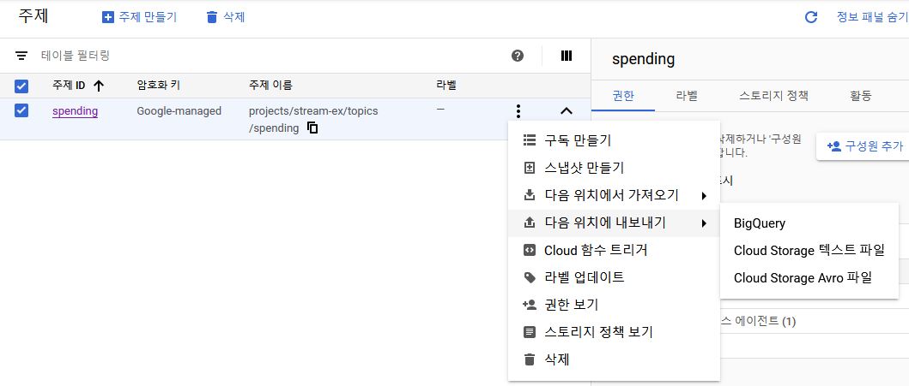
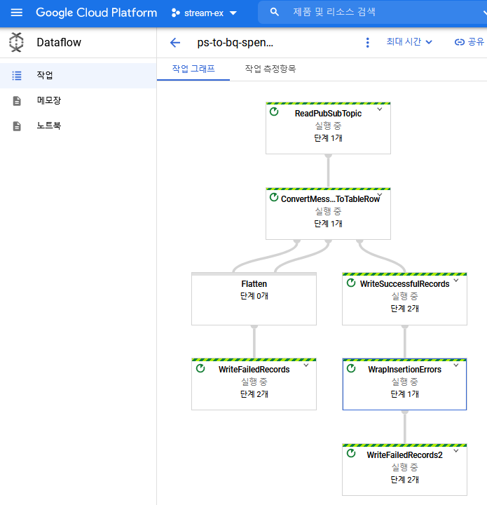
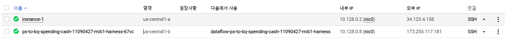

# Google Cloud Stream Processing

## 필자 수준

참고로 빅쿼리에 벌크업로드 정도 해본 정도이며 오늘 소개하는 건 전부 처음 해보는 것임. 실제 내용도 별거 없음

## 오늘 다룰 내용의 공식 문서

백서이긴 하지만 내용은 읽기 불편하지 않다.

[Google Streaming Analytics Platform White Paper](https://services.google.com/fh/files/misc/google-streaming-analytics-platform.pdf)

## 준비작업

### 가입

최초 사용시 90일간 300$을 자유롭게 사용할 수 있다. 카드정보를 입력하지만 자동 결제가 되지 않는다는 것을 매우 강조하고 있다. 유치한 디스로 보일 수 있다. 하지만 AWS 50만원쯤 날려먹은 기억이 있어서 유치하다고 말하기엔 자괴감이 좀 든다. AWS 쓸 땐 조심하자. 꺼진 인스턴스도 다시 봐라.

다음 화면이 나올때까지 정보들을 입력하자 입력하자.


## 만들어보자

### 만들 것 요약

백서 내용 중 아래 아키텍처로 구성할 거다.


이 문서에서는 데이터적재, 파이프라인, DW / DL 의 세번째 스텝까지 실습해본다. 네번째인 advanced analytics 의 경우 비교적 특정 도메인이 적합한 서비스인데 아쉽게도 저 중에 내가 아는 분야가 없다. 나열된 단어중 사용할 서비스는 다음과 같다.

1. `Cloud Pub/Sub` Kafka 같은 거
2. `Cloud Dataflow` Apache beam 기반의 managed service. [Cloud Dataproc vs Cloud Dataflow](https://dong-life.tistory.com/58)
3. `BigQuery` 성능 좋은 DB
4. `Cloud Functions` 이것으로 데이터 수집 예정
5. `Compute Engine` 가상 머신
6. `Storage` Object storage. Dataflow 임시 파일을 저장할 목적으로 사용함

### 우선 프로젝트 생성

stream-ex 라는 이름으로 프로젝트를 하나 생성했다. 기본 프로젝트로 해도 상관은 없지만 왠지 없어보이니 만들자. 만드는 메뉴위치는 찾기 어렵지 않기에 따로 설명하지는 않는다. 이후에도 찾기 어렵거나 옵션이 필요하지 않는 이상 만드는 메뉴를 모두 설명하진 않는다.


### pub/sub 설정

Pubsub 주제 생성


### 빅쿼리 설정

데이터셋과 테이블을 생성하자. 데이터셋 이름은 spending이고 테이블은 cash, credit_card 두가지를 생성한다. 테이블은 모두 spending_time 을 기준으로 일단위 파티션 되어 있다.

컬럼 스키마는 아래를 보고 정하자

[빅쿼리 표준 SQL 데이터 유형](https://cloud.google.com/bigquery/docs/schemas?hl=ko#standard_sql_data_types)

#### 데이터셋

다음과 같이 데이터셋을 생성하자.


현금 사용 내역을 저장할 cash 테이블과 신용카드 사용 내역을 저장할 cred_card 테이블을 다음 스키마로 생성하자. 신용카드 테이블이 저장하는 정보가 더 많으며 현금 테이블과 달리 consumer와 amount가 required이다.


### Cloud function

이제 pubsub에 데이터를 부어넣을 cloud function을 만들자. 함수만들기 설정은 다음과 같이했다.

- `함수이름` spending-ingest
- `리전` us-central1
- `인증되지 않은 호출 허용`
- `할당 메모리` 256MiB
- `제한시간` 10초
- `최대 함수 인스턴스` 5
- `내부트래픽만 허용` 테스트 메세지는 같은 프로젝트 내의 compute engine으로 할 것이므로 내부만 허용

다음을 누르면 코드 inline editor가 나온다. 직접 업로드하거나 GCS에 올려두고 쓸수도 있는데 길지 않은 코드이니 직접 입력하자. 무슨 언어로 하지? 아는건 java 밖에 없는데, 그래도 정석대로 js로 가자. (기본이 node.js 10 이기도 하고)

초기 inline 에디터에는 아래 껍데기 코드가 있다.

```js
/**
 * Responds to any HTTP request.
 *
 * @param {!express:Request} req HTTP request context.
 * @param {!express:Response} res HTTP response context.
 */
exports.helloWorld = (req, res) => {
  let message = req.query.message || req.body.message || 'Hello World!';
  res.status(200).send(message);
};
```

[메시지를 pubsub 주제에 게시](https://cloud.google.com/pubsub/docs/publisher?hl=ko#publishing_messages)

아래는 cash테이블과 credit-card 테이블에 적재될 json을 받아서 pubsub으로 publish 하는 cloud function 코드. 각종 node js 샘플은 여기를 참고: [github://GoogleCloudPlatform/nodejs-docs-samples](https://github.com/GoogleCloudPlatform/nodejs-docs-samples)

```js
'use strict';

// [START functions_pubsub_publish]
const {PubSub} = require('@google-cloud/pubsub');

// Instantiates a client
const pubsub = new PubSub();

exports.publish = async (req, res) => {
  if (!req.body) {  
    res .status(400).send('nobody');
    return;
  }

  console.log(`Publishing message to topic projects/stream-ex/topics/spending`);

  const messageObject = JSON.parse(req.body);
  messageObject['collect_time'] = Date.now();
  const messageBuffer = Buffer.from(JSON.stringify(messageObject), 'utf8');

  // References an existing topic

  // Publishes a message
  try {
    if (req.query['type'] == 'cash') {
      const topic = pubsub.topic('projects/stream-ex/topics/spending-cash');
      await topic.publish(messageBuffer);
      console.log('Message published to cash topic');
      res.status(200).send('Message published to cash topic');

    } else if (req.query['type'] == 'creditCard') {
      const topic = pubsub.topic('projects/stream-ex/topics/spending-cred-card');
      await topic.publish(messageBuffer);
      console.log('Message published to credit card topic');
      res.status(200).send('Message published to credit card topic');

    } else {
      console.log('Bad spending type');
      res.status(400).send('Bad spending type');
    }
  } catch (err) {
      console.error(err);
      res.status(500).send(err);
      return Promise.reject(err);
  }
};
```

### PubSub 2 BigQuery Dataflow 설정

spending-cash 주제를 빅쿼리 spending:cash 테이블에 적재해보자.



만드는 창이 뜨면 적절한 정보를 입력한 후 생성.

- `작업이름` unique한 이름. 사전에 입력되어 있음.
- `리전 엔드포인트` us-central1
- `Dataflow 템플릿` Pub/Sub Topic to Bigquery. 입력되어 있음
- `필수 매개변수` 데이터를 가져올 토픽. 입력되어 있음.
- `BigQuery output table` 데이터를 저장할 테이블 입력. stream-ex:spending.cash
- `임시 위치` Dataflow 도중 생성되는 임시 파일을 저장할 gs 주소

생성하고 나면 아래 그림처럼 dataflow의 작업 그래프가 나오며 메세지가 어떻게 처리되는지 보여준다. 사실 처음엔 apache nifi ([demo](https://www.youtube.com/watch?v=4yBc7hHvaQU)) 처럼 작업 그래프상에서 뭔가 편집 가능할 줄 알고 감탄했는데 그렇지는 않았다. 그냥 모니터링용.



### 테스트 해 봅시다

우선 curl로 하나 보내보자. Cloud shell 터미널 실행하고 다음 명령어 입력 (우상단에 >_ 이렇게 생긴 아이콘클릭) application/json이 아니라 text/plain인 이유는 묻지 마라. json으로 보내니까 제대로 처리가 안되는게 아마도 cloud function의 js 코드가 잘못된 듯 한데 삽질하고 싶지 않았다. 게으른게 부끄러운 건 아니잖아.

```bash
curl -X POST "https://us-central1-stream-ex.cloudfunctions.net/spending-ingest?type=cash" -H "Content-Type: text/plain" -d '{"consumer": "consumer-1", "amount": "100000", "merchant": "불란서 제빵소", "spending_time": "2020-01-01"}'
```

운이 좋다면 shell을 볼 수 있겠지만 개인적으로는 안될때가 더 많았다. 안되면 인스턴스에서 테스트하자.

그리고 미리 만들어둔 테스트용 jar로 여러개의 데이터를 보내보다. jar는 미리 빌드해서 gs에 올려뒀다.

1. java 설치
2. gsutil 로 storage 에 저장된 jar 다운로드
3. 실행

```bash
sudo apt-get install openjdk-11-kdk
gsutil cp gs://spending-resource/jsongen-jar-with-dependencies.jar .
java -cp jsongen-jar-with-dependencies.jar net.youngrok.jsongen.JsonGenApp
```

### credit card 테이블 적재

Dataflow를 하나 더 띄워서 credit card 도 적재해볼까? Cash에 입력할때와 동일하게 실행! 하면 짤없이 실패한다. 다음은 에러 메세지 내용이다.

```text
Workflow failed. Causes: Project stream-ex has insufficient quota(s) to execute this workflow with 1 instances in region us-central1. Quota summary (required/available): 1/6 instances, 4/3 CPUs, 1230/808 disk GB, 0/250 SSD disk GB, 1/99 instance groups, 1/49 managed instance groups, 1/99 instance templates, 1/2 in-use IP addresses.
```

4/3 CPUs 라는 부분이 눈에 띈다. VCPU 4개가 필요한데 3개밖에 여유가 없어서 dataflow를 만들 수 없다는 뜻이다. Compute Engine 대시보드에 가보면 ps-to-bq-spending-cash... 이라는 내가 만든건 아니지만 익숙한 이름의 인스턴스가 하나 있다. 바로 DataFlow가 동작하기 위해서 필요한 인스턴스이고, 4CPU 를 사용한다. 테스트 계정은 CPU 리밋이 8로 걸려 있고 변경할 수도 없기 때문에 dataflow를 하나 더 돌리려면 instance를 없애야 한다. 그렇다면 dataflow는 managed service일까 아닐까?



### 그러면 어쩌지

그래도 적재하고 싶은데. 지금까지 코딩하고 스샷 뜬게 너무 아까운데.. 다음 정도가 생각났지만 전부다 하지 말아야할 필계가 생각났기 때문에 그냥 포기

1. 돈내고 CPU 제한을 푼다. --> 내가 왜?
2. Bean SDK로 코딩해서 두개의 pipeline을 하나에 dataflow에 구동한다. --> 될지 확신이 없음.
3. Pubsub 가져와서 bigquery로 내보내는 java app 작성. --> 의미 없는 일이라 생각해서 조금하다가 관둠.

## 결론

없음. 사실 튜토리얼이란게 딱히 결론 내리는 글은 아니잖아.
