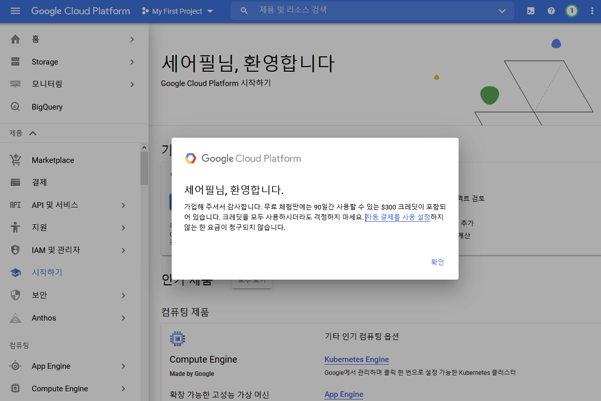
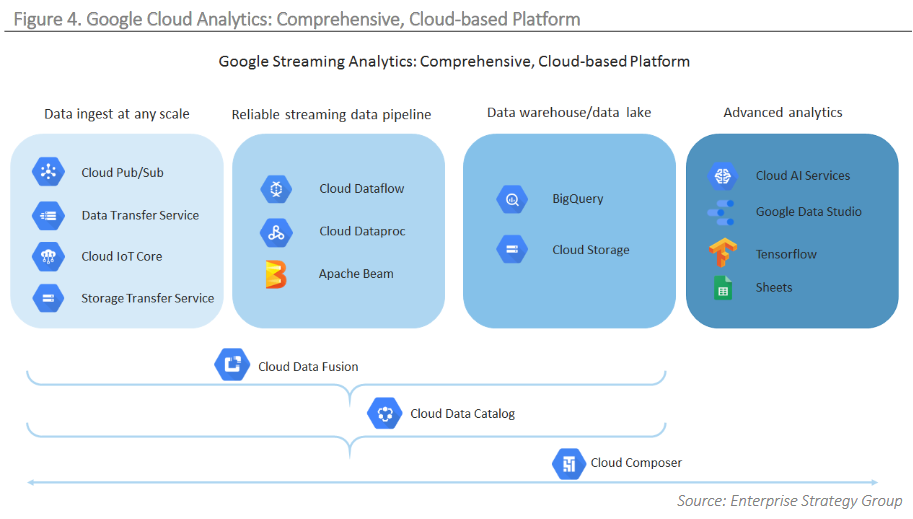
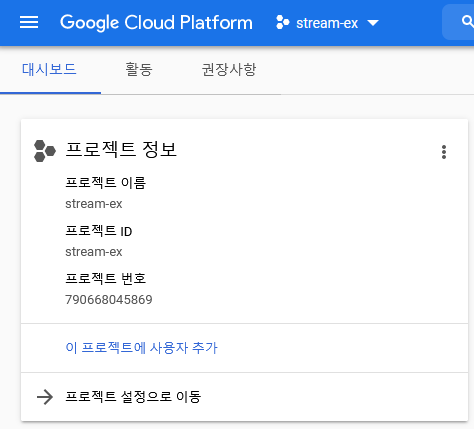
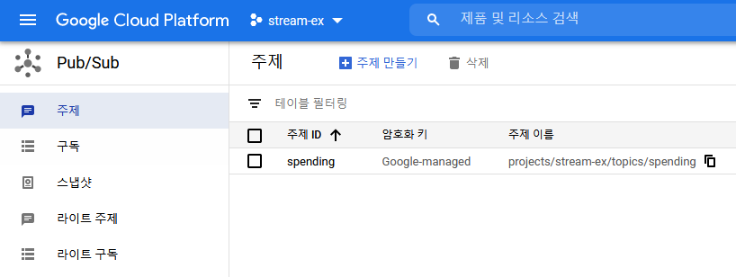
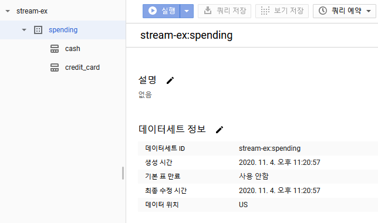
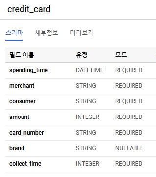
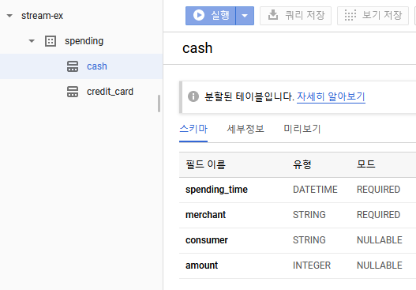

# Flink

## 필자 수준

글 작성자가 가진 flink 에 대한 경험은 샘플 몇개 실행하고서 UI 구경해본게 전부이다. 하지만 hot 하다고들 하니 일단 배경 지식부터 좀 쌓고, 어떤 use case 하나 가정해서 코딩해보는 기로 했다. 돌이켜보면 storm이든 spark이든 처음에 워드카운트 돌려보고서 알 수 있는 건 아무것도 없고 일단 어느정도 개념을 쌓아야 했다. 그나저나 왜 워드카운트를 가장 먼저 샘플로 내세우는 걸까?

## 어떻게 접근할까?

어떤 식으로 flink 에 접근할지 고민이 됐다.

0. Akka 에 기반하고 있다고 하니 actors 패턴부터 시작해서 플랫폼 내부에 대해서 다룰까? [Akka and Actors](https://cwiki.apache.org/confluence/display/FLINK/Akka+and+Actors)
1. 스트림 프로세싱에 대한 배결설명부터 설명할까?
2. 대표적인 use case 를 잡고 설명할까?
3. 다 됐고 쉬운 것으로 hands on을 할까?

사실 마음같아서는 다하고 싶지만 막상 하나도 제대로 작성할 능력이 안되는 게 현실이다. 그래서 비교적 쉬운 방식인 (하지만 가장 지루한 방식인) 1번으로 하기로 했다.

필자가 너무 무식한 사람으로 깔고 시작했는데 그래도 아주 오래전에 storm, kafka 등의 스트림 프로세싱 툴을 운영하고 코딩도 해봤다.

## 배경 지식

### 배치 프로세싱 vs 스트림 프로세싱

[아파치 실시간 처리 프레임워크 비교분석 (1) - popit.kr](https://www.popit.kr/%EC%95%84%ED%8C%8C%EC%B9%98-%EC%8B%A4%EC%8B%9C%EA%B0%84-%EC%B2%98%EB%A6%AC-%ED%94%84%EB%A0%88%EC%9E%84%EC%9B%8C%ED%81%AC-%EB%B9%84%EA%B5%90%EB%B6%84%EC%84%9D-1/)

[아파치 실시간 처리 프레임워크 비교분석 (2) - popit.kr](https://www.popit.kr/%EC%95%84%ED%8C%8C%EC%B9%98-%EC%8B%A4%EC%8B%9C%EA%B0%84-%EC%B2%98%EB%A6%AC-%ED%94%84%EB%A0%88%EC%9E%84%EC%9B%8C%ED%81%AC-%EB%B9%84%EA%B5%90%EB%B6%84%EC%84%9D-2/)

### 스트림 프로세싱

### 스트림 프로세싱 플랫폼 비교

## Flink

### 구조

### 프로그래밍 모델

### 간단한 모델

## 시작

우선 참고 문서. 백서이긴 하지만 내용은 읽기 불편하지 않다.

[Google Streaming Analytics Platform White Paper](https://services.google.com/fh/files/misc/google-streaming-analytics-platform.pdf)

## 준비작업

### 가입

최초 사용시 90일간 300$을 자유롭게 사용할 수 있다. 카드정보를 입력하지만 자동 결제가 되지 않는다는 것을 매우 강조하고 있다. 유치한 디스로 보일 수 있다. 하지만 나역시 50만원쯤 날려먹은 기억이 있어서 유치하다고 말하기엔 자괴감이 좀 든다. AWS 쓸 땐 조심하자. 꺼진 인스턴스도 다시 봐라.

다음 화면이 나올때까지 정보들을 입력하자 입력하자.

백서 내용 중 아래 아키텍처로 구성할 거다.

이 문서에서는 데이터적재, 파이프라인, DW / DL 의 세번째 스텝까지 실습해본다. 네번째인 advanced analytics 의 경우 비교적 특정 도메인이 적합한 서비스인데 아쉽게도 저 중에 내가 아는 분야가 없다. 나열된 단어중 사용할 서비스는 다음과 같다.

- `Cloud Pub/Sub` Kafka 같은 거
- `Cloud Dataflow` Stream Processing. Apache beam 기반의 managed service. [Cloud Dataproc vs Cloud Dataflow](https://dong-life.tistory.com/58)
- `BigQuery` 성능 좋은 DB

추가로 데이터를 수집하고 처리하기 위해서 다음 항목도 추가

- `Cloud Functions` 이것으로 데이터 수집 예정
- `Compute Engine` 가상 머신

### 참고

예시를 위한 것이며 프로젝트 권한과 같은 부분은 다루지 않음

## 만들어보자

### 만들 것 요약

데이터 처리 시스템에 사용되는 서비스

1. `Cloud Functions` Json 데이터를 web 으로 수신한 후 pub/sub 으로 publish
2. `Pub/Sub` Message queue
3. `DataFlow` Pub/Sub의 메세지를 파싱하여 bigquery 테이블에 저장
4. `BigQuery` DW

테스트에는 일반 가상머신을 사용한다.

- `Compute Engine` Json 데이터 발송

### 우선 프로젝트 생성

stream-ex 라는 이름으로 프로젝트를 하나 생성했다. 기본 프로젝트로 해도 상관은 없지만 왠지 없어보이니 만들자. 만드는 메뉴위치는 찾기 어렵지 않기에 따로 설명하지는 않는다. 이후에도 찾기 어렵거나 옵션이 필요하지 않는 이상 만드는 메뉴를 모두 설명하진 않는다.

### pub/sub 설정

Pubsub 주제 생성

### 빅쿼리 설정

데이터셋과 테이블을 생성하자. 데이터셋 이름은 spending이고 테이블은 cash, credit_card 두가지를 생성한다. 테이블은 모두 spending_time 을 기준으로 일단위 파티션 되어 있다.

컬럼 스키마는 아래를 보고 정하자

[빅쿼리 표준 SQL 데이터 유형](https://cloud.google.com/bigquery/docs/schemas?hl=ko#standard_sql_data_types)

#### 데이터셋

#### credit_card table

Credit_card 테이블에는 신용카드 사용 정보를 저장한다.

#### cash table

Cash 테이블은 현금 사용 정보를 저장한다. 신용카드보다 정보가 적고 consumer와 amount가 nullable인 것이 특징이다.

