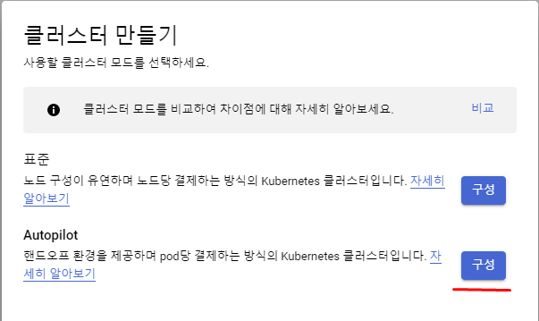
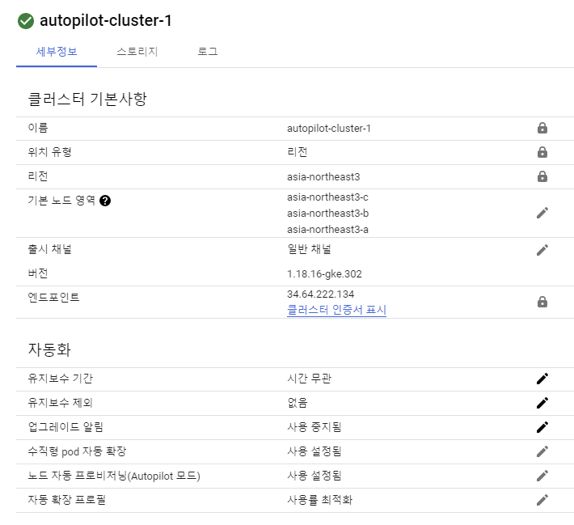
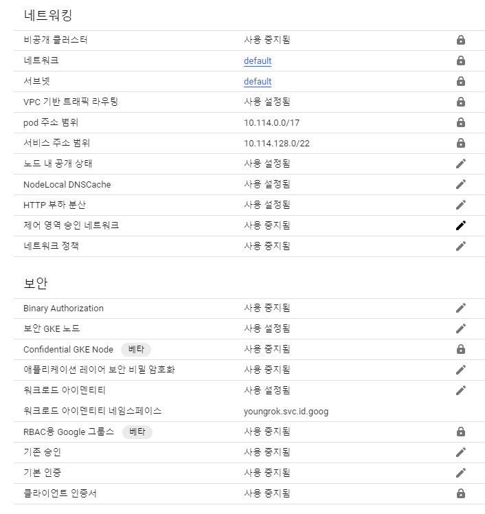
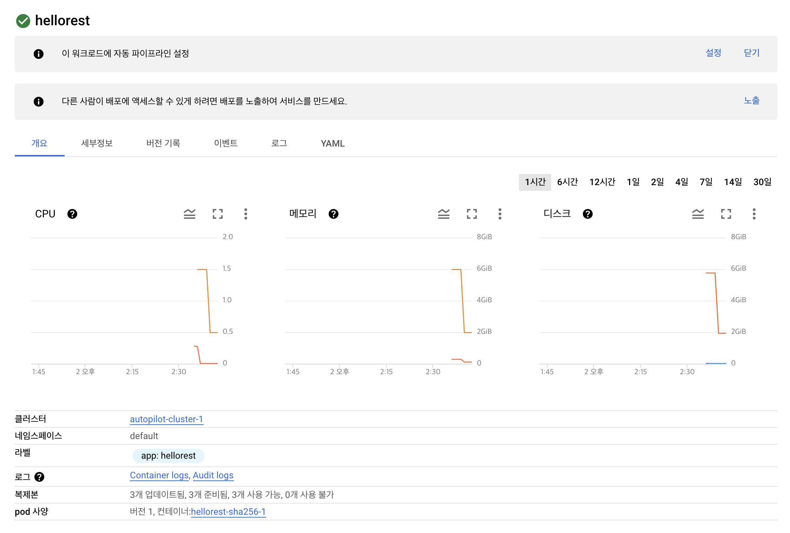
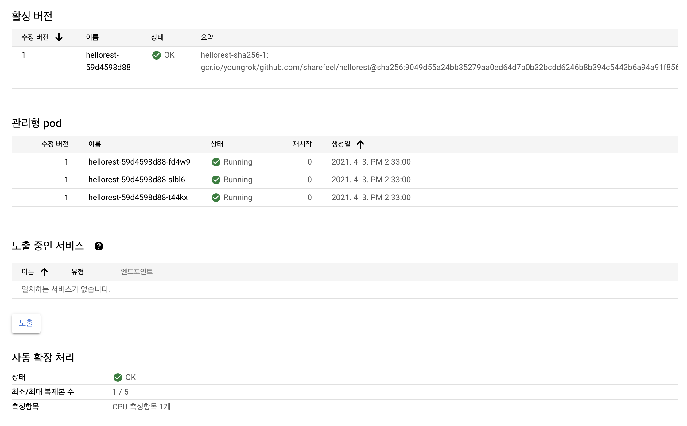
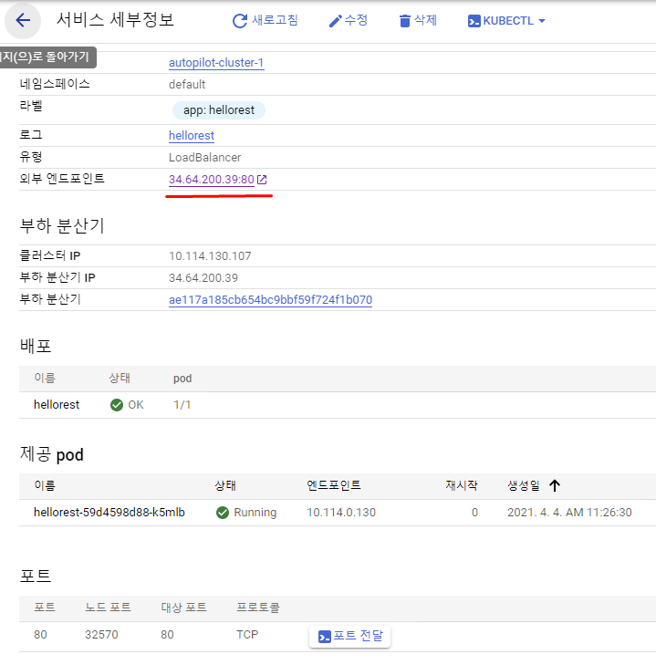
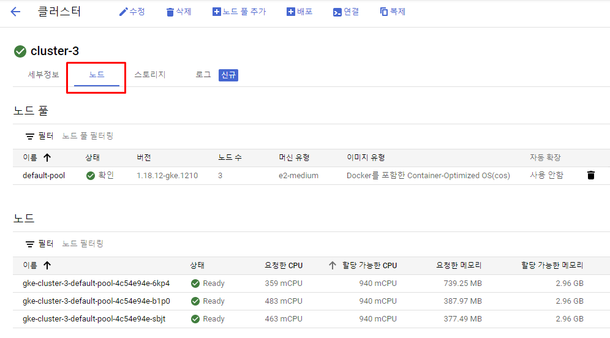
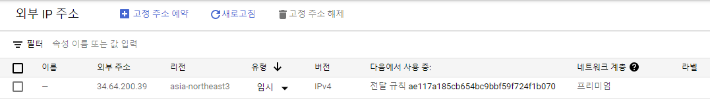
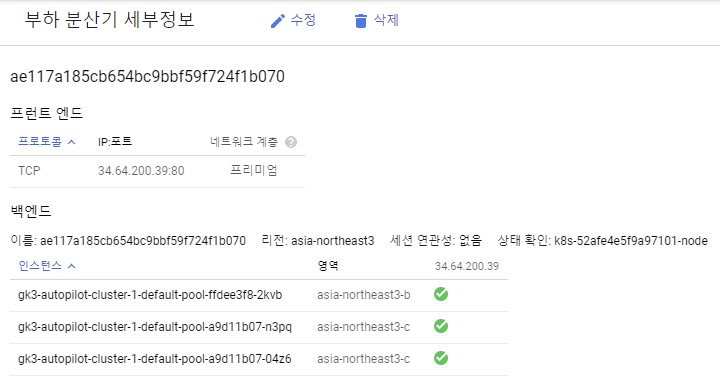

# GCP Kubernetes Engine AutoPilot Mode

## 개요

### 문서 내용

이 문서는 다음 내용으로 구성되어 있다.

1. GKE Autopilot 모드로 심플한 k8s 서비스 생성 예제
2. Kubernetes 개요

맞다. 개요보다 예제가 먼저 있다. 사실 이 문서는 ops 좀 아는 devs를 위한 게 아니다. 이 문서의 대상 독자는 "docker start" 정도 해본 사람 중 GKE에서 프로그램을 구동해야하는 자들이다.

### GKE 클러스터 두가지

2021/04/03 기준 GKE에서는 두가지 방법으로 클러스터를 생성할 수 있다.

1. 표준모드
2. Auto Pilot 모드

사용의 간편함부터 과금 단위까지 여러가지 차이가 있다. 자세한건 여길 참고: [Autopilot 개요 - Google GKE 가이드](https://cloud.google.com/kubernetes-engine/docs/concepts/autopilot-overview?hl=ko)

이 문서에서는 Auto Pilot을 다룰 것인데 그 이유는 다음과 같다.

- `쉽다` Pod 단위만 생각하면 되므로 쉽다. 상술했듯이 이 문서의 독자는 docker start 정도 해본사람이다.
- `전형적인 클러스터` 매우 전형적이고 단순한 서비스를 배포할 것이며 그 목적에 autopilot 모드가 딱이다.

## Autopilot 모드를 사용한 서비스 생성 예제

### Auto Pilot으로 kubernetes 클러스터 생성

가장 먼저 k8s 클러스터 생성이 필요하다. Auto pilot으로 생성하는 화면으로 이름과 리전만 설정하면 된다. 입력 내용이 중요한 것은 아니고 autopilot 이 무엇을 해주는지 한번 읽어보자.

메뉴: Kubernetes Engine > 클러스터 > 만들기 > Autopilot 구성

다음은 생성화면인데 클러스터 이름과 리전만 입력하면 클러스터가 생성된다. 생성까지는 꽤 걸린다. 여담인데 삭제도 꽤 걸린다.



실제 생성된 클러스터 설정은 다음과 같다. 위치 유형은 자동으로 리전으로 되어 있으며 세가지 영역이 모두 포함되어 있다. 참고로 표준모드로 생성하면 위치 유형을 리전과 영역 중 선택할 수 있다. 참고로 autopilot 서울리전의 a,b,c 모든 영역이 포함되는 것처럼 보이지만 실제로 그렇지는 않다. 때에 따라 a,b,b 영역이 포함되기도 하는데 이유는 모르겠다. 위치 유형 외에도 여러가지가 기본으로 설정되어 있다.

<details> <summary> cluster 상세 설정 (펼쳐보기) </summary>




</details>

### 배포할 컨테이너

배포할 프로그램은 매우 간단한 spring-boot 프로그램이다. 이 소스코드는 `github.com/sharefeel/hellorest`에 업로드되어 있다고 가정한다.

```java
@RestController
@RequestMapping("/")
@SpringBootApplication
public class HelloRestApp {

    public static void main(String... args) {
        SpringApplication.run(HelloRestApp.class);
    }

    @GetMapping("hello")
    public ResponseEntity<String> hello() throws UnknownHostException {
        String localAddress = InetAddress.getLocalHost().getHostAddress();
        String localHostName = InetAddress.getLocalHost().getHostName();
        return ResponseEntity.ok("GitHub ver 2. I am " + localHostName + "(" + localAddress + ") ");
    }

    @GetMapping("alive")
    public ResponseEntity<String> alive() {
        return ResponseEntity.ok("alive ");
    }
}
```

아래는 cloud build 에 의해서 실행될 Dockerfile이다. Java 11 상에서 프로그램을 구동하는 이미지를 생성한다. Distroless java는 경량의 리눅스와 open-jdk 기반 runtime 이다. Java 8과 11이 지원된다. [[GitHub Distroless Java]](https://github.com/GoogleContainerTools/distroless/tree/master/java) Open-jdk jre를 base image로 사용하는 경우보다 이미지 크기가 작다.

```Dockerfile
# Build stage
FROM maven:3-openjdk-11-slim AS build
COPY src /home/app/src
COPY pom.xml /home/app
RUN mvn -f /home/app/pom.xml clean package -Dmaven.test.skip=true

# Package stage
FROM gcr.io/distroless/java:11
COPY --from=build /home/app/target/hellorest-github.jar /usr/local/lib/app.jar
EXPOSE 8080
ENTRYPOINT ["java","-jar","/usr/local/lib/app.jar"]
```

### 배포할 컨테이너 이미지 빌드

배포를 위해서 github 소스를 가져와 docker 빌드 후 gcr 업로드해야 한다. 다음 정보로 build trigger 생성하고 트리거를 실행하자.

콘솔메뉴: Cloud 빌드 > 트리거 > 트리거 만들기

- `이름` hellorest-trigger
- `태그` k8s-autopilot (필수 입력 아님)
- `트리거` 수동호출
- `소스`
  - `저장소` sharefeel/hellorest
  - `버전` 브랜치 / main
- `구성`
  - `유형` Dockerfile
  - `위치` 저장소
  - `Dockerfile 디렉토리` / (default)
  - `Dockerfile 이름` Dockerfile (default)
  - `이미지 이름` gcr.io/youngrok/github.com/sharefeel/hellorest:$COMMIT_SHA (default)

Github main branch 를 가져와 docker 빌드하는 것으로써 설정상 특별한 것은 없다. 알아둘 것은 가장 마지막행 `이미지 이름` 부분으로 이 이름으로 container registry 에 push 된다. 사실 CI/CD를 구성한다면 Dockerfile 이 아니라 inline 스크립트 또는 cloudbuild.yaml 파일을 사용하게 될 것이다.

### Cluster에 이미지 배포

성공적으로 빌드되고 gcr에 이미지가 push되었으면 k8s 클러스터에 배포할 수 있다.

콘솔메뉴: kubernetes engine > deploy

1. `컨테이너`
   1. 기존 컨테이너 이미지 (default)
   2. container registry에 업로드된 이미지 선택 - gcr.io/youngrok/github.com/sharefeel/hellorest@sha256:...
2. `구성`
   1. `애플리케이션 이름` hellorest
   2. `Kubernetes 클러스터` autopilot-cluster-1 (asia-northeast3)
3. `배포`

(오래) 기다리면 배포 결과 화면이 나온다. 리소스가 모자른다는 식의 에러들은 무시하자. 리프레시 하다보면 에러가 없어진다. 배포작업 완료후에 측정해야할 값들을 배포중에 측정함으로써 리소스가 모자라다고 출력된가 아닐까? 라고 추측은 해보지만 뇌피셜이다.

<details> <summary> 배포된 상태의 클러스터 </summary>




</details>

전체적으로 특별한 내용은 없다. 단 `노출하라` 라는 메세지가 눈에 띈다. 현재 컨테이너가 pod로 배포되어 있지만 접속 가능한 상태는 아니다.

### 서비스 노출

이 클러스터는 진입점이 없이 pod 만 배포된 상태이다. 그럼 접속 가능하도록 노출시켜보자. 노출 버튼을 클릭하고 다음 내용을 입력.

- `포트매핑`
  - `포트` 80
  - `대상 포트` 8080
  - `프로토콜` TCP
- `서비스 유형` 부하 분산기
- `서비스 이름` hellorest-service

아래는 실행한 결과이다. 접속가능한 endpoint가 생성되어 있다.



접속 가능하다.

```bash
% curl http://34.64.200.39/hello
GitHub ver 2. I am hellorest-59d4598d88-fd4w9(10.114.0.194)
```

쉽다.

### 알게 모르게 생성된 infra

배포해서 접속테스트 하는 것까지 살펴봤다. 여기서부터는 생성되어 있는 리소스를 살펴보자. 직접적으로 생성한 것도 있고 google cloud가 알아서 생성한 것도 있는데 크게 다음 두가지로 나눠볼 수 있을 것이다. ("것"은 편의상 리소스로 통칭)

- `Kubernetes 리소스` Kubernetes cluster, node instance, health check (상태확인) 기능
- `네트워크 리소스` Load Balancer, 외부IP, 포워딩 룰
- `빌드 리소스` CloudBuild 트리거, Container registry 이미지

나열되지 않은 것이 더 있을 수도 있다. 클릭 몇번에 필요 리소스를 대신 식별해주니 편리하고 운영 코스트가 줄어드니 좋다고 생각할 수도 있다. 하지만 주의할 것이 있다. GKE autopilot은 그 자체로 managed 서비스가 아니며 기존 리소스를 조합하여 하나의 서비스처럼 보이는 것이다. 이때 각 리소스 단위로 빌링이 이루어지며 리소스의 해제의 최종적인 책임 역시 사용자에게있다. 예를 들어 k8s 클러스터를 삭제하더라도 네트워크리소스는 삭제되지 않기 때문에 외부IP 비용이 계속 발생하게 된다.

#### VM Instance

Autopilot 모드에서는 VM 인스턴스는 생성되지 않는다. 즉 사람은 pod가 동작할 node는 신경쓸 필요가 없다.

```bash
% gcloud compute instances list
Listed 0 items.
```

반면 표준 모드로 k8s 클러스터를 생성한 경우 다음과 node instance가 생성된다. 사실 autopilot 모드로 생성하면 클러스터 정보에서 `노드` 탭 자체가 없다.



#### 외부 IP

노출을 위해서 외부 IP가 하나 할당된다.

콘솔메뉴: VPC 네트워크 > 외부 IP 주소



#### Load Balancer

로드밸런서 역시 생성된다.

메뉴: 네트워크 서비스 > 부하 분산



---

## 이제 위에서 한 일을 설명해보자

### Kubernetes?

Kubernetes란 무엇인가? 원문: [쿠버네티스란 무엇인가? - kubernetes.io](https://kubernetes.io/ko/docs/concepts/overview/what-is-kubernetes/)

아래그림은 container가 무엇인지를 기존 인프라와 비교하여 설명하고 있다.


쿠버네티스는 다음을 제공한다.

- `서비스 디스커버리와 로드 밸런싱` 쿠버네티스는 DNS 이름을 사용하거나 자체 IP 주소를 사용하여 컨테이너를 노출할 수 있다. 컨테이너에 대한 트래픽이 많으면, 쿠버네티스는 네트워크 트래픽을 로드밸런싱하고 배포하여 배포가 안정적으로 이루어질 수 있다.
- `스토리지 오케스트레이션` 쿠버네티스를 사용하면 로컬 저장소, 공용 클라우드 공급자 등과 같이 원하는 저장소 시스템을 자동으로 탑재 할 수 있다.
- `자동화된 롤아웃과 롤백` 쿠버네티스를 사용하여 배포된 컨테이너의 원하는 상태를 서술할 수 있으며 현재 상태를 원하는 상태로 설정한 속도에 따라 변경할 수 있다. 예를 들어 쿠버네티스를 자동화해서 배포용 새 컨테이너를 만들고, 기존 컨테이너를 제거하고, 모든 리소스를 새 컨테이너에 적용할 수 있다.
- `자동화된 빈 패킹(bin packing)` 컨테이너화된 작업을 실행하는데 사용할 수 있는 쿠버네티스 클러스터 노드를 제공한다. 각 컨테이너가 필요로 하는 CPU와 메모리(RAM)를 쿠버네티스에게 지시한다. 쿠버네티스는 컨테이너를 노드에 맞추어서 리소스를 가장 잘 사용할 수 있도록 해준다.
- `자동화된 복구(self-healing)` 쿠버네티스는 실패한 컨테이너를 다시 시작하고, 컨테이너를 교체하며, '사용자 정의 상태 검사'에 응답하지 않는 컨테이너를 죽이고, 서비스 준비가 끝날 때까지 그러한 과정을 클라이언트에 보여주지 않는다.
- `시크릿과 구성 관리` 쿠버네티스를 사용하면 암호, OAuth 토큰 및 SSH 키와 같은 중요한 정보를 저장하고 관리 할 수 있다. 컨테이너 이미지를 재구성하지 않고 스택 구성에 시크릿을 노출하지 않고도 시크릿 및 애플리케이션 구성을 배포 및 업데이트 할 수 있다

Kubernetes components 출처: [쿠버네티스 컴포넌트 - kubernetes.io](https://kubernetes.io/ko/docs/concepts/overview/components/)


각 components 에 대한 상세 내용은 링크 안에서!

### Kubernetes Cluster

위에서는 k8s의 구조를 살펴봤다. 그렇다면 이것이 cloud 상에서 배포되었을때 어떤 형태인지 살펴보자. 다음은 azure aks 마이크로서비스 아키텍처 문서이다. 위 gke autopilot hands-on 의 결과로 생성된 클러스터는 aks microservice architecture의 일부이다.

[AKS(Azure Kubernetes Service)의 마이크로 서비스 아키텍처](https://docs.microsoft.com/ko-kr/azure/architecture/reference-architectures/containers/aks-microservices/aks-microservices)


