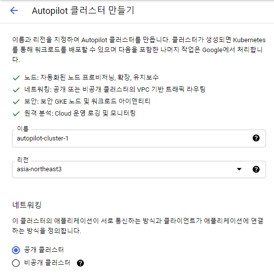

# GCP Kubernetes Engine AutoPilot Mode

2021/04/03 기준 GKE에서는 두가지 방법으로 클러스터를 생성할 수 있다.

1. 기본(?)
2. Auto Pilot

사용의 간편함부터 과금 단위까지 여러가지 차이가 있다. 자세한건 auto pilot 문서를 참고하라. 그냥 문서 링크.
이 문서에서는 Auto Pilot을 다룰 것인데 그 이유는 다음과 같다.

- Pod 단위만 생각하면 되므로 쉽다
- 클러스터의 한가지 표준을 볼 수 있다.

## 일단 Kubernetes 가 뭔지는 아래 링크 참고

참고할만한 링크

### Auto Pilot으로 클러스터 생성

콘솔에서 auto pilot으로 생성하는 방법. 리전만 설정하면 만들 수 있다.




실제 생성된 클러스터 설정은 다음과 같다. 여러 설정이 기본으로 세팅되어 있다.

<details> <summary> cluster 상세 설정 (펼쳐보기) </summary>


</details>

### 배포할 컨테이너

매우 간단한 spring-boot code 이다.

```java
@RestController
@RequestMapping("/")
@SpringBootApplication
public class HelloRestApp {

    public static void main(String... args) {
        SpringApplication.run(HelloRestApp.class);
    }

    @GetMapping("hello")
    public ResponseEntity<String> hello() throws UnknownHostException {
        String localAddress = InetAddress.getLocalHost().getHostAddress();
        String localHostName = InetAddress.getLocalHost().getHostName();
        return ResponseEntity.ok("GitHub ver 2. I am " + localHostName + "(" + localAddress + ") ");
    }

    @GetMapping("alive")
    public ResponseEntity<String> alive() {
        return ResponseEntity.ok("alive ");
    }
}
```

아래는 cloud build 에 의해서 실행될 Dockerfile이다. Java 11 상에서 위 프로그램을 동작시킨다.

```Dockerfile
# Build stage
FROM maven:3-openjdk-11-slim AS build
COPY src /home/app/src
COPY pom.xml /home/app
RUN mvn -f /home/app/pom.xml clean package -Dmaven.test.skip=true

# Package stage
FROM gcr.io/distroless/java:11
COPY --from=build /home/app/target/hellorest-github.jar /usr/local/lib/app.jar
EXPOSE 8080
ENTRYPOINT ["java","-jar","/usr/local/lib/app.jar"]
```

### Cloud Build

Dockerfile 빌드후 gcr 업로드

위 소스코드는 github에 업로드 되어 있다.

다음 정보로 build trigger 생성

- `이름` hellorest-trigger
- `태그` k8s-autopilot (필수 입력 아님)
- `트리거` 수동호출
- `소스`
  - `저장소` sharefeel/hellorest
  - `버전` 브랜치 / main
- `구성`
  - `유형` Dockerfile
  - `위치` 저장소
  - `Dockerfile 디렉토리` / (default)
  - `Dockerfile 이름` Dockerfile (default)
  - `이미지 이름` gcr.io/youngrok/github.com/sharefeel/hellorest:$COMMIT_SHA (default)

Github main branch 를 가져와 docker 빌드하는 것으로써 설정상 특별한 것은 없다. 알아둘 것은 가장 마지막행 `이미지 이름` 부분으로 이 이름으로 container registry 에 push 된다.

### 배포

kubernetes engine > deploy

1. `컨테이너`
   1. 기존 컨테이너 이미지 (default)
   2. container registry에 업로드된 이미지 선택 - gcr.io/youngrok/github.com/sharefeel/hellorest@sha256:...
2. `구성`
   1. `애플리케이션 이름` hellorest
   2. `Kubernetes 클러스터` autopilot-cluster-1 (asia-northeast3)
3. `배포`

몇분 기다리면 배포 결과 화면이 나온다. 리소스가 모자른다는 식의 에러들은 무시하자. 리프레시 하다보면 에러가 없어진다. 배포작업 완료후에 측정해야할 값들을 배포중에 측정함으로써 리소스가 모자라다고 출력된가 아닐까? 라고 추측은 해보지만 뇌피셜이다.

배포 설정 이미지 추가

설명

### 서비스 노출

서비스 노출 하라고 나올 것이다. 이 클러스터는 진입점이 없이 pod 만 배포된 상태이다. 이를 설정해야 접속이 가능하다.

서비스 노출 스크린샷

```yaml
---
apiVersion: "v1"
kind: "Service"
metadata:
  name: "hellorest-service"
  namespace: "default"
  labels:
    app: "hellorest"
spec:
  ports:
  - protocol: "TCP"
    port: 80
    targetPort: 8080
  selector:
    app: "hellorest"
  type: "LoadBalancer"
  loadBalancerIP: ""
```

생성된 서비스 오버뷰 이미지

접속 가능하다.

```bash
% curl http://34.64.200.39/hello
GitHub ver 2. I am hellorest-59d4598d88-fd4w9(10.114.0.194)
```

### 알게 모르게 생성된 infra

생성되는 것
Kubernetes 요소들, Kubernetes node health check
네트웍 요소들: Load Balancer, 외부IP, 포워딩 룰

#### VM Instance

VM 인스턴스는 생성되지 않는다.

```bash
% gcloud compute instances list
Listed 0 items.
```

반면 autopilot 모드가 아닌경우 다음과 node instance 가 생성된다.

-- 일반 클러스터의 스크린샷

#### LoadBalancer & IP

메뉴: 네트워크 서비스 > 부하 분산

접속 가능한 로드밸런서 외부 ip가 생성되었다.

메뉴: VPC 네트워크 > 외부 IP 주소

## Kubernetes (k8s)

어떤가 autopilot 모드로 region 단위 가용성을 가지는 http rest 서비스를 만드는 것은 매우 쉽지 않은가?

Kubernetes 작업과, 
