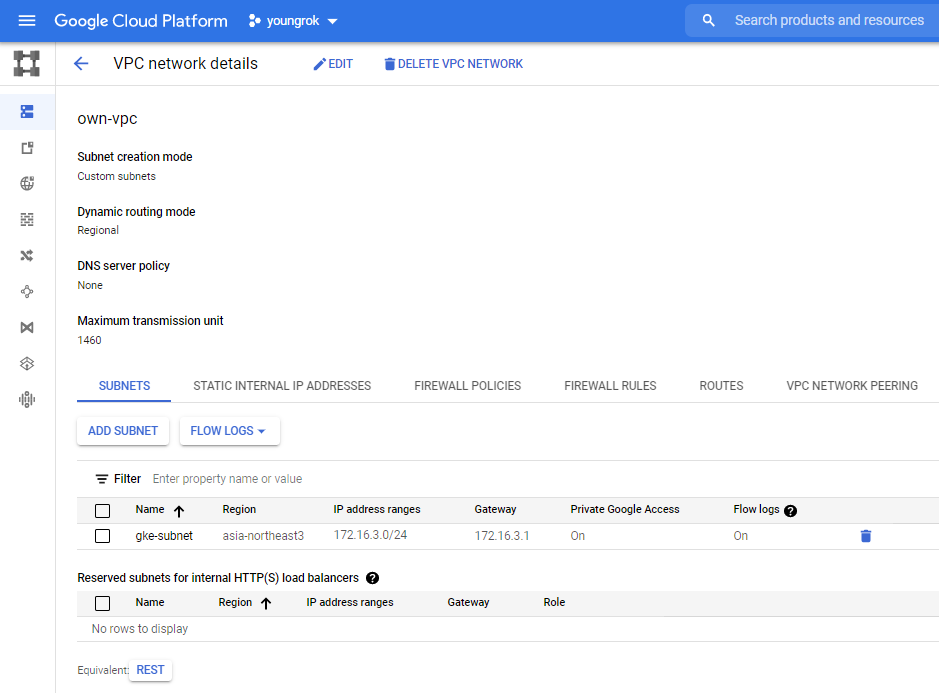
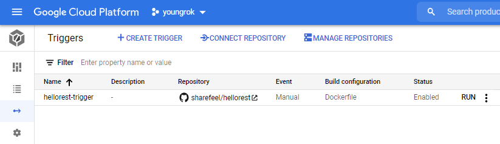
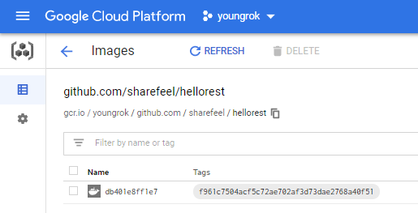
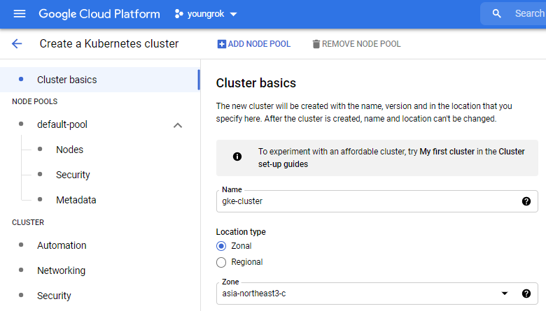
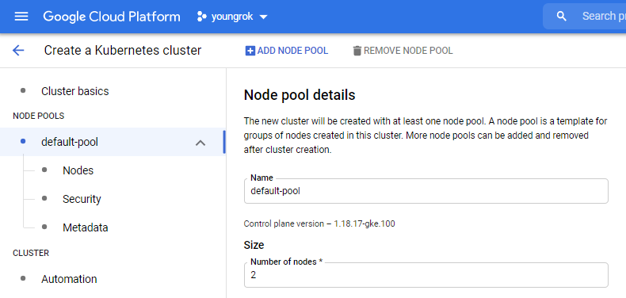
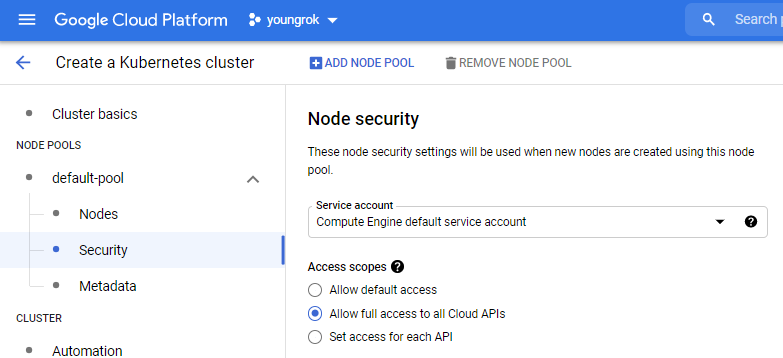
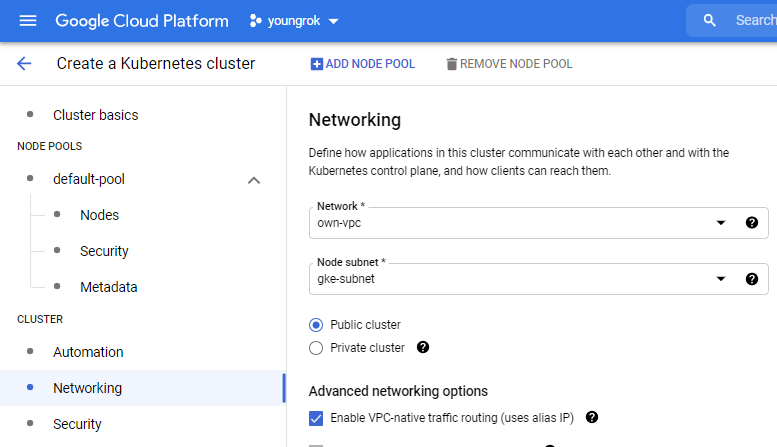
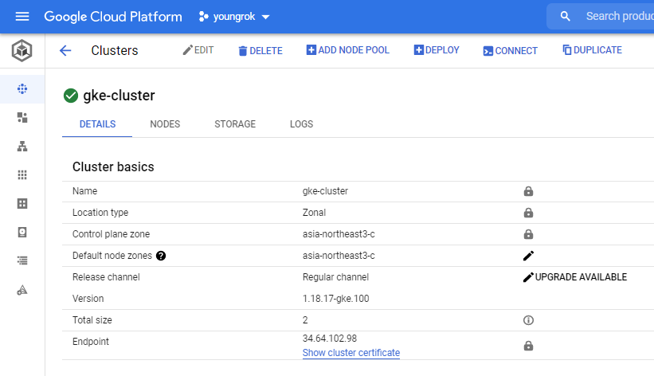

# Google Kubernetes Engine Private Cluster Container Deployment with CloudBuild

이 문서는 GKE Private cluster에 Cloud Build를 통해서 container를 배포하는 방법을 소개한다. 매우 장문이므로 천천히 읽어보자.

## 문제가 무엇인가?

GKE 클러스터에 보안상의 이유로 직접적인 접근을 제한하기 위해서 클러스터 생성시 다음 옵션을 줄 수 있다.

1. Private 클러스터로 구성
2. Control plane의 endpoint를 private ip로 지정

1번 설정에 의해 node는 external ip를 가지지 않게 되는데 이는 당연한 설정이고 이 문서의 관심사는 아니다. 이 문서에서 다루려는 것은 바로 2번으로 인해서 발생하는 컨테이너 배포 문제와 그 해결 방법이다. Cloud Build 를 통해 컨테이너를 배포하기 위해서는 다음 역할을 하는 트리거를 작성해야 한다.

1. 소스 저장소 clone
2. docker 빌드
3. Container Registry 로 빌드 결과 push
4. kubectl을 통해서 배포
   1. k8s 클러스터의 credential을 가져옴
   2. kubectl set image 를 통해서 pod의 컨테이너 이미지 교체

이때 control plane의 endpoint가 external ip를 가지지 않은 경우 4.2 단계에서 실패하게 된다. 이는 Cloud Build의 워커장비 즉 kubectl을 호출하는 장비가 endpoint에 접속을 못하기 때문이다. 또 external ip를 부여한 후 방화벽으로 CloudBuild의 접속만을 허용하는 방법도 사용할 수 없다. 이유는 Cloud Build 워커장비의 IP를 특정할 수 없기 때문이다.

## 어떻게 해결할 것인가?

### Management VM

GKE 클러스터와 같은 서브넷 내에 private ip만 가지는 VM을 생성한다. 이 VM은 private endpoint에도 kubectl 명령어를 실행할 수 있다. CloudBuild에서는 이 VM에 gcloud ssh를 통해서 kubectl 명령어를 실행함으로써 배포를 수행한다.

사실 CloudSDK를 사용해서는 k8s 관리가 충분하지 않기 때문에 어차피 클러스터를 관리할 가상머신이 필요하다. 배포를 위해 새로운 무언가를 만들어내는 것은 아니며 존재하는 VM을 활용하는 것이다.

### IAP Tunneling

관리 VM을 통한 배포가 설립하기 위해서는 CloudBuild에서 VM에 ssh 명령을 수행할 수 있어야 한다. 즉 22번 포트로 접근 가능해야 하며 ssh key 교환이 이뤄져 있어야 한다. 위에서도 언급했듯이 CloudBuild는 IP를 특정할 수 없는 문제가 발생하는데 이는 CloudBuild가 관리 VM으로 IAP 터널을 생성하도록 설정하여 해결한다. 다음 두 설정이 필요하다.

1. CloudBuild service account 의 권한 업데이트
2. IAP 명령이 유입되는 대역에 대해서 22 포트 방화벽 허용

설정 방법은 아래에서 다룬다.

## 해보자

다음 순서로 External Endpoint, Private Endpoint, Private Endpoint + Manager VM 세가지 방법을 비교할 것이다. 1번은 배포가 성공하지만 external ip란 문제가 있고, 2번은 배포가 실패한다. 최종적으로 3번방식 즉 manager vm을 추가하여 성공하는 방법을 보인다.

0. 준비, 세팅
   1. VPC, Subnet 설정
   2. 배포할 컨테이너 소스코드
1. Private Cluster / Private IP EndPoint의 배포 실패 
2. 관리 VM을 통한 배포
   1. Manager VM 추가
   2. Cloud Build 를 통한 배포 (실패 버전)
   3. IAP 터널링 세팅
   4. 배포 성공

### 준비, 세팅

#### VPC, Subnet 준비

테스트에 사용할 VPC와 subnet을 생성하자. 이 항목은 ontheterrace님 블로그의 [[GCP] GKE 구성하기 (1) - VPC 생성](https://ontheterrace.tistory.com/entry/GKE-VPC-%EC%83%9D%EC%84%B1%ED%95%98%EA%B8%B0?category=825811) 포스트를 참고했다. Cloud shell (또는 CloudSDK 설치된 장비)에서 다음 두 명령어를 실행하자.

```bash
gcloud compute networks create own-vpc --project=youngrok --subnet-mode=custom --mtu=1460 --bgp-routing-mode=regional

gcloud compute networks subnets create gke-subnet --project=youngrok --range=172.16.3.0/24 --network=own-vpc --region=asia-northeast3 --enable-private-ip-google-access --enable-flow-logs --logging-aggregation-interval=interval-5-sec --logging-flow-sampling=0.5 --logging-metadata=include-all
```

아래는 실제 실행한 후 출력화면이다.

```bash
ko_youngrok@cloudshell:~ (youngrok)$ gcloud compute networks create own-vpc --project=youngrok --subnet-mode=custom --mtu=1460 --bgp-routing-mode=regional
Created [https://www.googleapis.com/compute/v1/projects/youngrok/global/networks/own-vpc].
NAME     SUBNET_MODE  BGP_ROUTING_MODE  IPV4_RANGE  GATEWAY_IPV4
own-vpc  CUSTOM       REGIONAL

Instances on this network will not be reachable until firewall rules
are created. As an example, you can allow all internal traffic between
instances as well as SSH, RDP, and ICMP by running:

$ gcloud compute firewall-rules create <FIREWALL_NAME> --network own-vpc --allow tcp,udp,icmp --source-ranges <IP_RANGE>
$ gcloud compute firewall-rules create <FIREWALL_NAME> --network own-vpc --allow tcp:22,tcp:3389,icmp

ko_youngrok@cloudshell:~ (youngrok)$ gcloud compute networks subnets create gke-subnet --project=youngrok --range=172.16.3.0/24 --network=own-vpc --region=asia-northeast3 --enable-private-ip-google-access --enable-flow-logs --logging-aggregation-interval=interval-
5-sec --logging-flow-sampling=0.5 --logging-metadata=include-all
Created [https://www.googleapis.com/compute/v1/projects/youngrok/regions/asia-northeast3/subnetworks/gke-subnet].
NAME        REGION           NETWORK  RANGE
gke-subnet  asia-northeast3  own-vpc  172.16.3.0/24
```

클라우드 콘솔을 사용한다면 다음과 같이 입력하면 된다.

메뉴: VPC network > Create a VPC network

입력 내용 (default는 생략)

- `Name` own-vpc
- `New subnet`
  - `Name` gke-subnet
  - `Region` asia-northeast3
  - `IP address range` 172.16.3.0/24
  - `Private Google access` On
  - `Flow logs` On

다음은 생성된 VPC Detail`



#### 배포할 컨테이너

배포할 컨테이너는 / 호출시 200 OK를 리턴하는 spring-boot 프로그램이다. 이 파일을 GCR에 배포하자.

```java
@RestController
@RequestMapping("/")
@SpringBootApplication
public class HelloRestApp {

    public static void main(String... args) {
        SpringApplication.run(HelloRestApp.class);
    }

    @GetMapping("")
    public ResponseEntity<String> root() {
        return ResponseEntity.ok("ok");
    }
}
```

```Dockerfile
# Build stage
FROM maven:3-openjdk-11-slim AS build
COPY src /home/app/src
COPY pom.xml /home/app
RUN mvn -f /home/app/pom.xml clean package -Dmaven.test.skip=true

# Package stage
FROM gcr.io/distroless/java:11
COPY --from=build /home/app/target/hellorest-github.jar /usr/local/lib/app.jar
EXPOSE 8080
ENTRYPOINT ["java","-jar","/usr/local/lib/app.jar"]
```

Pod 배포시 사용하기 위해 빌드 후 container registry에 push하는 cloudbuild trigger를 작성하자. 복잡한 설정없이 단순히 Dockerfile 만으로 빌드한다.

메뉴: CloudBuild > Triggers > Create trigger

아래 내용 입력후 create. 다른 내용은 수정하지 않는다.

- `Name` hellorest-trigger
- `Event` Manual invocation
- `Source`
  - `Repository` sharefeel/hellorest (GitHub App)
  - `Revision` Branch, main
- `Configuration`
  - `Type` Dockerfile

다음은 생성된 트리거



**`RUN`** 버튼을 눌러 빌드하면 image name에 설정한 `gcr.io/youngrok/github.com/sharefeel/hellorest:$COMMIT_SHA`에 컨테이너 이미지가 push된다. 참고. PC에서 빌드시 .m2 캐시를 사용하는 것과 달리 클라우드빌드는 maven central에서 이미지를 매번 다시 받기 때문에 빌드시간이 길다.



#### Pod 생성 방법

### External Endpoint Cluster

Kubernetes standard cluster를 생성한다.  이 항목은 ontheterrace님 블로그의 [[GCP] GKE 구성하기 (2) - 클러스터 생성(2/1)](https://ontheterrace.tistory.com/entry/GKE-GKE-%ED%81%B4%EB%9F%AC%EC%8A%A4%ED%84%B0-%EC%83%9D%EC%84%B1?category=825811) 포스트를 참고했다. 포스트의 내용 중 방화벽 등의 상세 내용은 생략하고 이 글의 관심사인 ci/cd와 관련된 부분만 발췌했다.

```bash
gcloud beta container --project "youngrok" clusters create "gke-cluster" --zone "asia-northeast3-c" --no-enable-basic-auth --cluster-version "1.18.17-gke.100" --release-channel "regular" --machine-type "e2-medium" --image-type "COS" --disk-type "pd-standard" --disk-size "100" --metadata disable-legacy-endpoints=true --scopes "https://www.googleapis.com/auth/cloud-platform" --num-nodes "2" --enable-stackdriver-kubernetes --enable-ip-alias --network "projects/youngrok/global/networks/own-vpc" --subnetwork "projects/youngrok/regions/asia-northeast3/subnetworks/gke-subnet" --no-enable-intra-node-visibility --default-max-pods-per-node "110" --no-enable-master-authorized-networks --addons HorizontalPodAutoscaling,HttpLoadBalancing,GcePersistentDiskCsiDriver --enable-autoupgrade --enable-autorepair --max-surge-upgrade 1 --max-unavailable-upgrade 0 --enable-shielded-nodes --node-locations "asia-northeast3-c"
```

각 옵션의 의미를 살펴보자.

**`Cluster Basics`** 서울리전 c영역에 gke-cluster 라는 이름으로 생성한다. 지금 이 문서는 90일 트라이얼에서 작성중이기 때문에 인스턴스 수 할당량 제한에 걸리지 않도록 zonal로 생성한다. Regional로 할 경우 기본으로 최소 영역수만큼 인스턴스가 생성된다. 회사돈이라면 regional로 하자.

- `Name` GKE 클러스터 이름
- `Location` Zonal / asia-northeat3-c



**`Node Poll`** 노드풀과 풀을 구성하는 인스턴스의 스펙을 정하자. 노드풀은 하나만 사용한다.

- `Name` 이름은 그냥 두자
- `Number of nodes` 2





가장 중요한 네트워킹 부분



생성된 클러스터



### Private Endpoint

Worker에서 kubectl 실행은 실패한다.

### Private Endpoint + Manager VM

CloudSDK를 통해서 manager vm에서 kubectl을 실행하도록 한다.
