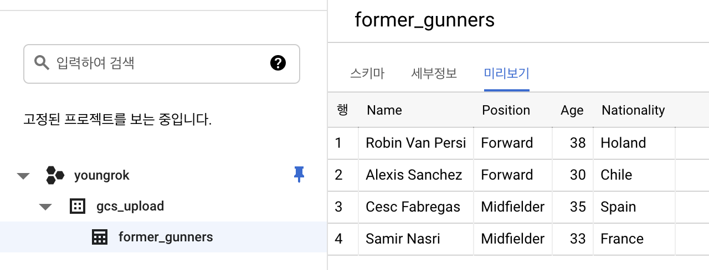

# Google Cloud Storage Integrations

이 문서에서는 어쩌고 저쩌고, 이하 GCS 로 칭함

## Google Cloud Storage 개요

[GCS 설명](https://cloud.google.com/storage?hl=ko)

## 구글 클라우드 설정

gcloud 설정

|항목|설정 값|
|:-:|-|
| default zone | asia-northeast3-ab |
| project | youngrok |
| bucket | youngrok |

## 연동 및 사용

담음 항목에 대해서 연동 방법을 살펴본다.

- 항목 1
- 항목 2

### HDFS 인터페이스

HDFS 파일시스템은 인터페이스에 hdfs 구현체가 붙어 있는 식임. hdfs 구현체 대신 s3, gcs 구현체를 붙임으로써 다른 스토리지로 사용할 수도 있다.

테스트를 위해서 HDP 3.1 사용

hadoop fs distcp gs://..

이때 distcp 의 체크섬 기능은 사용할 수 없음

### 빅쿼리

빅쿼리에는 avro, parquet, orc, csv, tsv, json 파일을 사용해 일괄 얼로드 가능하다. 이 혜에서는 gcs에 있는 tsv 파일을 빅쿼리 테이블에 적재하는 예를 보인다. 예시 스텝은 다음과 같다.

1. gcs에 csv 업로드 (gsutil 사용)
2. gcs에서 빅쿼리 테이블로 csv 업로드 (bq 사용)

업로드할 tsv 파일은 다음과 같다. ([다운로드링크](.resources/gcp_storage_integrations/bigquery_data.csv)) 첫행은 빅쿼리 테이블의 컬럼 이름으로 사용된다.

```csv
Name,Position,Age,From
Cesc Fabregas,Midfielder,35,Spain
Robin Van Persi,Forward,38,Holand
Samir Nasri,Midfielder,33,France
Alexis Sanchez,Forward,30,Chile
```

위 csv 파일을 업로드한다. 빅쿼리는 gzip 압축된 파일도 import 가능하지만 비압축된 파일보다 속도가 느리다. 물론 업로드는 더 빠르겠지.

```bash
# 업로드
$ gsutil cp bigquery_data.csv gs://youngrok_storage/
Copying file://bigquery_data.tsv [Content-Type=text/tab-separated-values]...
/ [1 files][  175.0 B/  175.0 B]
Operation completed over 1 objects/175.0 B.

# 업로드 확인
$ gsutil ls -l gs://youngrok_storage/
       162  2021-03-07T14:35:42Z  gs://youngrok_storage/bigquery_data.csv
TOTAL: 1 objects, 162 bytes (162 B)

# 빅쿼리 import
$ bq load --autodetect --source_format=CSV --skip_leading_rows=1 gs://youngrok_storage bigquery_data.tsv gcs_upload.arsenal_players
```

콘솔에서 확인한 생성된 테이블



참고문서

1. [gsutil을 사용한 업로드](https://cloud.google.com/storage/docs/uploading-objects?hl=ko#gsutil)
2. [Cloud Storage에서 CSV 데이터 로드](https://cloud.google.com/bigquery/docs/loading-data-cloud-storage-csv?hl=ko#bq)

빅쿼리 import에는 훨씬 다양한 옵션이 존재하는데 이 예는 빅쿼리가 아닌 gcs에 관한 예제이므로 상세 옵션은 설명하지 않는다.

### Http direct access

기본적으로 웹에서 읽을 수 있음

### Http through CloudCDN

CloudCDN 은 여러가지 백엔드를 가짐. 그중에 GCS가 가능함

### Log bucket

[로그 버킷](https://cloud.google.com/logging/docs/buckets)

### Migration (Data Transfer)

S3, On premise

### API (java 예제)

### Spring

### 기타 구글 코드들

Dataflow

DataProc

AI Platform
