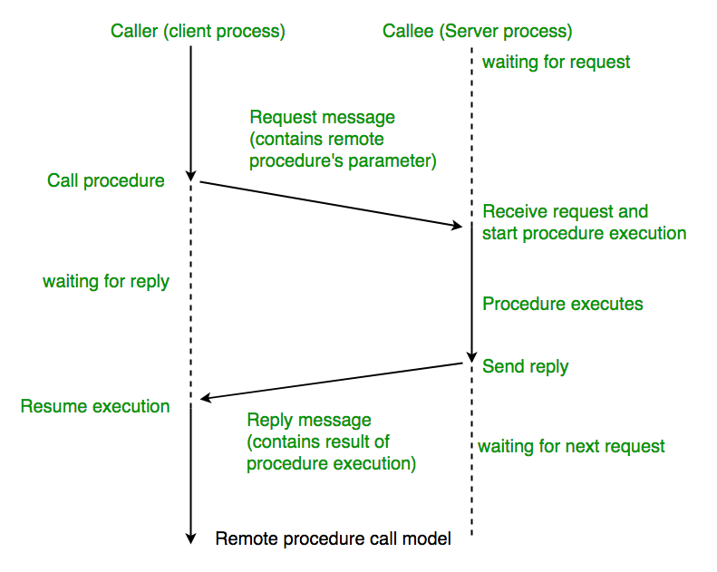

# GRPC

## 들어가기 전에

GRPC 문서는 [grpc.io](http://grpc.io)에 매우 잘 설명되어 있다. 스펙이나 사용문법 나열에 그치지않고 현업에 바로 적용가능한 설명들이 있으니 이미 GRPC를 써야겠다고 결정한 사람은 이 글은 skip하고 바로 grpc.io로 가시라. 아직 마음을 못정했거나 많은 영문 글을 읽기 싫은 사람에게는 의미가 있을 수 있겠다.

## 글의 내용

- GRPC에 대한 설명과 이해를 위한 배경지식
- HTTP 1.1/JSON과의 차이점
- 운영 이슈

Google RPC 라고 이름이 지어져 있지만 구글 스스로도 기존의 rpc(sun rpc, xml rpc) 등이 아닌 RESTful API(http 1.1/JSON)을 타겟으로 하여 비교하고 있다. 실제 GRPC가 RESTful API와 비교할때 장점이 두드러지고 우수한 대체제이기 때문에 포커스를 그쪽으로 맞추는 것이 당연하다.

# 배경지식

GRPC는 Remote Procedure Call(이하 RPC)의 하나로써 payload로 Google Protocol Buffers(이하 protobuf)로 serialize된 데이터를 사용한다. 들어가기 전에 RPC와 protobuf에 대해서 알아보자.

## Remote Procedure Call (RPC)

RPC란 이름 그대로 원격지의 프로시저를 호출하는 프로그래밍 모델이다. 다음은 caller와 caller 관점에서 도식화한 RPC를 도식화한 그림이다.

<figure align="middle">
  
</figure>


그림출처: https://www.geeksforgeeks.org/remote-procedure-call-rpc-in-operating-system/

RPC의 실제 내부동작을 들여다보면 아래와 같다. Sun rpc, xmlrpc, grpc, thrift 등 여러종류의 rpc가 있지만 이 구조는 동일하다고 보면 된다.

<figure align="middle">
  
</figure>

## Google Protocol Buffers (Protobuf)

GRPC는protobuf로 serialize된 데이터를 메세지의 payload에 사용한다. 그러니 우선 protobuf이 무엇인지 살펴보자.

[Protcol Buffers](grpc_protocol_buffers.md)

# GRPC란?

설명

## RESTful과 GRPC의 통신 방식 비교

GRPC와 RESTful API 차이는 결국 두가지이다.
- HTTP 2.0
- Protobuf

GRPC가 가지는 대부분의 장점은 장점, 한계는 위의 두 차이에 기인하며 GRPC가 효율성을 보이는 use case, 아키텍처, 운영 방식까지도 역시 위 두가지에서 파생된다.

- **`HTTP 2.0`**
  - Connection oriented: 빠른 응답, 낮은 PPS, 서버 부하 감소  - 
  - 낮은 네트웍 부하: Connection oriented, header compression, protobuf 
  - 빠른 응답
  - Server push
- **`Protobuf`**
  - 스키마 정합성
  - Binary serialization: 네트웍 트래픽 감소, 서버 리소스 사용 감소

## 서버 사이드

### 서버 통신에서 restful의 단점
HTTP의 단점
모든 커넥션

JSON의 단점
큰 프로토콜 사이즈
schema-less
구문 오류

### GRPC가 이것을 해결한다. 
GRPC가 이 문제들을 해결한다.
굳


# 적용

## Micro Service Architecture 에서의 사용

https://medium.com/@goinhacker/microservices-with-grpc-d504133d191d

https://levelup.gitconnected.com/grpc-in-microservices-5887caef195


https://docs.microsoft.com/en-us/dotnet/architecture/cloud-native/rest-grpc


# 운영 지식

## GRPC 단점

GRPC는 훌륭하고 완성도 높은 (한편으론 특별할 것 없는) 기술이다. 이런 기술들은 이미 **문제점**은 거의 없어진 상태이며 최종적으로는 기술이 주는 장점을 취하기 위해 심각하지 않은 수준의 **해결 불가능한 한계점**을 용인하면서 사용한다. 한계점을 완화하든 회피하든 그런식으로 말이다.

<figure align="center">
  
  <figcaption><b>하나만 쓸수 있다면?</b></figcaption>
</figure>
<p>

Trade-off로 감안할 수 밖에 없는 불가능한 한계점은 GRPC의 기반기술에서 온다. Protobuf를 사용함으로써 데이터가 human readable하지 않기 때문에  connection oriented 프로토콜인 HTTP 2.0을 사용함으로 인해 기존 인프라와는 다른 방식으로 운영해야 한다.

### HTTP1.1 API 방식과의 차이

HTTP 1.1의 기반 API의 호출 절차이다.
1. connect - request 1 - close
2. connect - request 2 - close
3. :

반면 HTTP 2.0은 다음과 같다.
1. connect
2. request 1
3. request 2
4. :
5. close

Caller수 / callee수 / tps 등에 상관없이 sticky session 방식만 아니라면 비교적 균일하게 callee의  


### Round robin load balancing 적용 시 문제

HTTP 1.1을 사용하는 경우 가장 흔한 load balancing 방법은 caller의 리퀘스트가 l4/l7 스위치 또는 프록시에서 각 callee로 request를 보내는 것이며 round-robin이 가장 많이 사용하는 방법이다.

HTTP 2.0의 경우 한번 connection이 맺어진 후에는 리퀘스트는 항상 해당 서버로만 전송되므로 특정 서버에 connection이 몰릴 수 있다. 이 문제는 (grpc가 장점으로 내세우는) 서버to서버 call에서 더욱 부각된다. 서버to서버 통신의 경우 아래와 같은 특성을 가지고 있으며 각 특성은 복합적으로 보인다.
- `Caller 수가 적은 경우` 
- `Connection의 lifecycle 긴경우` 
- `Connection마다 부하가 다른 경우`
- `Callee가 elastic하게 scale-in/out을 하는 경우`
- `Callee의 rolling update가 잦은 경우` 

최초 callee를 일괄 시작할 시 connection은 정상적으로 분배된다. 하지만 connection이 다시 연결되는 상황이 반복되면 연결은 불균할 수 밖에 없다.

<figure align="middle">
  
  <figcaption><b>Evenly balanced</b></figcaption>
</figure>
<figure align="middle">
  
  <figcaption><b>4 was reconnected</b></figcaption>
</figure>

#### Least connection은?

Round robin 대신 least connection을 사용하는 것이 한가지 답이 될 수 있다. 하지만 이 역시 완벽한 답을 될 수 없다. Least connection은 각 connection에 의해 생성되는 부하가 동일할 경우 효과가 극대화되는 방식이기 때문에, 만약 caller간 call 수의 편차가 크다면 부하는 각 callee들에 균등하게 분배되지 않는다.

https://grpc.io/blog/loadbalancing/


### Rolling update

가용성을 유지한채로 서버를 업데이트하기 위해 rolling restart를 하게 된다. HTTP 1.1 방식에서는 다음 스텝으로 간단하게 수행가능하다. (편의상 1대씩 업데이트한다고 가정)

```java
for (i = 0; i < 서버수; i++>) {
   Step 1. 스위치에서 서버i로 request가 가지 않도록 설정
   Step 2. Graceful shutdown을 위해 서버i에 커넥션이 사라지도록 대기
   Step 3. 서버i 업데이트 및 재시작
   Step 4. 서버i 로 request 전송 여부 확인
}
```

반면 HTTP 2.0(을 포함한 connection oriented 프로토콜) 서버에서는 두 스텝에서 시나리오가 성립하지 않는다. 문제가 발생하는 스텝을 살펴보자.
- Step 1. Connection oriented 서비스의 스위치에서 서버를 제외하더라도 경우 커넥션이 사라지지 않기 때문에 기존방식으로 graceful shutdown이 불가능하다. 클라이언트의 reconnect & 재전송이나 서버에서 서비스 종료 push를 보내는 등의 추가 작업이 필요하다.
- Step 4. 서버i가 다운되면 클라이언트는 다른 서버에 연결한다. 이때 서버i를 다시 기동하더라도 커넥션이 있는 다른 서버가 다운되기 전까지는 서버i로 들어오는 커넥션은 없다. 만약 least connection을 사용중이라면 될 수 있다.

### Scale-in/out

요즘같은 클라우드 시대에 RESTful API를 대체가능하려면 elastic한 scale-in/out에 쉽게 대응가능해야 한다. 하지만 rolling update와 마찬가지 이유에서 scale-in/out 역시 어렵다. (사실상 rolling update가 scale-in과 scale-out의 조합이다)

### Load balancing (linkerd)

Kubernetes linkerd 관련 설명

아래 문서를 발취한 내용이다.


https://kubernetes.io/blog/2018/11/07/grpc-load-balancing-on-kubernetes-without-tears/


# 결론

1. 서버2서버에서 RESTful API를 대체하는데는 매우 좋다.
2. HTTP 1.1 운영방식과 인프라역시 변경이 필요하다.
