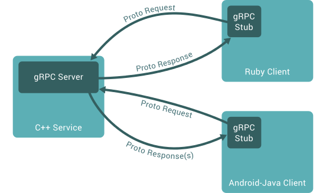

# GRPC

## 들어가기 전에

GRPC 문서는 [grpc.io](http://grpc.io)에 매우 잘 설명되어 있다. 스펙이나 사용문법 나열에 그치지않고 현업에 바로 적용가능한 설명들이 있으니 이미 GRPC를 써야겠다고 결정한 사람은 이 글은 skip하고 바로 grpc.io로 가시라. 아직 마음을 못정했거나 많은 영문 글을 읽기 싫은 사람에게는 이글이 의미가 있을 수 있겠다.

## 글의 내용

- GRPC에 대한 설명 + 배경지식
- RESTful API 과의 차이점
- GRPC 특성에 따른 운영 이슈

# 배경지식

GRPC는 이름 그대로 구글에서 만든 remote procedure call famework(이하 RPC)로 payload에 Google Protocol Buffers(이하 protobuf)로 serialize된 데이터를 사용한다. 우선 RPC와 protobuf에 대해서 짧게(?) 알아보자.

## Remote Procedure Call (RPC)

RPC란 이름 그대로 원격지의 프로시저를 호출하는 프로그래밍 모델이며, 일반적으로 전송 레이어를 포함한 framework를 지칭하기도 한다. (RPC framework도 RPC로 부른다는 소리) 다음은 caller와 callee 관점에서 RPC를 도식화한 그림이다.

<figure align="middle">
  
</figure>

그림출처: https://www.geeksforgeeks.org/remote-procedure-call-rpc-in-operating-system/

RPC의 실제 내부동작을 들여다보면 아래와 같다. Sun rpc, xmlrpc, grpc, thrift 등 여러종류의 rpc가 있고 각 RPC들은 고유의 payload 포맷과 호출 타겟의 addressing 문법을 가지지만 아키텍처와 사용법은 동일하다고 보면 된다. 

<figure align="middle">
  
</figure>

추가적으로 major RPC framework은 여러 편의기능을 제공하기 때문에 개발자는 비지니스 로직에 집중할 수 있다.
- 네트워크 에러 처리
- 다양한 언어 지원
- 다른 플랫폼 및 아키텍처와 호환성

## Google Protocol Buffers (Protobuf)

GRPC는protobuf로 serialize된 데이터를 메세지의 payload에 사용한다. 주의: 이 글보다 더 길다.

[Protcol Buffers](grpc_protocol_buffers.md)

# GRPC란?



Payload가 protobuf데이터인 RPC이다. - 설명끝 -

## RESTful과 GRPC의 통신 방식 비교

Google RPC 라고 이름이 지어져 있지만 구글은 기존의 전형적인 RPC(sun rpc, xml rpc)가 아닌 RESTful API(http 1.1/JSON)을 타겟으로 하여 비교하고 있다. GRPC가 RESTful API와 비교할때 장점이 두드러지고 서버2서버 통신 분야에서 뛰어난 대체제이기 때문에 포커스를 그쪽으로 맞추는 것이 당연하다.

GRPC이 RESTful API 와 다른점은 결국 두 가지이다.
- HTTP 2.0
- Protobuf

GRPC가 가지는 대부분의 장점과 한계는 위의 두 차이에 기인하며 GRPC가 적합한 분야와, 소프트웨어 아키텍처, 그리고 운영 방식의 차이역시 역시 위 두가지에서 파생된다.

- **`HTTP 2.0`**
  - Connection establishing 비용 감소
  - Header compression을 통한 불필요한 통신 오버헤드 감소
  - 빠른 응답 시간
  - Server push 지원
  - 브라우저 지원 없음
- **`Protobuf`**
  - 스키마 정합성
  - Binary serialization 사용
    - 네트웍 트래픽 감소
    - 서버 리소스 사용 감소
    - 사람이 읽을 수 없음

## Micro Service Architecture 에서의 사용

위에 언급한 장점들로 인해서 server to server 통신에서 GRPC가 RESTful API에 비해 기술적으로 우위에 있다(고 생각한다). Web(browser) 상에서도 grpc가 사용가능하며 관련 프로젝트도 있지만 메인스트림은 아닌 것으로 보인다. 마이크로소프트도 그렇다고 한다. [狐假虎威](https://namu.wiki/w/%ED%98%B8%EA%B0%80%ED%98%B8%EC%9C%84)

At the time of writing of this book, most browsers have limited support for gRPC. gRPC heavily uses HTTP/2 features and no browser provides the level of control required over web requests to support a gRPC client. gRPC is typically used for internal microservice to microservice communication. Figure 4-22 shows a simple, but common usage pattern.


출처: https://docs.microsoft.com/en-us/dotnet/architecture/cloud-native/rest-grpc

# 코드를 한번 볼까?

다른 사람이 이해하기 쉽게 작성한 것을 첨부한다.

[GRPC java 서버/클라이언트 예제 - 정아마추어 코딩블로그](https://jeong-pro.tistory.com/192)

# 운영 지식

GRPC는 훌륭하고 완성도 높은 (한편으론 특별할 것 없는) 기술이다. 이런 기술들은 이미 **문제점**은 없어진 상태이며 기술이 주는 장점을 취하기 위해 심각하지 않은 수준의 **해결 불가능한 한계점**을 용인하면서 사용한다. 한계점을 회피 또는 완화하는 식으로 말이다. 

<figure align="middle">
  
  <figcaption><b>하나만 쓸수 있다면?</b></figcaption>
</figure>

Trade-off로 감안할 수 밖에 없는 불가능한 한계점은 GRPC의 기반기술에서 온다. Protobuf를 사용함으로써 데이터가 human readable하지 않고, connection oriented 프로토콜인 HTTP 2.0을 사용함으로 인해 운영 방식이 달라져야 한다. 그런데 어떻게 해야하는 지는 모르겠다.

## Load Balancing

HTTP 2.0의 경우 한번 connection이 맺어진 후에는 리퀘스트는 항상 해당 서버로만 전송되므로 특정 서버에 connection이 몰릴 수 있다. 이 문제는 (grpc가 장점으로 내세우는) 서버to서버 call에서 더욱 부각된다. 서버to서버 통신의 경우 아래와 같은 특성을 가지고 있으며 각 특성은 복합적으로 나타나기도 한다.
- `클라이언트 수가 적은 경우` 
- `Connection의 lifecycle 긴경우` 
- `Connection마다 부하가 다른 경우`
- `서버가 elastic하게 scale-in/out을 하는 경우`
- `서버의 rolling update가 잦은 경우` 

### Conventional round robin load balancing 적용 시 문제

HTTP 1.1을 사용하는 경우 가장 흔한 load balancing 방법은 클라이언트의 리퀘스트를 l4/l7 스위치 또는 프록시에서 각 서버로 request를 보내는 것이다. 이때 가장 흔히 사용되는 정책이 round-robin인데 GRPC에서는 이 정책을 그대로 적용하면 문제가 발생한다.

Round robin을 적용시 최초 클라이언트를 일괄 시작한다면 connection은 각 서버에 균등하게 분배된다. 하지만 connection이 다시 연결되는 상황이 반복되면 연결은 불균할 수 밖에 없다. 아래그림은 4번 클라이언트를 재시작함으로 인해 서버들의 connection수가 불균형해진 예이다.

<figure align="middle">
  
  <figcaption><b>Evenly balanced</b></figcaption>
</figure>
<figure align="middle">
  
  <figcaption><b>4 was reconnected</b></figcaption>
</figure>

### 그렇다면 least connection은?

Least connection은 load balancer가 backend 서버중 connection이 가장 적은 서버를 타겟으로 선택하는 정책이다.
Round robin 대신 least connection을 사용함으로써 부하 분산에 더 도움을 받을 수 있지만 이 역시 완벽한 답을 될 수 없다. Least connection은 각 connection에 의해 생성되는 부하가 동일할 경우 유효한 방식이기 때문에 만약 각 caller 간 call 수의 편차가 크다면 부하는 각 callee들에 균등하게 분배되지 않는다.

### Look-aside loadbalancer 

발췌자료: [GRPC Load balancing](https://grpc.io/blog/loadbalancing/)

아래그림은 look-aside load balancer를 설명하고 있다. 기존 load balancer가 클라이언트가 전송한 패킷이 load balancer를 거쳐서 보내진다면, look-aside load balancer는 서버정보제공 역할만 하고 어느 서버를 선택할지는 클라이언트가 결정된다. 하지만 아키텍처의 전체적인 복잡도가 높아지고 클라이언트의 책임이 증가한다.

<figure align="middle">
  
  <figcaption><b>Look-aside load balancer</b></figcaption>
</figure>

### AWS ALB (Application Load balancer) vs NLB (Network Load balancer)

결론부터 말하자면 ALB는 GRPC를 지원하지 않기 때문에 NLB를 사용해야한다. NLB는 L4 스위치에 해당하고 ALB는 L7에 해당한다. 즉 NLB는 HTTP를 이해하지 못하기 때문에 ALB가 할 수 있는 여러가지 일을 하지 못한다. 사실 ALB 기능중 GRPC에서 필요한 기능이 얼마나 있을지는 나는 모른다. 하지만 패킷 레벨이 아닌 HTTP 레벨에서의 모니터링만 가능해도 좋지 않겠는가?

ELB 기능 비교: https://aws.amazon.com/ko/elasticloadbalancing/features/

### Software L7 load-balancer

Load balancing 부분에서 설명했듯이 A1의 리퀘스트가 B1으로 몰리는 상황이 발생할 수 있다. (좌) GRPC를 이해하는 software L7 load-balancer는 리퀘스트를 여러 backend 서버로 분산할 수 있다.


**`Linkerd`** Linkerd는 open-source service mesh 로써 l7 load-balancing 기능을 포함하고 있다. 참고로 container 용이다. 사실 위 그림은 linkerd 소개자료에서 가져온 것이다. [gRPC Load Balancing on Kubernetes without Tears](https://kubernetes.io/blog/2018/11/07/grpc-load-balancing-on-kubernetes-without-tears/) 

**`HAProxy`** HAProxy 1.9.2 버전에 HTTP/2 지원이 포함되었고 GRPC에도 적용가능하다. Container 기반이 아닌 경우 HAProxy를 선택하면 될 듯하다. [HAProxy 1.9.2 Adds gRPC Support](https://www.haproxy.com/blog/haproxy-1-9-2-adds-grpc-support/)

**`Envoy`** Envoy 도 있다고 하는데 사실 이번에 조사하면서 알게됐다. GRPC 공홈과 Google Cloud에서도 소개되고 있다. [grpc.io](https://grpc.io/docs/tutorials/basic/web/) / [Using Envoy Proxy to load-balance gRPC services on GKE](https://cloud.google.com/solutions/exposing-grpc-services-on-gke-using-envoy-proxy?hl=ko#deploy_envoy)

## Rolling update

서비스의 가용성을 위해 서버 업데이트 시 rolling restart를 하게 된다. HTTP 1.1 방식에서는 다음 스텝으로 간단하게 업데이트가 수행가능하다. (편의상 1대씩 업데이트한다고 가정)

```c
for (i = 0; i < 서버수; i++>) {
   Step 1. 스위치에서 서버i로 request가 가지 않도록 설정
   Step 2. Graceful shutdown을 위해 서버i에 커넥션이 사라지도록 대기
   Step 3. 서버i 업데이트 및 재시작
   Step 4. 서버i 로 request 전송 여부 확인
}
```

반면 HTTP 2.0(을 포함한 connection oriented 프로토콜) 서버에서는 두 스텝에서 시나리오가 성립하지 않는다. 문제가 발생하는 스텝을 살펴보자.
- Step 1. Connection oriented 서비스의 스위치에서 서버를 제외하더라도 경우 커넥션이 사라지지 않기 때문에 기존방식으로 graceful shutdown이 불가능하다. 클라이언트의 reconnect & 재전송이나 서버에서 서비스 종료 push를 보내는 등의 추가 작업이 필요하다.
- Step 4. 서버i가 다운되면 클라이언트는 다른 서버에 연결한다. 이때 서버i를 다시 기동하더라도 커넥션이 있는 다른 서버가 다운되기 전까지는 서버i로 들어오는 커넥션은 없다. 만약 least connection을 사용중이라면 될 수 있다.

## Scale-in/out

요즘같은 클라우드 시대에 RESTful API를 대체가능하려면 elastic한 scale-in/out에 쉽게 대응가능해야 한다. 하지만 rolling update와 같은 이유에서 scale-in/out 역시 어렵다. (사실상 rolling update가 scale-in과 scale-out의 조합이다)

# 지난가는 이야기

## GRPC를 웹에서 쓰면 안되나?

사실 지원하는데 뭔가 꽃히진 않네.

https://grpc.io/blog/state-of-grpc-web/

# 결론

1. 서버2서버에서 RESTful API를 대체하는데는 매우 좋고 microservice와 어울린다.
2. HTTP 1.1 기반 서비스에서 GRPC로 drop-in-replacement 방식의 migration은 불가능하다. 운영방식과 인프라 변경이 수반되어야 한다.

<div w3-include-html=".includes/disqus.html"></div>
