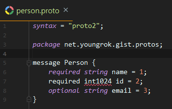

# Protocol Buffers

## 해보자

Java 에서 해보자. 기본적으로는 공식홈페이지의 튜토리얼 중 [Basic:Java](https://developers.google.com/protocol-buffers/docs/javatutorial) 부분을 참고했으며 약간의 살을 더했다.

돈되는 product가 아니라 그런지 (2020년기준) 나온지 11년이 지나도록 문서의 한글화를 안해준다. 개인적으로는 2013년에 이 문서를 처음 접했는데 그 뒤로 내용이 바뀐 것도 없다. 심지어 protobuf 버전3이 나왔지만 이 문서는 버전2이다.

### protoc 설치
protoc는 .proto 파일을 언어별 클래스를 생성하는 컴파일러이다.

[Github protobuffers release](https://github.com/protocolbuffers/protobuf/releases)에 접속하면 필요한 컴파일러를 다운받을 수 있다. 컴파일러는 압축 파일의 이름에 따라서 다음과 같이 분류되며 필요한 버전을 받아서 압축을 풀자.
- `protobuf-언어-*` 컴파일러의 언어별 빌드 소스
- `protoc-버전-플랫폼-아키텍쳐-*` 플랫폼과 아키텍처 별 prebuild된 컴파일러 바이너리

기본적으로 protobuf 컴파일러는 c++ 로 개발되어 있으며 소스코드 버전은 configure와 make 기반으로 빌드가 필요하다. 이 글에서는 prebuild된 컴파일러 기준으로 설명한다. (압축을 푼 디렉토리는 $PROTO_HOME으로 가정)

### .proto 작성

스키마(데이터 타입)를 정의하는 .proto 파일을 작성하자. Json과 달리 avro, protobuf 등의 IDL은 스키마를 미리 정의한다.

```
// code came from https://developers.google.com/protocol-buffers/docs/javatutorial
syntax = "proto2";

package net.youngrok.gist.protos;

option java_package = "net.youngrok.gist.protos";
option java_outer_classname = "AddressBookMessage";

message Person {
    required string name = 1;
    required int32 id = 2;
    optional string email = 3;

    enum PhoneType {
        MOBILE = 0;
        HOME = 1;
        WORK = 2;
    }

    message PhoneNumber {
        required string number = 1;
        optional PhoneType type = 2 [default = HOME];
    }

    repeated PhoneNumber phones = 4;
}

message AddressBook {
    repeated Person people = 1;
}
```
서두에 언급했듯이 이 .proto 정의 version 2 이다. 실제 언어 스펙은 아래 링크를 참고
- `language guide v2` https://developers.google.com/protocol-buffers/docs/proto
- `language guide v3` https://developers.google.com/protocol-buffers/docs/proto3

위 protobuf 파일을 기반으로 json 샘플을 작성하면 대충 이런 식을 것이다.

```
{
    "name": "이름",
    "id" : 32,
    "email": "이메일 주소",
    "phones": [
        {
            "number": "010-1024-2048",
            "type": "MOBILE"
        },
        {
            "number": "02-3273-8783",
            "type": "HOME"
        }
    ]
}
```

### .proto 파일 컴파일

설치했던 protobuf 컴포일러로 .proto 파일을 컴파일하여 언어의 클래스를 생성한다. 기본적인 protoc 사용법은 다음과 같다.


### IDE 플러그인
IntelliJ 를 사용한다면 [IntelliJ Protobuf Support plugin](https://plugins.jetbrains.com/plugin/8277-protobuf-support)을 설치하자. Syntax validation, syntax highlighting, code formatting 등의 개발 편의기능을 제공한다. 아래는 실제 적용한 예이며 formatting도 플러그인의 도움을 받았다.




### Maven plugin

.proto 파일을 java 소스로 컴파일해주는 플러그인이다.


# 참고

Protocol Buffers 공홈: https://developers.google.com/protocol-buffers

Java 프로그램 가이드: https://developers.google.com/protocol-buffers/docs/javatutorial

프로토콜 버퍼 컴파일러: https://github.com/protocolbuffers/protobuf/releases/tag/v3.11.3

Maven protocol buffers plugin: https://www.xolstice.org/protobuf-maven-plugin/examples/protoc-artifact.html

IntelliJ protobuf 플러그인: https://plugins.jetbrains.com/plugin/8277-protobuf-support
