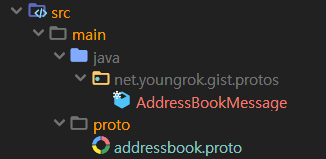

# Protocol Buffers

프로토콜 버퍼가 뭐냐? 이 자료는 구글에서 베끼자

# 해보자

Java 에서 해보자. 기본적으로는 공식홈페이지의 튜토리얼 중 [Basic:Java](https://developers.google.com/protocol-buffers/docs/javatutorial) 부분을 참고했으며 약간의 살을 더했다.

돈되는 product가 아니라 그런지 (2020년기준) 나온지 11년이 지나도록 문서의 한글화를 안해준다. 개인적으로는 2013년에 이 문서를 처음 접했는데 그 뒤로 내용이 바뀐 것도 없다. 심지어 protobuf 버전3이 나왔지만 이 문서는 버전2이다.

## 준비작업

### protoc 설치
protoc는 .proto 파일을 언어별 클래스를 생성하는 컴파일러이다.

[Github protobuffers release](https://github.com/protocolbuffers/protobuf/releases)에 접속하면 필요한 컴파일러를 다운받을 수 있다. 컴파일러는 압축 파일의 이름에 따라서 다음과 같이 분류되며 필요한 버전을 받아서 압축을 풀자.
- `protobuf-언어-*` 컴파일러의 언어별 빌드 소스
- `protoc-버전-플랫폼-아키텍쳐-*` 플랫폼과 아키텍처 별 prebuild된 컴파일러 바이너리

기본적으로 protobuf 컴파일러는 c++ 로 개발되어 있으며 소스코드 버전은 configure와 make 기반으로 빌드가 필요하다. 이 글에서는 prebuild된 컴파일러 기준으로 설명한다. (압축을 푼 디렉토리는 $PROTO_HOME으로 가정)

## 스키마(타입) 정의 및 Java 클래스 변환 (컴파일)

....

### .proto 작성

다음은 전화부(AddressBook)의 스키마(데이터 타입)를 정의하는 .proto 파일이다. Github 마크다운은 protobuf 문법도 지원한다!

```protobuf
// code came from https://developers.google.com/protocol-buffers/docs/javatutorial
syntax = "proto2";

package net.youngrok.gist.protos;

option java_package = "net.youngrok.gist.protos";
option java_outer_classname = "AddressBookMessage";

message Person {
    required string name = 1;
    required int32 id = 2;
    optional string email = 3;

    enum PhoneType {
        MOBILE = 0;
        HOME = 1;
        WORK = 2;
    }

    message PhoneNumber {
        required string number = 1;
        optional PhoneType type = 2 [default = HOME];
    }

    repeated PhoneNumber phones = 4;
}

message AddressBook {
    repeated Person people = 1;
}
```
서두에 언급했듯이 이 .proto 정의 version 2 이다. 언어별 매뉴얼은 아래 링크 참고.
- `language guide v2` https://developers.google.com/protocol-buffers/docs/proto
- `language guide v3` https://developers.google.com/protocol-buffers/docs/proto3

위 protobuf 파일을 기반으로 json 샘플을 작성하면 대충 이런 식을 것이다.

```json
{
    "people": [
        {
            "name": "rock",
            "id" : 32,
            "email": "rock@nroll.com",
            "phones": [
                {
                    "number": "010-1024-2048",
                    "type": "MOBILE"
                },
                {
                    "number": "02-3273-8783",
                }
            ]
        },
        {
            "name": "kai",
            "id" : 33,
            "email": "kai@database.org",
            "phones": [
                {
                    "number": "010-1677-7216",
                    "type": "MOBILE"
                }
            ]
        }
    ]
}

```

### .proto 파일 컴파일

설치했던 protobuf 컴포일러로 .proto 파일을 컴파일하여 언어의 클래스를 생성한다. 기본적인 protoc 사용법은 다음과 같다.
```bash
$ protoc -I=$SRC_DIR --java_out=$DST_DIR filetocomple.proto
```
- `$SRC_DIR` .proto 파일 위치
- `$DST_DIR` 자바 소스 디렉토리
- `filetocomple.proto` 컴파일할 .proto 정의 파일

실행 예)
Java 프로젝트를 생성하고 src/main/proto 디렉토리에 위 .proto 파일을 저장한후 컴파일 해보자. 명령어 실행위치는 프로젝트 홈디렉토리 즉 ${project.basedir} 이다.

실행한 명령어
```bash
$ protoc -I=src/main/proto --java_out=src/main/java addressbook.proto
```
결과



person.proto에 정의된 대로 net.youngrok.gist.protos 패키지에 AddressBookMessage 클래스가 생성된 것을 볼 수 있다. 

### 라이브러리

위까지 실행하면 컴파일에러를 잔뜩 안고 있는 AddressBookMessage 클래스를 얻을 수 있다. 다른 IDL처럼 protobuf 역시 라이브러리가 필요하다. pom.xml 파일에 다음 의존성을 추가.
```xml
<!-- https://mvnrepository.com/artifact/com.google.protobuf/protobuf-java -->
<dependency>
    <groupId>com.google.protobuf</groupId>
    <artifactId>protobuf-java</artifactId>
    <version>3.11.3</version>
</dependency>
```

## 사용

백문이 불여일견. 코더는 코드로 말한다. 다음 세개의 예를 통해 사용법을 간단히 보자.

- `writeMessage()` rock, kai 두 Person이 포함되어 있는 AddressBook 메세지를 파일에 저장
- `readMessage()` 파일에 저장된 AddressBook을 읽어서 화면에 출력. 기본제공되는 toString() 사용
- `loopAddressBook()` 실제 AddressBook 메세지를 사용하는 예제

### 메세지 작성

```java
private static final String SERIALIZED_ADDRESS_BOOK = "addressbook.message";
@Test
public void writeMessage() {
    // AddressBook with Two person
    Person rock = Person.newBuilder().setName("rock").setId(32).setEmail("rock@nroll.com")
            .addPhones(PhoneNumber.newBuilder().setNumber("010-1024-2048").setType(PhoneType.MOBILE).build())
            .addPhones(PhoneNumber.newBuilder().setNumber("02-3273-8783")).build();
    Person kai = Person.newBuilder().setName("kai").setId(33).setEmail("kai@database.org")
            .addPhones(PhoneNumber.newBuilder().setNumber("010-1677-7216").setType(PhoneType.MOBILE).build())
            .build();
    AddressBook addressBook = AddressBook.newBuilder().addPeople(rock).addPeople(kai).build();
    // Write to file
    try (OutputStream outputStream = new FileOutputStream(SERIALIZED_ADDRESS_BOOK)) {
        addressBook.writeTo(outputStream);
    } catch (IOException ignore) {
    }
}    
```
위 코드를 실행하면 serialize된 데이터가 다음과 같이 addressbook.message 파일에 저장된다. (Builder 기반으로 코드를 작성하긴 했는데 더 간결한 방법이 있는지는 모르겠다) 생성된 파일의 용량은 107바이트로써 같은 데이터 저장시 674바이트가 필요한 json보다 훨씬 작다.


### 메세지 읽기
파일에서 읽은 후 deserialize (parseFrom)을 거쳐서 제공되는 toString() 메소드로 화면에 출력하는 코드이다. AddressBook 객체를 생성해내는 것은 한줄이면 된다. (물론 exception 처리코드는 추가되야 한다.)

```java
@Test
public void readMessage() {
    try (InputStream inputStream = new FileInputStream(SERIALIZED_ADDRESS_BOOK)) {
        AddressBook addressBook = AddressBook.parseFrom(inputStream);
        System.out.println(addressBook.toString());
    } catch (IOException ignore) {
    }
}
```

<details><summary>출력 결과(클릭)</summary>

```
people {
  name: "rock"
  id: 32
  email: "rock@nroll.com"
  phones {
    number: "010-1024-2048"
    type: MOBILE
  }
  phones {
    number: "02-3273-8783"
  }
}
people {
  name: "kai"
  id: 33
  email: "kai@database.org"
  phones {
    number: "010-1677-7216"
    type: MOBILE
  }
}
```
</details>

### 실제 AddressBook을 navigate하는 코드

```java
@Test
public void loopAddressBook() {
    try (InputStream inputStream = new FileInputStream(SERIALIZED_ADDRESS_BOOK)) {
        AddressBook addressBook = AddressBook.parseFrom(inputStream);
        for (Person person : addressBook.getPeopleList()) {
            System.out.println("Person ID: " + person.getId());
            System.out.println("  Name: " + person.getName());
            if (person.hasEmail()) {
                System.out.println("  E-mail address: " + person.getEmail());
            }
            for (Person.PhoneNumber phoneNumber : person.getPhonesList()) {
                switch (phoneNumber.getType()) {
                    case MOBILE:
                        System.out.print("  Mobile phone #: ");
                        break;
                    case HOME:
                        System.out.print("  Home phone #: ");
                        break;
                    case WORK:
                        System.out.print("  Work phone #: ");
                        break;
                }
                System.out.println(phoneNumber.getNumber());
            }
        }
    } catch (IOException ignore) {
    }
}

```
<details><summary>출력 결과</summary>

```
Person ID: 32
  Name: rock
  E-mail address: rock@nroll.com
  Mobile phone #: 010-1024-2048
  Home phone #: 02-3273-8783
Person ID: 33
  Name: kai
  E-mail address: kai@database.org
  Mobile phone #: 010-1677-7216
```
</details>

toString으로 출력했을때와의 차이가 보이는가? 메세지 작성시 02-3273-8783의 경우 전화번호 타입(MOBILE, HOME, WORK)를 선택하지 않았고 toString() 출력했을때는 타입이 보이지 않았다.
```
  phones {
    number: "02-3273-8783"
  }
```
하지만 .proto에서 PhoneNumber 정의시 PhoneType 디폴트값을 HOME으로 지정했기 때문에 02-3273-8783의 phoneNumber.getType()은 HOME을 리턴한다.
```
message PhoneNumber {
    required string number = 1;
    optional PhoneType type = 2 [default = HOME];
}
```    

## 좀 더 편하게 사용 (Maven Plugin)

protoc를 직접 사용해서 컴파일할 수도 있겠지만 좀더 편하게 maven의 generate-sources 단계에서 클래스를 생성하도록 설정해보자. Maven 플러그인을 통해서 할 수 있는데 maven-antrun-plugin과 maven두가지 방법이 대표적이지 않을까 한다.

protobuf-maven-plugin 이란 플러그인도 있는데 딱히 쓸만한게 못된다.


# 타 IDL과의 비교

## JSON / XML

Protobuf 홈페이지는 물론 관련한 많은 문서들이 json/xml과 protobuf를 비교하여 장점을 주창하고 있다. 사실 이바닥에서 장점이라는 것 자체가 원래 이론적이거나 특정 분야에 한정하여 강점을 가지는 경우가 많다는 것 정도는 다들 알고 있으니 이글에서도 그냥 장점 위주로 적겠다. ~~무책임한가? 컨셉이다.~~

|  | Json | ProtoBuf |
|---|---|---|
| 스키마정의 | 없음 | 있음 |
| 포맷 | 문자열 | 바이너리|
| 파싱 | Json 파싱 | serialize/deserialize |
| 범용성 | 매우 높음 | 낮음 |
| 데이터타입 | 모호함 | 명확함 |


항목별로 설명을 더해보자.

## Avro

스키마정의/컴파일/(de)serialization 과정을 거친다는 면에서 avro와 protobuf의 기본적인 사용 패턴은 동일하다. 실제로 .avro와 .proto라는 파일명만 다를뿐 메세지를 만드는 과정은 완전히 동일하다. 하지만 serialize된 파일 포맷에 있어서 둘은 큰 차이를 가진다. Protobuf의 경우 serialize된 데이터는 value만을 가지고 있는 것과는 달리 avro는 self-describing 방식으로 value의 스키마 또는 스키마 버전을 포함하고 있다.

- 당연히 value만 있는 것이 경량이며 통신에 유리하다. 하지만 이를 위해서는 생성자와 소비자가 동일한 스키마를 공유하고 있어야 하는 문제가 있다. 
- 하지만 스키마가 변할 수 있는 경우 self-describing 방식이 더 적합하다. 특히 스키마의 life-cycle이 긴 경우 하위호환성 유지가 필수적이기 때문에 avro 쪽이 더 유리하다. 
  - 장기간의 데이터를 하나의 테이블에 누적하여 저장하는 경우. 예) Hive table
  - 통신의 두 peer의 스키마 버전 업데이트 시점이 별개인 경우. 예) 업데이트된 서버가 업데이트 되지 않은 클라이언트를 지원

스키마의 진화(버전업) 측면에서도 avro가 protobuf방식보다 더 유리하다고 하는데 정확히 파악은 못했다. (Protobuf 역시 진화를 지원한다.) 다만 schema-registry와 kafka, hive에 사용되고 있다는 면에서 보자면 유연성에 있어서 protobuf보다 avro가 더 높은 점수를 받고 있다는 것을 알 수 있다.

참고문서: http://sjava.net/2012/12/%EB%B2%88%EC%97%AD-%EC%97%90%EC%9D%B4%EB%B8%8C%EB%A1%9Cavro-%ED%94%84%EB%A1%9C%ED%86%A0%EC%BD%9C-%EB%B2%84%ED%8D%BCprotocol-buffers-%EC%93%B0%EB%A6%AC%ED%94%84%ED%8A%B8thrift%EC%9D%98-%EC%8A%A4/

이 문서는 2012년에 작성된 것이기 때문에 protobuf가 더 발전했는지는 모르겠다. 특히 버전3에서 어떻게 변했는지는 알아볼 필요는 있겠다. ``__하지만 이미 하둡쪽은 avro 세상이니 protobuf와 avro둘중 하나만 익히겠다고 하면 avro를 권한다.__``

## Thrift

역사가 긴 IDL로써 그만큼 사용되는 곳이 매우 많다. 사실 thrift같은 경우 단순히 IDL은 아닌 것이 전송 레이어에 대한 구현을 포함하는 RPC framework이다. 즉 thrift는 기능적으로 보자면 protobuf가 아니라 grpc + protobuf에 대응한다고 할 수 있다.


### IDE 플러그인
IntelliJ 를 사용한다면 [IntelliJ Protobuf Support plugin](https://plugins.jetbrains.com/plugin/8277-protobuf-support)을 설치하자. Syntax validation, syntax highlighting, code formatting 등의 개발 편의기능을 제공한다. 아래는 실제 적용한 예이며 formatting도 플러그인의 도움을 받았다.


# 참고

Protocol Buffers 공홈: https://developers.google.com/protocol-buffers

Java 프로그램 가이드: https://developers.google.com/protocol-buffers/docs/javatutorial

프로토콜 버퍼 컴파일러: https://github.com/protocolbuffers/protobuf/releases/tag/v3.11.3

Maven protocol buffers plugin: https://www.xolstice.org/protobuf-maven-plugin/examples/protoc-artifact.html

IntelliJ protobuf 플러그인: https://plugins.jetbrains.com/plugin/8277-protobuf-support
