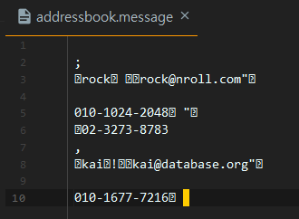
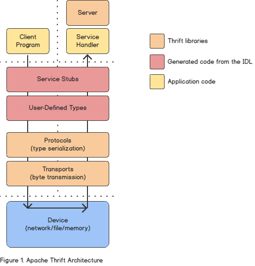

# Protocol Buffers

Protocol Buffers (이하 protobuf)는 구글에서 만든 Interface Description Language 이다. 현재 버전3까지 나왔으며 버전2도 계속 사용되고 있다. 같은 부류의 IDL로는 대표적으로 avro와 thrift이 있으며 사용하는 패턴은 셋 모두 동일하다. 데이터의 생산자와 소비자 관점에서 사용방법은 다음과 갈다.

- 생산자 소비자 공통
  1. IDL 고유 언어로 데이터(메세지)를 정의
- 생산자
  1. 데이터 정의를 기반으로 사용 언어의 타입(클래스) 생성
  2. 타입을 기반으로 데이터를 생성
  3. 데이터를 바이너리 데이터로 serialize 하여 소비자에게 전달
- 소비자
  1. 데이터 정의를 기반으로 사용 언어의 타입(클래스) 생성
  2. 바이너리 데이터를 deserialize 하여 언어 타입의 데이터 생성
  3. 데이터 사용

구글은 항상 json/xml과 protobuf를 비교하여 strict한 데이터 타입 정의, 파싱의 불필요, 작은 메세지 사이즈 등의 장점을 내세운다. 하지만 이는 protobuf의 장점이라기보다는 avro, thrift로 대표되는 바이너리 기반 IDL의 장점이며 이 분야에서 가장 큰 공헌을 한 것은 당연히 thrift이다.

다음 그림은 모질라에서 북마크를 처리하는 과정을 보여주고 있다. Rust와 kotlin이라는 다른 언어로 작성된 프로그램이 데이터를 교환하는 방법을 보여준다. Rust 쪽이 생산자 kotlin 쪽이 소비자이다.


이미지 출처: [Crossing the Rust FFI frontier with Protocol Buffers - Aprin 2, 2019](https://hacks.mozilla.org/2019/04/crossing-the-rust-ffi-frontier-with-protocol-buffers/)

# 한번 해보자

Java에서 해보자. 이 문서는 기본적으로 공식홈페이지의 튜토리얼 중 [Basic:Java](https://developers.google.com/protocol-buffers/docs/javatutorial) 부분을 옮긴 것이며, 실생활에 사용할 수 있도록 약간의 내용을 추가했다. 덤으로 구글이 잘난체하는 것 갈아서 좀 까기도 했다. 본문의 소스코드는 https://github.com/sharefeel/gist/ 에 가면 받을 수 있다.

여담인데 (2020년기준) 나온지 11년이 지나도록 문서가 한글화되지 않았고 개인적으로는 2013년에 이 문서를 처음 접했는데 그 뒤로 내용이 바뀐 것도 없다. 심지어 protobuf 버전3이 나왔지만 이 문서는 버전2를 다루고 있다.

## 준비작업

### Protobuf 컴파일러 protoc 설치

Protobuf 사용을 위해서는 가장 먼저 protobuf 컴파일러를 설치해야 한다. Protobuf의 데이터정의는 .proto 확장자로 저장되는데 protoc는 이 .proto 파일을 기반으로 언어별 클래스를 생성하는 역할을 한다.

[Github protobuffers release](https://github.com/protocolbuffers/protobuf/releases)에 접속하면 필요한 컴파일러를 다운받을 수 있다. 컴파일러는 압축 파일의 이름에 따라서 다음과 같이 분류되니 필요한 버전을 받아서 압축을 풀자.
- `protobuf-언어-*` 컴파일러의 언어별 소스코드 (빌드 필요)
- `protoc-버전-플랫폼-아키텍쳐-*` 플랫폼과 아키텍처 별 prebuild된 컴파일러 바이너리

기본적으로 protobuf 컴파일러는 c++ 로 개발되어 있으며 소스코드 버전은 configure와 make 기반으로 빌드한다. 이 글에서는 prebuild된 컴파일러 기준으로 설명한다. 다운받아서 압축을 풀면 protoc.exe 파일이 있다.

## 스키마(타입) 정의 및 Java 클래스 변환 (컴파일)

앞서 설명했듯이 .proto로 스키마를 정의하고 컴파일하여 java 클래스를 생성하는 과정이 먼저 필요하다.

### .proto 작성

다음은 전화부(AddressBook)의 스키마를 정의하는 .proto 파일이며 구글 튜토리얼에 나온 내용이다. Github 마크다운은 protobuf syntax highlighting도 지원한다!

```protobuf
// code came from https://developers.google.com/protocol-buffers/docs/javatutorial
syntax = "proto2";

package net.youngrok.gist.protos;

option java_package = "net.youngrok.gist.protos";
option java_outer_classname = "AddressBookMessage";

message Person {
    required string name = 1;
    required int32 id = 2;
    optional string email = 3;

    enum PhoneType {
        MOBILE = 0;
        HOME = 1;
        WORK = 2;
    }

    message PhoneNumber {
        required string number = 1;
        optional PhoneType type = 2 [default = HOME];
    }

    repeated PhoneNumber phones = 4;
}

message AddressBook {
    repeated Person people = 1;
}
```
서두에 언급했듯이 이 .proto 정의는 버전2 문법으로 작성되었다. 버전별 언어 가이드는 아래 링크 참고.
- `language guide v2` https://developers.google.com/protocol-buffers/docs/proto
- `language guide v3` https://developers.google.com/protocol-buffers/docs/proto3

위 .proto 파일에 정의된 스키마에 따라서 json 샘플 데이터를 작성하면 대충 이런 식을 것이다. Addressbook 내에 rock, kai 두 Person이 등록된 예제이다.

```json
{
    "people": [
        {
            "name": "rock",
            "id" : 32,
            "email": "rock@nroll.com",
            "phones": [
                {
                    "number": "010-1024-2048",
                    "type": "MOBILE"
                },
                {
                    "number": "02-3273-8783",
                }
            ]
        },
        {
            "name": "kai",
            "id" : 33,
            "email": "kai@database.org",
            "phones": [
                {
                    "number": "010-1677-7216",
                    "type": "MOBILE"
                }
            ]
        }
    ]
}

```

### .proto 파일 컴파일

설치했던 protobuf 컴파일러로 .proto 파일을 컴파일하여 언어의 클래스를 생성해야 한다. 기본적인 protoc 사용법은 다음과 같다.
```bash
$ protoc -I=$SRC_DIR --java_out=$DST_DIR filetocomple.proto
```
- `$SRC_DIR` .proto 파일 위치
- `$DST_DIR` 자바 소스 디렉토리
- `filetocomple.proto` 컴파일할 .proto 정의 파일

실행 예) Java 프로젝트를 생성하고 src/main/proto 디렉토리에 위 .proto 파일을 저장한후 컴파일 해보자. 명령어 실행위치는 프로젝트 홈디렉토리 즉 ${project.basedir} 이다.
```bash
$ protoc -I=src/main/proto --java_out=src/main/java addressbook.proto
```
실행결과


adressbook.proto에 정의된 대로 net.youngrok.gist.protos 패키지에 AddressBookMessage 클래스가 생성된 것을 볼 수 있다. 

### 라이브러리

protoc 명령어를 실행하고나면 컴파일에러를 잔뜩 안고 있는 AddressBookMessage 클래스를 얻을수 있다. pom.xml 파일에 다음 의존성을 추가.
```xml
<!-- https://mvnrepository.com/artifact/com.google.protobuf/protobuf-java -->
<dependency>
    <groupId>com.google.protobuf</groupId>
    <artifactId>protobuf-java</artifactId>
    <version>3.11.3</version>
</dependency>
```

## 사용

백문이 불여일견. 코더는 코드로 말한다. 다음 세개의 예를 통해 사용법을 간단히 보자.

- `writeMessage()` rock, kai 두 Person이 포함되어 있는 AddressBook 메세지를 파일에 저장
- `readMessage()` 파일에 저장된 AddressBook을 읽어서 화면에 출력. 기본제공되는 toString() 사용
- `loopAddressBook()` 실제 AddressBook 메세지를 사용하는 예제

### 메세지 작성

```java
private static final String SERIALIZED_ADDRESS_BOOK = "addressbook.message";
@Test
public void writeMessage() {
    // AddressBook with Two person
    Person rock = Person.newBuilder().setName("rock").setId(32).setEmail("rock@nroll.com")
            .addPhones(PhoneNumber.newBuilder().setNumber("010-1024-2048").setType(PhoneType.MOBILE).build())
            .addPhones(PhoneNumber.newBuilder().setNumber("02-3273-8783")).build();
    Person kai = Person.newBuilder().setName("kai").setId(33).setEmail("kai@database.org")
            .addPhones(PhoneNumber.newBuilder().setNumber("010-1677-7216").setType(PhoneType.MOBILE).build())
            .build();
    AddressBook addressBook = AddressBook.newBuilder().addPeople(rock).addPeople(kai).build();
    // Write to file
    try (OutputStream outputStream = new FileOutputStream(SERIALIZED_ADDRESS_BOOK)) {
        addressBook.writeTo(outputStream);
    } catch (IOException ignore) {
    }
}    
```
위 코드를 실행하면 serialize된 데이터가 다음과 같이 addressbook.message 파일에 저장된다. (Builder 기반으로 코드를 작성하긴 했는데 더 간결한 방법이 있는지는 모르겠다) 생성된 파일의 용량은 107바이트로써 같은 데이터 저장시 674바이트가 필요한 json보다 훨씬 작다.



### 메세지 읽기
파일에서 읽은 후 deserialize (parseFrom)을 거쳐서 제공되는 toString() 메소드로 화면에 출력하는 코드이다. AddressBook 객체를 생성해내는 것은 한줄이면 된다. (물론 parseFrom이 뱉는 exception 처리는 추가되야겠지)

```java
@Test
public void readMessage() {
    try (InputStream inputStream = new FileInputStream(SERIALIZED_ADDRESS_BOOK)) {
        AddressBook addressBook = AddressBook.parseFrom(inputStream);
        System.out.println(addressBook.toString());
    } catch (IOException ignore) {
    }
}
```

<details><summary>출력 결과(클릭)</summary>

```
people {
  name: "rock"
  id: 32
  email: "rock@nroll.com"
  phones {
    number: "010-1024-2048"
    type: MOBILE
  }
  phones {
    number: "02-3273-8783"
  }
}
people {
  name: "kai"
  id: 33
  email: "kai@database.org"
  phones {
    number: "010-1677-7216"
    type: MOBILE
  }
}
```
입력한 데이터대로 출력된 것을 볼 수 있다. 
</details>

### 실제 AddressBook을 navigate하는 코드

```java
@Test
public void loopAddressBook() {
    try (InputStream inputStream = new FileInputStream(SERIALIZED_ADDRESS_BOOK)) {
        AddressBook addressBook = AddressBook.parseFrom(inputStream);
        for (Person person : addressBook.getPeopleList()) {
            System.out.println("Person ID: " + person.getId());
            System.out.println("  Name: " + person.getName());
            if (person.hasEmail()) {
                System.out.println("  E-mail address: " + person.getEmail());
            }
            for (Person.PhoneNumber phoneNumber : person.getPhonesList()) {
                switch (phoneNumber.getType()) {
                    case MOBILE:
                        System.out.print("  Mobile phone #: ");
                        break;
                    case HOME:
                        System.out.print("  Home phone #: ");
                        break;
                    case WORK:
                        System.out.print("  Work phone #: ");
                        break;
                }
                System.out.println(phoneNumber.getNumber());
            }
        }
    } catch (IOException ignore) {
    }
}

```
<details><summary>출력 결과</summary>

```
Person ID: 32
  Name: rock
  E-mail address: rock@nroll.com
  Mobile phone #: 010-1024-2048
  Home phone #: 02-3273-8783
Person ID: 33
  Name: kai
  E-mail address: kai@database.org
  Mobile phone #: 010-1677-7216
```
</details>

toString으로 출력했을때와의 차이가 보이는가? 메세지 작성시 rock의 전화번호인 02-3273-8783에는 전화번호 타입(MOBILE, HOME, WORK)를 선택하지 않았고 toString() 출력했을때는 타입이 보이지 않았다.
```
phones {
  number: "02-3273-8783"
}
```
하지만 .proto에서 PhoneNumber 정의시 PhoneType 디폴트값을 HOME으로 지정했기 때문에 02-3273-8783의 phoneNumber.getType()은 HOME을 리턴한다.
```
message PhoneNumber {
    required string number = 1;
    optional PhoneType type = 2 [default = HOME];
}
```    

## 좀 더 편하게 사용

### .proto compile within maven
protoc를 직접 사용해서 컴파일할 수도 있겠지만 좀더 편하게 maven의 generate-sources phase에서 protoc 명령어를 실행되도록 설정해보자. 여기서는 exec-maven-plugin을 사용했는데 maven-antrun-plugin을 사용해도 될 듯하다. (더 좋은 방법 있으면 알려주세요) Protobuf 컴파일러가 설치된 곳으로 ${protoc.home} 설정하고 argument 지정해서 사용하면 된다.

```xml
<plugin>
    <groupId>org.codehaus.mojo</groupId>
    <artifactId>exec-maven-plugin</artifactId>
    <version>1.6.0</version>
    <executions>
        <execution>
            <phase>generate-sources</phase>
            <goals>
                <goal>exec</goal>
            </goals>
        </execution>
    </executions>
    <configuration>
        <executable>${protoc.home}/bin/protoc</executable>
        <workingDirectory>${project.basedir}</workingDirectory>
        <arguments>
            <argument>-I=src/main/proto</argument>
            <argument>--java_out=src/main/java</argument>
            <argument>addressbook.proto</argument>
        </arguments>
    </configuration>
</plugin>
```

플러그인: https://www.mojohaus.org/exec-maven-plugin/usage.html

### IDE 플러그인
IntelliJ 를 사용한다면 [IntelliJ Protobuf Support plugin](https://plugins.jetbrains.com/plugin/8277-protobuf-support)을 설치하자. Syntax validation, syntax highlighting, code formatting 등의 개발 편의기능을 제공한다. 아래는 실제 적용한 예이며 formatting도 플러그인의 도움을 받았다.


또한 compile 후 생성된 클래스를 지울때 safe-delete 기능도 제공한다. 아래는 java_outer_classname에 클래스이름이 지정되어 있어서 지울수 없는 예시인데 사실 이 기능은 오히려 귀찮다. "Search in comments and strings"를 해제하면 삭제 가능하다.


### 프로젝트간 .proto 공유

Protobuf로 통신하려면 각 프로젝트간 .proto 공유가 되야한다.

- `그냥 파일복사해서 공유` 가장간단하지만 형상관리가 안되고 무식해보인다는 단점이 있다.
- `별도 저장소` 별도 저장소를 만들고 하위경로에 clone 받는다면? 한 프로젝트에 .git 파일이 둘 생긴다는 면에서 이것도 별로다.
- `svn` external을 사용하여 .proto가 위치한 디렉토리에 하드링크를 걸수 있다. 하지만 svn은 유행이 지났다.
- `언어가 같다면?` .proto 파일이 아닌 .proto를 컴파일해서 나온 소스를 공유할수 있으나 언어제약이 있다.
- `repo가 있는 언어면?` java라면 .proto를 컴파일한 소스를 빌드하여 여. jar를 배포한후 다운받아서 쓴다. scala 정도는 같이 쓸수 있으나 역시 범용하긴 힘들다.
- `git` submodule로 가능할까? 테스트 필요.

하지만 이렇게 공유한다 하더라도 언어별 네이밍 컨벤션이나 파일 위치의 차이로 불만을 가지는 사람이 생긴다. 어떻게 보면 강제로 소스리뷰하는 상황이다. 결국 더 권력있는 사람의 환경과 언어에 맞춰지는 상황이 생겨버리기도 한다.


# 타 IDL과의 비교

## JSON (and XML)


이미지 출처: [5 Reasons to Use Protocol buffers Instead of JSON for Your Next Service - June 5, 2014](https://codeclimate.com/blog/choose-protocol-buffers/)

Protobuf 홈페이지는 물론 관련한 많은 문서들이 json/xml과 protobuf를 비교하여 장점을 주창하고 있다. 

| | Json | ProtoBuf |
|-|-|-|
| 스키마정의 | 없음 | 있음 |
| 데이터타입 | 모호함 | 명확함 |
| 저장포맷 | 문자열 | 바이너리|
| 파싱 | Json 파싱 | serialize/deserialize |
| 범용성 | 매우높음 | 낮음 |

Protobuf와 json 의 가장큰 차이는 protobuf가 schema를 가진다는 것이며 그로 인해 모호성이 사전에 차단된다. 따라서 사용자는 데이터의 syntax에 대해서는 신경쓰지 않고 데이터를 사용하는데만 집중할 수 있다. 다음 json 관련 코드를 보자
``` Java
// 처리해야 하는 에러코드가 너무 많다.
// 원하는 컬럼이 있는지? 없으면 getAs타입() 호출시에 NPE가 발생한다.
// default값이 있는 컬럼이면 null일때 default값 입력
// 프로그램이 원하는 형태로 타입 변환
// 받은 데이터가 그 포맷이 맞는지도 테스트 필요
try {
    JsonObject object = jsonParser.parse(jsonString);
    JsonElement longElement = object.get("LongColumn");
    long longData = 0; // default value
    if (Object.nonNull(longElement)) {
        try {
        longData = longElement.getAsLong();
        } catch (NumberFormatException e) {
            // 니가 숫자인지까지 내가 체크해야되냐?
        }
    }
} catch (JsonParseException) {
    // 익셉션 역시 처리할 필요가 없다.
}
```
Json이 schema-less라고는 하지만 그로 인해서 작성해야 신택스 검증과 예외처리 코드가 너무길다. 게다가 그 작업들은 문자열 파싱, 예외처리와 같이 CPU를 많이 소모한다. 예외처리 비용을 줄이기 위해서 object mapping과 annotation 기반의 validation 기법들이 사용되지만 object mapping 방식은 사실상 mapping되는 클래스가 스키마역할을 하는 것이다. 즉 protobuf로 개발하는 것과 다를게 없다는 거다. Protobuf 비해 장점은 스키마가 언어의 native code라는 정도? 

반면 json이 protobuf에 비해 가지는 장점은 압도적인 범용성과 거의 대부분의 분야에서 사용되고 있다는 것이다. 아무리 protobuf가 발전한다고 해도 "데이터의 교환"이라는 분야에서 json을 뛰어 넘는 것음 힘들 것이다. 솔직히 말해서 protobuf가 json만큼 사용된다면 저장 포맷이 human readable하지 않다는 것도 아주 minor한 단점이 될 수 있다. 매우 간편하게 serialize된 데이터를 readable하게 해주는 툴이 나올 수도 있고 아니면 그냥 human이 protobuf readable하게 될 수도 있다. 사람은 적응의 동물이지 않은가.

<details> <summary>그런데 그것이 실제로 있어나고 있습니다.</summary>


</details>

## Avro

스키마정의/컴파일/(de)serialization 과정을 거친다는 면에서 avro와 protobuf의 기본적인 사용 패턴은 동일하다. 실제로 .avro와 .proto라는 파일명만 다를뿐 메세지를 만드는 과정은 완전히 동일하다. 하지만 serialize된 파일 포맷에 있어서 둘은 큰 차이를 가진다. Protobuf의 경우 serialize된 데이터는 value만을 가지고 있는 것과는 달리 avro는 self-describing 방식으로 value의 스키마 또는 스키마 버전을 포함하고 있다.

- 당연히 value만 있는 것이 경량이며 통신에 유리하다. 하지만 이를 위해서는 생성자와 소비자가 동일한 스키마를 공유하고 있어야 하는 문제가 있다. 
- 하지만 스키마가 변할 수 있는 경우 self-describing 방식이 더 적합하다. 특히 스키마의 life-cycle이 긴 경우 하위호환성 유지가 필수적이기 때문에 avro 쪽이 더 유리하다. 
  - 장기간의 데이터를 하나의 테이블에 누적하여 저장하는 경우. 예) Hive table
  - 통신의 두 peer의 스키마 버전 업데이트 시점이 별개인 경우. 예) 업데이트된 서버가 업데이트 되지 않은 클라이언트를 지원

스키마의 진화(버전업) 측면에서도 avro가 protobuf방식보다 더 유리하다고 하는데 정확히 파악은 못했다. (Protobuf 역시 진화를 지원한다.) 다만 schema-registry와 kafka, hive에 사용되고 있다는 면에서 보자면 유연성에 있어서 protobuf보다 avro가 더 높은 점수를 받고 있다는 것을 알 수 있다.

참고문서: http://sjava.net/2012/12/%EB%B2%88%EC%97%AD-%EC%97%90%EC%9D%B4%EB%B8%8C%EB%A1%9Cavro-%ED%94%84%EB%A1%9C%ED%86%A0%EC%BD%9C-%EB%B2%84%ED%8D%BCprotocol-buffers-%EC%93%B0%EB%A6%AC%ED%94%84%ED%8A%B8thrift%EC%9D%98-%EC%8A%A4/

이 문서는 2012년에 작성된 것이기 때문에 protobuf가 더 발전했는지는 모르겠다. 특히 버전3에서 어떻게 변했는지는 알아볼 필요는 있겠다. __`하지만 이미 하둡쪽은 avro 세상이니 빅데이터를 하려면 avro에 관심을 가지는게 낫다`__ 구글이 하는 것이니만큼 avro보다 기술적으로 더 발전할 수 있지만 적용된데가 없으면 무쓸모 아니겠는가. Json보다 낫지만 대체하지 못하는 것과 같다.

## Thrift

Facebook이 개발하고 현재 apache에 호스팅되고 있다. 매우 많은 언어(액션스크립트, C, C++, C#, 카푸치노, 코코아, 델파이, 얼랭, Go, 하스켈, 자바, Node.js, 오브젝티브-C, OCaml, 펄, PHP, 파이썬, 루비, 스몰토크, ..)를 지원하며 그만큼 만은 곳에 사용되고 있다. 사실 thrift같은 경우 단순히 IDL은 아닌 것이 전송 레이어에 대한 구현을 포함하는 RPC framework이다. 즉 thrift는 기능적으로 보자면 protobuf가 아니라 grpc + protobuf에 대응한다고 할 수 있다.



그림출처: [A Guided Tour Through Thrift - August 23, 2016](https://sookocheff.com/post/thrift/a-tour-through-thrift/)

# 참고

Protocol Buffers 공홈: https://developers.google.com/protocol-buffers

Protobuf Java 튜토리얼: https://developers.google.com/protocol-buffers/docs/javatutorial

프로토콜 버퍼 컴파일러: https://github.com/protocolbuffers/protobuf/releases/tag/v3.11.3

Exec maven plugin: https://www.mojohaus.org/exec-maven-plugin/usage.html

IntelliJ protobuf 플러그인: https://plugins.jetbrains.com/plugin/8277-protobuf-support
