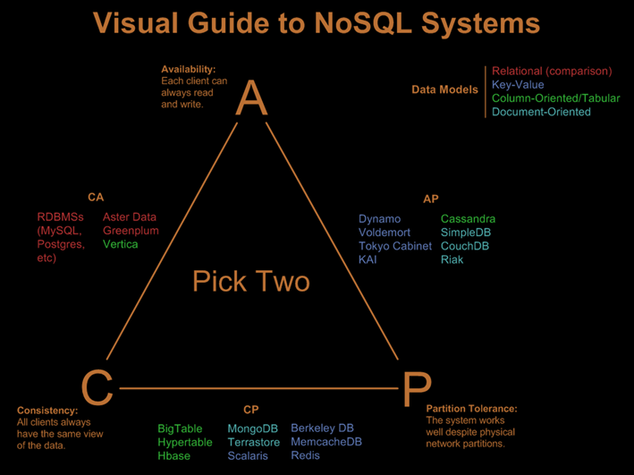

# 저장소는 많은 데이터를 어떻게 다루는가?
알아봅시다.

# 관점

## 기술적 관점
* 저장구조
* 네트웍 토폴로지
   * 서버
   * 클라이언트

# 배경 지식

## CAP 이론

분산환경에서 CAP (Consistency, Availibility, Partition Tolerance)를 모두 만족하는 것은 불가능하다. 현생하는 저장소들은 이 중 두가지 속성을 만족시키면서 각자의 길을 가고 있다. (각 속성의 뜻을 읽어보고 자신이 알고 있는 저장소가 어디에 위치하는지를 보면서 고개를 끄덕이시면 됩니다.)

__`ACID 와 CAP의 consistency 차이`__ ACID의 consistency는 write성공하면 이후 read는 같은 데이터가 보장되는 stroing consistency이다. 반면 CAP의 경우 weak consistency로써 eventual consistency가 그 예이다. 즉 write 하면 각 분산 노드에 저장된 데이터는 언젠가는 동기화되다는 것을 보장한다.

## 파일시스템

* 파일 = 헤더+데이터블럭의 조합
* 블럭단위의 Random Access
* 최적화: Cache, Sequential Access가 되도록 블럭 배치

__`비교: HDD vs SDD vs RAM`__ 왜 sequential하게 관리하나?

(이미지 출처: https://queue.acm.org/detail.cfm?id=1563874 )

__마음에 안정이 좀 되시나요?__

## RDBMS1

# 저장소별 특성

## Kafka

카프카 역시 저장소이다.

(이미지출처: http://cloudurable.com/blog/kafka-architecture-topics/index.html )

* 토폴로지
   * 멀티 파티션으로 데이터 분산해서 저장
   * 수평확장 가능
   * Producer에 의한 밸런싱 (기본밸런싱 알고리즘은 RR)
   * 메타 관리
      * Zookeeper로 멤버쉽과 토픽정보만 관리
      * Replication을 제외하면 장비간 통신 없음
      * 매우 단순한 구조로써 동기화 비용이 제거됨
* IO 최적화
   * Read / Write 모두 sequential io. (Read의 경우 시작지점은 지정 가능)
   * OS 버퍼캐쉬 적극 활용
   * 동시에 쓸수 있는 디스크수를 늘리는 것이 핵심
* 요약
   * 현존하는 저장소중 최고의 throughput, iops
   * 매우 단순한 I/O API만 제공

## Cassandra

__`Cassandra HDFS 비교`__ HDFS가 마스터 슬레이브인 것과 달리, 카산드라는 

* 토폴로지    
   * NoSQL, Colomn-oriented
   * 데이터는 각 노드에 분산되어 저장되며 저장 위치는 primary key 기반으로 샤딩
     * 노드 다운에 대비해 consistency hashing을 사용. 
   * 메타 관리
     * 멤버쉽, 스키마 정보가 운영에 필요
     * 각 노드가 클러스터 전체의 메타를 가지고 있음 
     * 특정 노드에서 스키마변화(테이블 생성등)를 실행하면 해당 정보는 전체 클러스터에 동기화 과정이 필요
     * 동기화 이전까지 추가 스키마 변경은 불가능
     * 동기화 되지 않은 상태로 남아 버리는 현상이 발생면 난감함
       * 라이브에서 발생하면 원인을 찾기도 대응을 하기도 힘듬. 다 그렇지만 이런 문제는 재현도 안됨
       * 믿을건 stackoverflow와 조직장의 결단 뿐
   * 데이터복제를 제외하면 장비간 통신 없음 --> 정보 동기화에 의한 지연시간 없음
   * 클라이언트
* IO 최적화
   * 쿼리별 동작
      * INSERT: 파일 뒤에 append
      * DELETE: 해당 row에 삭제되었음을 마킹 (tombstone) 
      * UPDATE: Insert & delete
   * Compaction
      * delete / update가 반복되면 실제 테이블에 저장된 row 대비 파일 사이즈가 커지게됨 (SELECT 성능도 저하)
      * Compaction을 실행하면 tomestone 마킹된 row를 제외하고 다시 파일을 생성함
      * 단 compaction은 시스템 리소스를 많이 소모함
   * ㅇㅇ

* 요약
   * 

## HDFS

## Bigquery

## C

# 기술적 경향
## Append 최적화
Delete와 update를 지원하지 않거나 insert 대비 비효율적이다. 두 작업은 다음과 같은 특성을 가진다.
- Insert : Sequential Access
- Delete, Update : Random Access
- Read 역시 sequantial 하게 처리

### 디스크의 특성
#### 우리는 HDD를 쓸 수 밖에 없다.

현재 대부분의 저장소에 사용되고 있는 스피닝 디스크(HDD)는 SSD비해 random access의 latency가 매우길다. 반면 SSD는 random access에 좋은 성능을 보이지만 용량 대비 가격이 매우 높기 때문에 가격적으로 불리하다.

__SSD vs. HDD__ 

이런 이유로 데이터 저장은 HDD에 하고 SSD는 random access, low latency가 필요한 작업에 한정하여 사용한다. 카산드라의 경우 데이터는 HDD에, commit log는 SSD에 구성하기도 한다.

#### 만약 당신이 SSD와 HDD 중 선택권이 있다면? (보통 없겠지만)
위 그림에서 볼때 SSD는 HDD의 6.5배 가격이다. 만약 HDFS를 SSD로 구성했을 경우 HDD 대비 두배의 속도가 나온다면 SSD를 선택할 것인가? 대체로는 SSD를 선택하지 않는다.

##### 비용

__`가격`__ 기본적으로 SSD는 비싸다.

__`최대용량`__ 그리고 HDD대비 용량이 낮기 때문에 같은 용량을 위해서는 HDD보다 더 많은 서버수가 필요하다. 그만큼 서버구매비용, 상면비용, 운영비용이 추가투입되어야 한다. 
   
__리소스간 밸런스__
   1. 디스크는 여러 상황에서 bottleneck이지만 항상 그런 것은 아니다. 또한 많은 현대적인 SW는 sequential access 를 가정하고 만들어져 있다. 실제 HDFS 역시 SSD와 HDD의 성능차는 몇십 퍼센트 수준이다.
   2. Spark, presto를 돌릴 것이라면 많은 core와 메모리에 사라.
   3. 데이터레이크 구성이라 디스크만 좋으면 된다고? 아니다. 높은 대역폭의 스위치를 이중화하는데 써라.

## Read