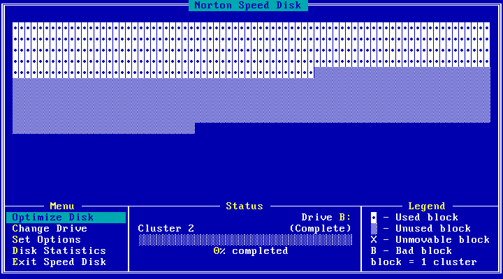
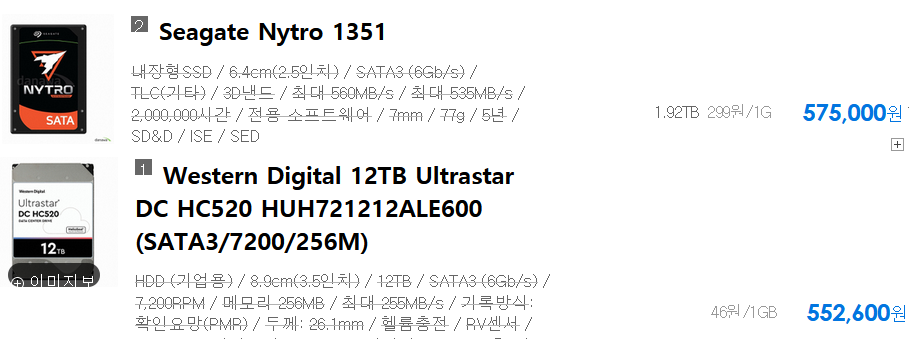

# 저장소는 많은 데이터를 어떻게 다루는가?
알아봅시다.

# 관점

## 기술적 관점
* 저장구조
* 네트웍 토폴로지
   * 서버
   * 클라이언트

# 저장소별 특성

## 파일시스템

* 파일 = 헤더+데이터블럭의 조합
* 블럭단위의 Random Access
* 최적화: Cache, Sequential Access가 되도록 블럭 배치

__마음에 안정이 좀 되시나요?__

## C

# 기술적 경향
## Append 최적화
Delete와 update를 지원하지 않거나 insert 대비 비효율적이다. 두 작업은 다음과 같은 특성을 가진다.
- Insert : Sequential Access
- Delete, Update : Random Access
- Read 역시 sequantial 하게 처리

### 디스크의 특성
#### 우리는 HDD를 쓸 수 밖에 없다.

현재 대부분의 저장소에 사용되고 있는 스피닝 디스크(HDD)는 SSD비해 random access의 latency가 매우길다. 반면 SSD는 random access에 좋은 성능을 보이지만 용량 대비 가격이 매우 높기 때문에 가격적으로 불리하다.

__SSD vs. HDD__ 

이런 이유로 데이터 저장은 HDD에 하고 SSD는 random access, low latency가 필요한 작업에 한정하여 사용한다. 카산드라의 경우 데이터는 HDD에, commit log는 SSD에 구성하기도 한다.

#### 만약 당신이 SSD와 HDD 중 선택권이 있다면? (보통 없겠지만)
위 그림에서 볼때 SSD는 HDD의 6.5배 가격이다. 만약 HDFS를 SSD로 구성했을 경우 HDD 대비 두배의 속도가 나온다면 SSD를 선택할 것인가? 대체로는 SSD를 선택하지 않는다.

##### 비용

__`가격`__ 기본적으로 SSD는 비싸다.

__`최대용량`__ 그리고 HDD대비 용량이 낮기 때문에 같은 용량을 위해서는 HDD보다 더 많은 서버수가 필요하다. 그만큼 서버구매비용, 상면비용, 운영비용이 추가투입되어야 한다. 
   
__리소스간 밸런스__
   1. 디스크는 여러 상황에서 bottleneck이지만 항상 그런 것은 아니다. 또한 많은 현대적인 SW는 sequential access 를 가정하고 만들어져 있다. 실제 HDFS 역시 SSD와 HDD의 성능차는 몇십 퍼센트 수준이다.
   2. Spark, presto를 돌릴 것이라면 많은 core와 메모리에 사라.
   3. 데이터레이크 구성이라 디스크만 좋으면 된다고? 아니다. 높은 대역폭의 스위치를 이중화하는데 써라.

## Read