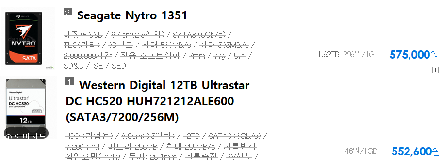
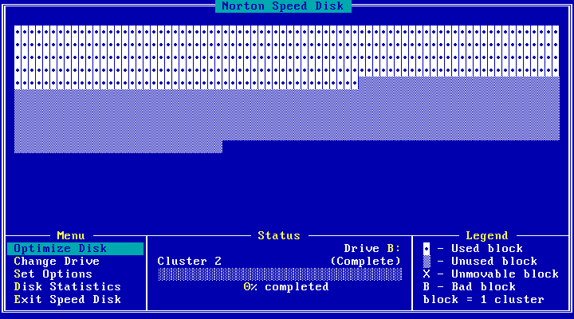
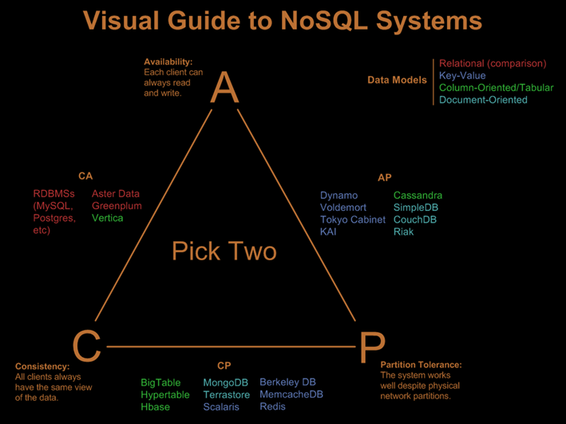
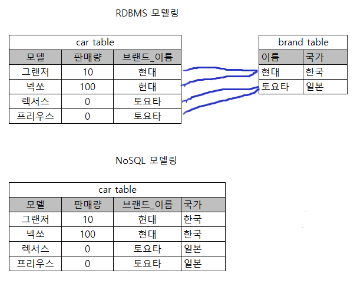
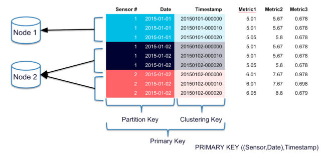
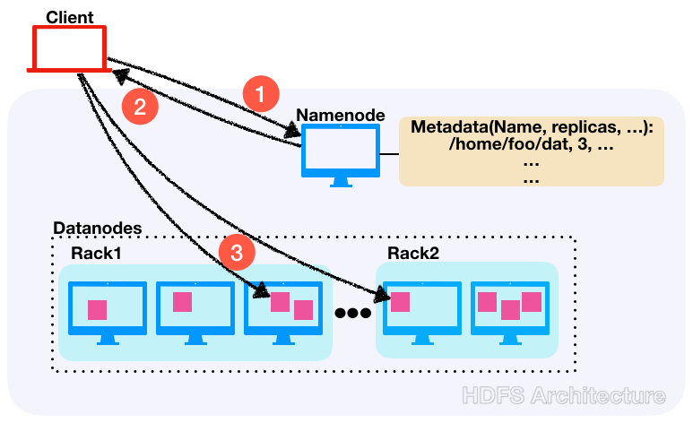

# 저장소는 많은 양의 데이터를 어떻게 다루는가?

세상에는 많은 수의 저장소 SW가 있다. 기존 RDBMS는 최대한 많은 기능을 제공하는 것에 초점을 뒀다면 현대의 저장소들은 그 사용처의 요구사항에 최대한 부합하는데 초점을 두고 있다. 대량 데이터를 처리하는 것이 최근의 트렌드이며 그것을 위해 기능의 제약을 감수한다. 대신 각각의 요구사항을 만족시키기 위한 여러가지 저장소 또는 저장소 조합이 나타나게 된다. RDBMS가 무수히 많은 기능을 제공하지만 HDFS, elastic, cassandra, redis, bigquery 등의 신규 저장소들이 하고 있는 일을 대신하기 어려우며, 그 반대도 마찬가지고 또한 신규 저장소끼리도 대체제로 쓰이긴 어렵다. 결국 이 업계에서 일하기는 더 빡쎄졌다.

다음 관점에서 각 저장소들의 특징을 살펴보려고 한다.

* __`네트웍 토폴로지`__ 장비구성, 데이터저장, 메타관리, 클라이언트 역할을 설명한다.
* __`IO 최적화`__ 데이터 저장 포맷, IO 패턴을 설명한다.

# 배경지식/전제

들어가기 전에 몇가지에 대해서 알아보자.

## 우리는 HDD를 쓸 수 밖에 없다. 

현재 대부분의 저장소에 사용되고 있는 스피닝 디스크(HDD)는 SSD비해 random access의 latency가 매우길다. 반면 SSD는 random access에 좋은 성능을 보이지만 용량 대비 매우 비싸다. 아래 그림은 서버용 HDD와 SSD를 비교한 것이다. 따라서 우리는 HDD를 쓸수밖에 없고, SSD를 쓰는 것보다 그리고 SW적으로 HDD의 단점을 보완하여 사용하는 것이 어렵지만 더 보편적인 선택이다.

__SSD vs. HDD__ 비싸다.

돈이 넉넉히 있어서 HDD 대신 SSD를 살 수 있다고 그것을 실천하는 것은 현명하지 않을 수 있다. 
1. __`가격`__ 일단 비싸다.
   1. __`SSD 비용`__ 용량 대비 가격이 비싸다.
   2. __`서버비용`__ HDD대비 디스크당 용량이 작기 때문에 같은 용량을 확보하기 위해서는 더 많은 서버수가 필요하다. 그만큼 서버구매비용, 상면비용, 운영비용이 추가투입되어야 한다.
2. __`리소스간 밸런스`__ 많은 경우 HDD는 bottleneck 이지만 "항상" 그런 것은 아니다. SDD에 투자할 비용을 다른 리소스에 투자함으로써 전체적인 성능이 더 올라갈 수 있다.
   1. __`Spark, presto`__ In-memory 프로세싱 작업을 할 것이라면 좋은 CPU와 많은 메모리를 사라.
   2. __`데이터레이크`__ 디스크 성능은 중요하지만 네트워크 성능 역시 중요하다. 높은 대역폭의 스위치를 이중화해라.

## 파일시스템
파일 시스템 특징 (중 이 글하고 관련된 내용)
* 파일 = 헤더+데이터블럭의 조합
* 블럭단위의 Random Access
* OS 최적화: Cache, Sequential Access가 되도록 블럭 배치

__`비교: HDD vs SDD vs RAM`__ 아래 그림은 왜 sequential 하게 배치하는지를 보여준다.

HDD는 random access에 매우 취약하다. 물론 이는 단순 벤치마크이며 application이 동작할때의 퍼포먼스의 격차는 적다. [자료출처: 테크스팟](https://www.techspot.com/review/1956-storage-performance/)

__마음에 안정이 좀 되시나요?__
실제 우리는 OS가 해주는 것 이상으로 파일시스템을 sequential 하게 관리하려고 노력하다.

## CAP 이론

분산환경에서 CAP (Consistency, Availibility, Partition Tolerance)를 모두 만족하는 것은 불가능하다. 현생하는 저장소들은 다음 세가지 중 두가지 속성을 만족시키면서 각자의 길을 가고 있다. (자신이 알고 있는 저장소가 어디에 위치하는지를 보면서 고개를 끄덕이시면 됩니다.)
* Availability
* Consistency 
* Partition Tolerance

__`ACID 와 CAP의 consistency 차이`__ ACID의 consistency는 write성공하면 이후 read는 같은 데이터가 보장되는 strong consistency이다. 반면 CAP의 경우 weak consistency로써 eventual consistency가 그 예이다. 즉 eventual consistency는 write하면 언젠가는 각 분산노드가 같은 데이터를 가지게 되는 것을 의미한다. 즉 최종적으로는 데이터가 반영되지 않고 유실되거나 각기 다른 두 write의 결과가 섞이는 일은 없다.

__`Eventual Consistency의 선택`__ 사실상 분산 storage에서 eventual consistency는 성능측면에서 불가항력적인 선택이다. 이는 strong consistency를 지원하는 분산스토리지인 zookeeper가 동기화 비용으로 인해 극단적으로 낮은 write throughput을 보이는 것을 보면 알 수 있다.

## 정규화에 대한 스탠스

RDBMS 데이터 모델링의 덕목중 하나로 정규화가 있다. 공통된 데이터를 별도 테이블로 분리하도록 설계하고, 분리된 두 테이블을 join 함으로써 하나의 데이터가 완성한다.

정규화를 통할 경우 다음과 같은 장점을 얻을 수 있다.
* 공통된 데이터에 대한 update
* 관계의 정의를 통한 데이터 정합성 확보
* 공간의 절약 (공간은 매우 비싼 리소스이자 최대 용량에 한계가 있음)

반면 nosql 계열은 성능을 위해 의도적으로 정규화를 하지 않는다.
* Update IO는 없거나 매우 드뭄 (write-once read-many에 최적화)
* Join이 없으므로 read시 탐색 및 로딩 횟수가 줄어듬
* 공간은 확장가능 (투자에 선형적으로 비례하여 늘어나는 무한한 리소스)
* Sequential write
* 데이터 정합성은 애플리케이션의 책임

### 테이블 설계 먼저냐? 쿼리 작성이 먼저냐?
테이블을 먼저 설계하고 쿼리를 작성해야할까? 아니면 그 반대일까? 두 작업이 100% 선후관계는 아니겠지만 대체로 다음 순서로 진행된다.
* `RDBMS` 데이터모델에 따라 테이블을 설계한 후 그에 맞게 쿼리를 작성한다.
* `nosql` 유연함이 떨어지기 때문에 원하는 쿼리를 먼저 정의하고 그에 맞게 테이블을 설계한다.

## 파티셔닝, 파티션 내 정렬

저장소는 데이터를 파일에 할때 파티셔닝과 파티션내 정렬을 통해서 성능의 저하를 감소시킨다. 파티션, 클러스터링, predicated pushdown 등 이름은 다양하더라도 결국 추구하는 바는 __스캔범위의 감소__ 이다. 그러니 적극적으로 __잘__ 써야한다.

(자료출처: https://www.instaclustr.com/cassandra-data-partitioning/)

위 그림은 cassandra의 파티셔닝과 클러스터링을 보여준다. 파티션키인 date를 통해서 데이터가 저장된 노드를 찾음으로써 읽어야할 데이터의 수를 감소하고, 클러스터링키인 timestamp를 검색에 힌트로써 활용한다. Hive의 경우에도 데이터파일인 orc를 특정 컬럼을 기준으로 분할(파티션)하여 저장하는 최적화 기능을 제공하며, 특정 컬럼을 기준으로 데이터를 정렬하여 저장한다.

# 저장소별 특성

사실상 이 글을 쓴 목적은 기존의 RDBMS와 비교하여 현재 많이 사용되는 저장소들의 특징을 알아보자는 것이다.

## RDBMS (비교 대상)

RDBMS는 막강한 기능을 가지고 있지만 대량 데이터처리에 있어서 한계를 가지고 있다.

* 토폴로지
  * 태생적으로 서버 한대에서 모든 데이터를 저장 및 프로세싱
  * 장비 스펙이 곧 저장소 성능
* 막강한 기능
  * 데이터간 relation
  * 정규화
  * ACID
* IO 최적화
  * Write-many read-many (이런 용어가 있는지 모르지만 분명히 write 성능이 우수하다) 
  * 인덱싱, 파티션, .. 잘 모름

## Apache Kafka

단순하지만 확장성, latency, throughput 면에서 최고의 저장소

(이미지출처: http://cloudurable.com/blog/kafka-architecture-topics/index.html)

* 토폴로지
   * 멀티 파티션으로 데이터 분산해서 저장
   * 수평확장 가능
   * 파티션간 밸런싱은 producer에 위임
      * Broker 부하 없음
      * 기본 정책은 가용한 파티션에 대해서 round-robin
   * 메타 관리를 zookeeper에 위임
      * Zookeeper로 멤버쉽과 토픽정보만 관리
      * Replication을 제외하면 장비간 통신 없음
   * 전체적으로 볼때 카프카 각 서버는 zookeeper의 지령을 받아서 각자도생하는 매우 단순한 구조
* IO 최적화
   * Read / Write 모두 sequential io. (Read는 예외가 있음)
   * OS 버퍼캐쉬 적극 활용
   * 동시에 쓸수 있는 디스크수를 늘리는 것이 핵심
   * HDD와 SSD 사용에 따른 성능 차이 없음

## Apache Cassandra

[카산드라가 뭔가?](https://meetup.toast.com/posts/58)

__`Cassandra HDFS 비교`__ HDFS가 마스터 슬레이브인 것과 달리 카산드라는 모든 노드가 동등한 역할을 한다. Seed 노드 개념이 있으나 서버 discovery용도로만 사용되며 또한 다수의 노드가 seed가 될 수 있다. (카산드라 클러스터 시작시 최소 하나의 seed 노드가 먼저 시작되어야 한다)

* 토폴로지
   * 모든 노드는 데이터의 저장과 프로세싱에서 동등한 역할을 수행
   * 데이터는 각 노드에 분산되어 저장
     * 테이블 생성시 전체 장비에 동일한 디렉토리가 생성됨
     * 데이터 저장 위치는 primary key를 샤딩하여 결정 / key를 잘못잡으면 특정 노드에 데이터 몰림
   * 메타 관리
     * 멤버쉽 및 테이블 스키마 정보
     * 모든 노드가 클러스터 전체의 메타를 복제해서 가지고 있음
     * 특정 노드에서 스키마변화(테이블 생성등)를 실행하면 해당 정보는 전체 클러스터에 동기화 과정이 필요
     * 동기화 이전까지 추가 스키마 변경은 불가능
     * 클러스터가 동기화 되지 않은 상태로 남아 버리는 현상이 발생면 난감함
       * 라이브에서 발생하면 원인을 찾기도 대응을 하기도 힘듬. 다 그렇지만 이런 문제는 재현도 안됨
       * 믿을건 stackoverflow와 조직장의 결단 뿐
* IO 최적화
   * 데이터 저장 구조
     * `MemTable / SSTable / CommitLog` Write 요청이 오면 메모리의 MemTable에 업데이트한 후 CommitLog에 write 사실을 기록하고 성공했음을 클라이언트로 리턴. 주기적으로 디스크의 SSTable로 flush
       * `SSD for commitlog` Write ahead log 성격인 commit log는 IOPS가 매우 높기 때문에 SSD에 분리저장하기도 함
   * 쿼리별 동작
     * `INSERT` SSTable 파일에 append, index 파일 업데이트
     * `DELETE` 해당 row에 삭제되었음을 마킹(tombstone). 쿼리시 데이터는 삭제하지 않음
     * `UPDATE` Insert & delete
   * Compaction
     * delete / update가 반복되면 실제 테이블에 저장된 row 대비 파일 사이즈가 커짐
     * Compaction을 실행하면 tomestone row를 제외하고 다시 파일을 생성함
     * Compaction은 시스템 리소스를 많이 소모

## HDFS (Hadoop Distributed File System)

대용량 분산저장소의 대명사인 HDFS에 대해서도 알아보자.

__`Namenode + Datanode + Client library`__ 클라이언트가 하둡 데이터에 접근하는 flow

* 토폴로지
  * Namenode + Datanode
    * `NameNode` 네임스페이스 역할을 하며 모든파일의 저장위치(datanode, 블럭정보)를 관리
    * `DataNode` 데이터를 저장하고 클라이언트와 데이터를 송수신
    * `Client` Namenode에 접속하여 메타를 가져오고 그것을 기반으로 datanode로 데이터를 송수신
  * 장비 스펙
    * `NameNode` 높은 CPU, 비싼 디스크, 많은 메모리
    * `DataNode` 저사양 CPU, 메모리, 많은 디스크 / 프로세싱(spark, hive 등)에 사용할경우 CPU 메모리도 높아져야함
* IO 최적화
  * HDFS의 목표
    * 짧은 latency 보다 높은 throughput에 최적화
    * 기가 또는 테라단위의 큰 파일에 최적화 
  * 큰 블럭 사이즈
    * default 64MB
    * 블럭사이즈가 큰 경우 작은 파일을 저장할 경우 공간이 낭비된다
    * 하지만 작아졌을때 발생하는 문제가 더 심각하다.
      * `NameNode 리소스 사용량` 블럭의 수가 많아지면 namenode가 저장해야하는 정보가 그만큼 많아지므로 부하가 커진다. 
        * 더 많은 메모리 필요
        * 더 많은 프로세싱 필요
        * 클라이언트와 통신량 증가
        * NameNode 시작시간이 길어진다
  * 작은 많은 파일은 HDFS 사상에 맞지 않는다.
    * 파일 갯수 감소 필요
      * hive에 저장된 데이터파일이 너무 많다! 파일들을 머지해서 큰 파일 생성 --> 테이블의 데이터 경로를 변경하는 식으로 관리.
      * 잘 안쓰는 파일은 압축해서 저장
    * `Name node federation` 네임노드를 여러개두고 hdfs 파일 경로를 샤딩하여 네임노드들이 나누어가짐

## GCP Bigquery

구글 클라우드에서 지원하는 빅쿼리는 대량의 데이터에 대해서 매우 빠른 속도로 처리를 한다. 다들 자기네 서비스 좋다고 광고해서 써보면 별로인 경우가 대다수인데 반해서 빅쿼리는 정말로 광고하는 것처럼 빠르다.

[얼마나 빠른지 직접 보자](https://cloud.google.com/blog/products/gcp/anatomy-of-a-bigquery-query)

* 토폴로지
  * Managed Service이다보니 알려진 것이 적음
* IO 최적화
  * 쿼리별 동작
    * `INSERT` 시 append
    * `SELECT` 범위 미지정시 full 스캔
    * `UPDATE / DELETE` 미지원
      * 만약 테이블에서 row2를 지우려면? ___Insert 새테이블 SELECT * FROM 기존테이블 WHERE row2 제외한나머지___
  * `파티션` 스캔범위를 줄임으로써 쿼리 성능향상, 비용감소
  * `클러스터링` 특정열을 기준으로 정렬. 해당열을 사용하는 작업시 성능향상

# Keywords
 #sequential access #append #write-once read-many #scan #partition #clustering #weak consistency #sharding
