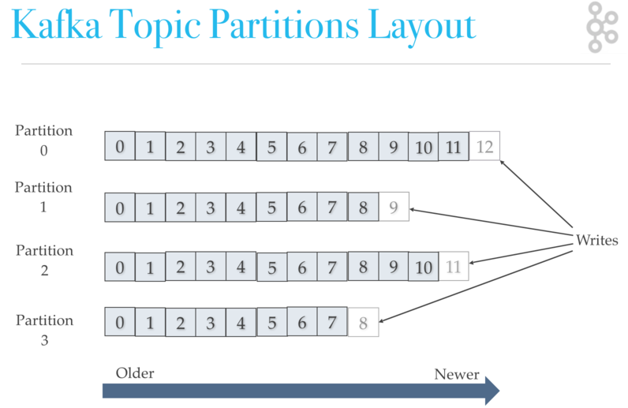

# 저장소는 많은 양의 데이터를 어떻게 다루는가?

세상에는 많은 수의 저장소 SW가 있다. 기존 RDBMS는 최대한 많은 기능을 제공하는 것에 초점을 뒀다면 현대의 저장소들은 그 사용처의 요구사항에 최대한 부합하는데 초점을 두고 있다. 대량 데이터를 처리하는 것이 최근의 트렌드이며 그것을 위해 기능의 제약을 감수한다. 대신 각각의 요구사항을 만족시키기 위한 여러가지 저장소 또는 저장소 조합이 나타나게 된다. RDBMS가 무수히 많은 기능을 제공하지만 HDFS, elastic, cassandra, redis, bigquery 등의 신규 저장소들이 하고 있는 일을 대신하기 어려우며, 그 반대도 마찬가지고 또한 신규 저장소끼리도 대체제로 쓰이긴 어렵다. 결국 이 업계에서 일하기는 더 빡쎄졌다.

다음 관점에서 각 저장소들의 특징을 살펴보려고 한다.

* __`네트웍 토폴로지`__ 장비구성, 데이터저장, 메타관리, 클라이언트 역할을 설명한다.
* __`IO 최적화`__ 데이터 저장 포맷, IO 패턴을 설명한다.

# 배경지식

들어가기 전에 몇가지에 대해서 알아보자.

## 우리는 HDD를 쓸 수 밖에 없다. 

현재 대부분의 저장소에 사용되고 있는 스피닝 디스크(HDD)는 SSD비해 random access의 latency가 매우길다. 반면 SSD는 random access에 좋은 성능을 보이지만 용량 매우 비싸다. 따라서 우리는 HDD를 쓸수밖에 없다. SSD를 쓰는 것보다 그리고 SW적으로 HDD의 단점을 보완하여 사용하는 것이 어렵지만 더 보편적인 선택이다.

__SSD vs. HDD__ 비싸다.

돈이 꽤 있어서 HDD 대신 SSD를 살 수 있다고 그것을 실천하는 것은 현명하지 않을 수 있다. 
1. __`최대용량`__ 그리고 HDD대비 용량이 낮기 때문에 같은 용량을 위해서는 HDD보다 더 많은 서버수가 필요하다. 그만큼 서버구매비용, 상면비용, 운영비용이 추가투입되어야 한다. 
2. __`리소스간 밸런스`__ 많은 경우 HDD는 bottleneck 이지만 "항상" 그런 것은 아니다. SDD에 투자할 비용을 다른 리소스에 투자함으로써 전체적인 성능이 더 올라갈 수 있다.
   1. __`Spark, presto`__ In-memory 프로세싱 작업을 할 것이라면 좋은 CPU와 많은 메모리를 사라.
   2. __`데이터레이크`__ 디스크는 중요하다. 하지만 그돈을 아껴서 높은 대역폭의 스위치를 이중화하는 데 써라.

## 파일시스템
* 파일 = 헤더+데이터블럭의 조합
* 블럭단위의 Random Access
* OS 최적화: Cache, Sequential Access가 되도록 블럭 배치

__`비교: HDD vs SDD vs RAM`__ 왜 sequential하게 관리하나?

(이미지 출처: https://queue.acm.org/detail.cfm?id=1563874 )

__마음에 안정이 좀 되시나요?__

## CAP 이론

분산환경에서 CAP (Consistency, Availibility, Partition Tolerance)를 모두 만족하는 것은 불가능하다. 현생하는 저장소들은 이 중 두가지 속성을 만족시키면서 각자의 길을 가고 있다. (자신이 알고 있는 저장소가 어디에 위치하는지를 보면서 고개를 끄덕이시면 됩니다.)

__`ACID 와 CAP의 consistency 차이`__ ACID의 consistency는 write성공하면 이후 read는 같은 데이터가 보장되는 stroing consistency이다. 반면 CAP의 경우 weak consistency로써 eventual consistency가 그 예이다. 즉 write 하면 각 분산 노드에 저장된 데이터는 언젠가는 동기화되다는 것을 보장한다.

__`Eventual Consistency`__ 사실상 분산 storage에서 eventual consistency는 성능상 불가항력적인 선택이다. 이는 strong consistency를 지원하는 분산스토리지인 zookeeper가 동기화 비용으로 인해 극단적으로 낮은 write throughput을 보이는 것을 보면 알 수 있다. 

## 정규화에 대한 태도

RDBMS 설계의 덕목중 하나로 정규화가 있다. 공통된 데이터를 별도 테이블로 분리하도록 설계하고, 분리된 두 테이블을 join 함으로써 하나의 데이터가 완성한다.

정규화를 통할 경우 다음과 같은 장점을 얻을 수 있다.
* 공통된 데이터에 대한 update
* 관계의 정의를 통한 데이터 정합성 확보
* 공간의 절약 (공간은 비싼 리소스)

반면 nosql 계열은 성능을 위해 의도적으로 정규화를 하지 않는다.
* Update IO는 없거나 매우 드뭄 (write-once read-many에 최적화)
* Join이 없으므로 read시 탐색 및 로딩 횟수가 줄어듬
* 공간은 확장 가능
* Sequential write
* 데이터 정합성은 애플리케이션의 책임

# 저장소별 특성

사실상 이 글을 쓴 목적은 기존의 RDBMS와 비교하여 현재 많이 사용되는 저장소들의 특징을 알아보자는 것이다.

## RDBMS (비교 대상)

RDBMS는 막강한 기능을 가지고 있지만 대량 데이터처리에 있어서 한계를 가지고 있다.

* 토폴로지
  * 태생적으로 서버 한대에서 모든 데이터를 저장 및 프로세싱
  * 장비 스펙이 곧 성능
* 막강한 기능
  * 데이터간 relation
  * 정규화
  * ACID
* IO 최적화
  * Write-many read-many (이런 용어가 있는지 모르지만 분명히 write 성능이 우수하다) 
  * 인덱싱, 파티션, .. 잘 모름

## Apache Kafka

단순하지만 확장성, latency, throughput 면에서 최고의 저장소

(이미지출처: http://cloudurable.com/blog/kafka-architecture-topics/index.html)

* 토폴로지
   * 멀티 파티션으로 데이터 분산해서 저장
   * 수평확장 가능
   * Producer에 의한 밸런싱 (기본밸런싱 알고리즘은 RR)
   * 메타 관리
      * Zookeeper로 멤버쉽과 토픽정보만 관리
      * Replication을 제외하면 장비간 통신 없음
      * 매우 단순한 구조로써 동기화 비용이 제거됨
* IO 최적화
   * Read / Write 모두 sequential io. (Read의 경우 시작지점은 지정 가능)
   * OS 버퍼캐쉬 적극 활용
   * 동시에 쓸수 있는 디스크수를 늘리는 것이 핵심
   * Write-once read-many
* 요약
   * 현존하는 저장소중 최고의 throughput, iops
   * 매우 단순한 I/O API만 제공

## Apache Cassandra

[카산드라가 뭔가?](https://meetup.toast.com/posts/58)

__`Cassandra HDFS 비교`__ HDFS가 마스터 슬레이브인 것과 달리 카산드라는 모든 노드가 동등한 역할을 한다. Seed 노드 개념이 있으나 클라이언트가 장비의 discovery를 하기 위해서만 사용되며 다수의 노드가 seed가 될 수 있다.

* 토폴로지    
   * 모든 노드는 데이터의 저장과 프로세싱에서 동등한 역할을 수행
   * 데이터는 각 노드에 분산되어 저장
     * 테이블 생성시 전체 장비에 동일한 디렉토리가 생성됨
     * 데이터 저장 위치는 primary key를 샤딩하여 결정
     * 노드 다운에 대비해 consistency hashing + vnode 개념을 사용
   * 메타 관리
     * 멤버쉽 및 테이블 스키마 정보
     * 모든 노드가 클러스터 전체의 메타를 가지고 있음
     * 특정 노드에서 스키마변화(테이블 생성등)를 실행하면 해당 정보는 전체 클러스터에 동기화 과정이 필요
     * 동기화 이전까지 추가 스키마 변경은 불가능
     * 클러스터가 동기화 되지 않은 상태로 남아 버리는 현상이 발생면 난감함
       * 라이브에서 발생하면 원인을 찾기도 대응을 하기도 힘듬. 다 그렇지만 이런 문제는 재현도 안됨
       * 믿을건 stackoverflow와 조직장의 결단 뿐
* IO 최적화
   * 데이터 저장 구조
     * `MemTable / SSTable / CommitLog` write 요청이 오면 메모리의 MemTable에 업데이트한 후 CommitLog에 write 사실을 기록하고 성공했음을 리턴. 주기적으로 디스크의 SSTable로 flush
       * `SSD for commitlog` Write ahead log 성격인 commit log는 IOPS가 매우 높기 때문에 SSD에 분리저장하기도 함
   * 쿼리별 동작
     * `INSERT` 파일 뒤에 append
     * `DELETE` 해당 row에 삭제되었음을 마킹(tombstone). 데이터는 삭제하지 않음
     * `UPDATE` Insert & delete
   * Compaction
     * delete / update가 반복되면 실제 테이블에 저장된 row 대비 파일 사이즈가 커짐
     * Compaction을 실행하면 tomestone row를 제외하고 다시 파일을 생성함
     * Compaction은 시스템 리소스를 많이 소모

## HDFS (Hadoop Distributed File System)

대용량 분산저장소의 대명사인 HDFS에 대해서도 알아보자.

__`Namenode + Datanode + Client library`__ 클라이언트가 하둡 데이터에 접근하는 flow

* 토폴로지
  * Namenode + Datanode
    * `NameNode` 네임스페이스 역할을 하며 모든파일의 저장위치(datanode, 블럭정보)를 관리
    * `DataNode` 데이터를 저장하고 클라이언트와 데이터를 송수신
    * `Client` Namenode에 접속하여 메타를 가져오고 그것을 기반으로 datanode로 데이터를 송수신
  * 장비 스펙
    * `NameNode` 높은 CPU, 비싼 디스크, 많은 메모리
    * `DataNode` 저사양 CPU, 메모리, 많은 디스크 / 프로세싱(spark, hive 등)에 사용할경우 CPU 메모리도 높아져야함
* IO 최적화
  * HDFS의 목표
    * 짧은 latency 보다 높은 throughput에 최적화
    * 기가 또는 테라단위의 큰 파일에 최적화 
  * 큰 블럭 사이즈
    * default 64MB
    * 블럭사이즈가 큰 경우 작은 파일을 저장할 경우 공간이 낭비된다
    * 하지만 작아졌을때 발생하는 문제가 더 심각하다.
      * `NameNode 리소스 사용량` 블럭의 수가 많아지면 namenode가 저장해야하는 정보가 그만큼 많아지므로 부하가 커진다. 
        * 더 많은 메모리 필요
        * 더 많은 프로세싱 필요
        * 클라이언트와 통신량 증가
        * NameNode 시작시간이 길어진다
    * 작은 파일을 작은 블럭사이즈로 저장하는 것은 HDFS 목표에 맞지 않는다.

## Bigquery
* 토폴로지
  * Managed Service이다보니 알려진 것이 적음
* IO 최적화
  * Insert 시 append. Create 
  * SELECT : 범위 미지정시 full 스캔
  * UPDATE / DELETE 를 위해서는 신규테이블 생성
    * 예) 테이블에서 row2를 지우려면? Insert 새테이블 SELECT * FROM 기존테이블 WHERE row2 제외한나머지
  * 빅쿼리는 테이블의 스캔 범위가 넓을 수록 다른 저장소에 비해서 압도적인 성능을 보임. 비록 과금 체계가 처리되는 데이터량에 비례하기 때문에 scan 범위를 줄여야 한다.

# Keywords
    #sequential access #append #write-once read-many #fullscan #weak consistency
